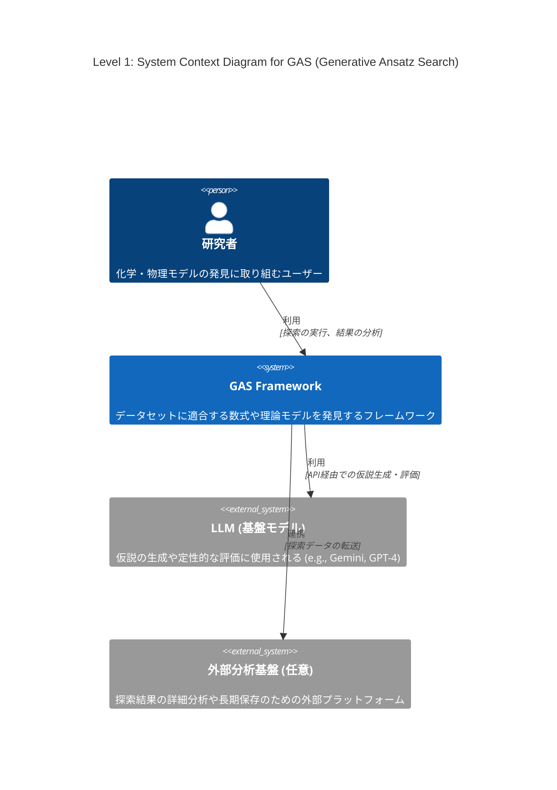
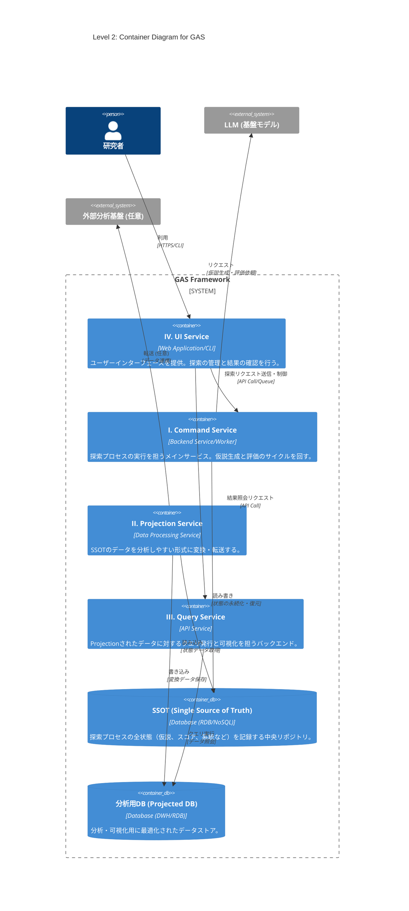
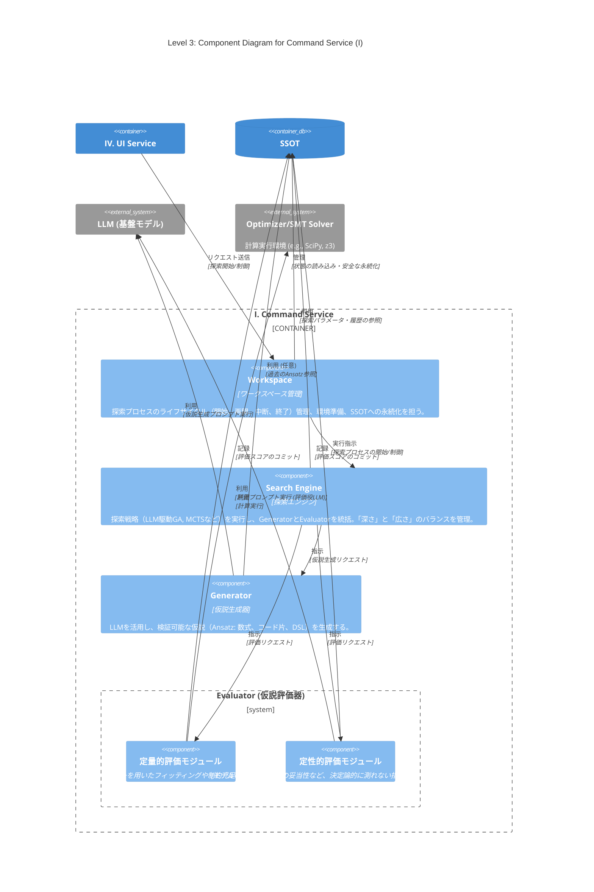

# 導入
最近LLMを用いた解の発見が流行っている、Alpha EvolveやDeep Researcher with Test-Time Diffusionなどがgoogleによって開発され、大成功を収めている

このような手法のうち、化学・物理モデルの発見に特化したものの開発に取り組んでいる

# Abstract

化学・物理モデルの発見ではデータセットに適合する数式や、微分方程式を構成することが目的である

機械学習でブラックボックスモデルを構築することも可能だが、そうではなく、意味のある理論式を見つけたい

データや理論値とのフィッティング度合いなどはある程度決定的に測れる

しかし化学方程式の場合や、微分方程式近似解の発見などで、計算精度だけが指標でない場合も多い

オッカムの剃刀の原則に則ったモデルのコンパクトさも主な指標となりうる

先行研究で考案されている手法も様々であり、私は今回、できるだけカバー範囲の広いフレームワークの構想を行っている

# フレームワーク設計案: Generative Ansatz Search (GAS)

様々な問題や探索手法に対応可能な、拡張性の高いモジュール式アーキテクチャを提案する。中核となる探索プロセスはストラテジーパターンを採用し、アルゴリズムの交換を容易にする。I ~ IVのインフラから構成することを考えている。

## I. Command Service: 探索プロセスの実行

仮説生成と評価のサイクルを回し、解を探索するメインサービス。

* **`Workspace` (ワークスペース管理)**
    * **役割**: 探索プロセスのライフサイクル（開始、再開、中断、終了）を管理する。探索に必要な環境（Workspace）の準備、状態の読み込み、および`SSOT`への安全な永続化を担う。
    * **実装**: 新規実行のためのパラメータ設定や、中断されたプロセスの状態を`SSOT`から復元する機能を実装する。終了・中断時には、現在の状態を`SSOT`へコミットする。

* **`Search Engine` (探索エンジン)**
    * **役割**: 探索戦略の実行と全体統括。
    * **実装**: LLM駆動の遺伝的アルゴリズム（GA）やモンテカルロ木探索（MCTS）などの探索戦略を実装する。`Generator`と`Evaluator`を協調させ、探索の「深さ（活用）」と「広さ（探索）」のバランスを考える。必要に応じて`SSOT`を使用する。

* **`Generator` (仮説生成器)**
    * **役割**: 検証可能な仮説（Ansatz）の生成。
    * **実装**: LLMを活用し、評価対象となる仮説を生成する。Ansatzは、数式、コード片、DSL（ドメイン固有言語）など、`Evaluator`が機械的に検証できる形式で出力される。必要に応じて`SSOT`を使用する。

* **`Evaluator` (仮説評価器)**
    * **役割**: 生成されたAnsatzの有効性を多角的に評価。
    * **実装**:
        * **定量的評価**: `optimizer`によるフィッティングや`z3`等のSMTソルバーを用いた制約充足チェックを機械的に実行。
        * **定性的評価**: モデルの簡潔性や構造の妥当性など、決定論的に測れない指標を別のLLM（評価役LLM）を用いて評価。

* **`SSOT` (Single Source of Truth)**
    * **役割**: 探索プロセスの全状態を記録する中央リポジトリ。
    * **実装**: 生成された全Ansatz、その評価スコア、系統（どのAnsatzから派生したか）、探索パラメータなどを一元的に保存する。

## II. Projection Service: データの変換・転送

`SSOT`に保存された状態データを、分析しやすい形式に変換したり、外部の分析基盤へ転送したりするサービス。

## III. Query Service: 状態の照会・可視化

Projectionされたデータに対して、人間が直接クエリを発行し、探索の進捗や結果を可視化・分析する。ProjectionされたDBへの認証情報などをもつバックエンド

## IV. UI Serivce: ユーザーインターフェース

Command Serivceにリクエストを送って探索してもらう。Query Serivceを呼び出して結果を確認する。

# C4 Model

## Level 1: System Context Diagram (システムコンテキスト図)

GASシステム全体の俯瞰図です。システムがユーザー（研究者）や主要な外部システム（LLM、外部分析基盤）とどのように関わるかを示します。

## Level 2: Container Diagram (コンテナ図)

GASシステムを構成する主要な実行単位（コンテナ）を示します。設計案のI〜IVのサービスとデータストア（SSOT、分析用DB）をコンテナとして定義しています。

## Level 3: Component Diagram (Command Serviceのコンポーネント図)

「I. Command Service」コンテナ内部の構造を示します。`Workspace`, `Search Engine`, `Generator`, `Evaluator`といった主要コンポーネント間の連携を記述します。

