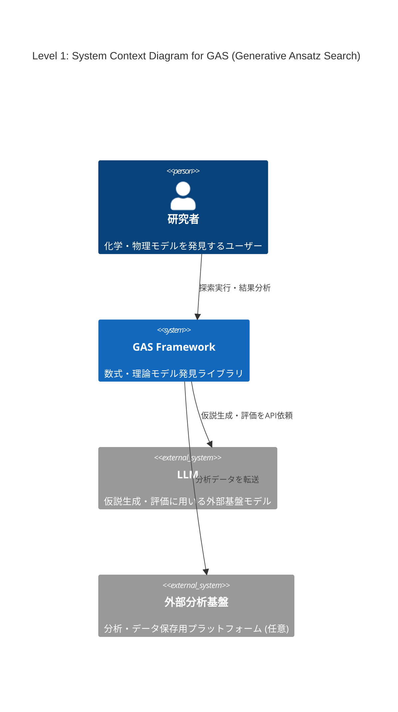
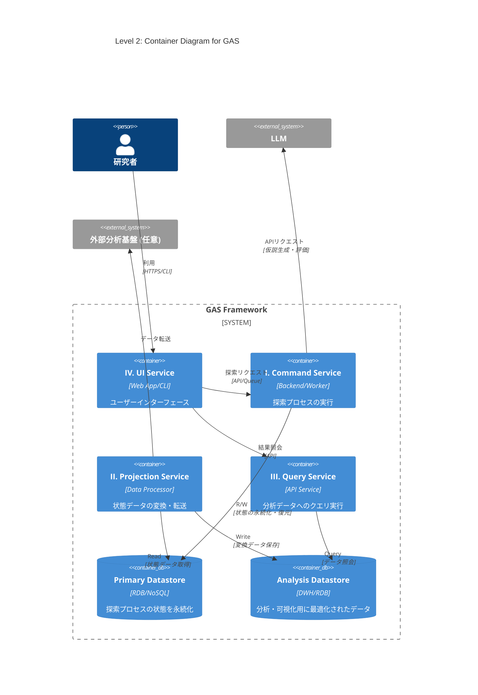
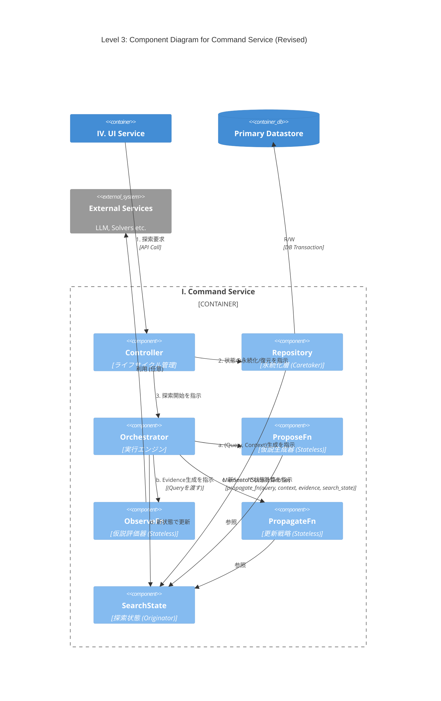

# 導入

最近LLMを用いた解の発見が流行っている、Alpha EvolveやDeep Researcher with Test-Time Diffusionなどがgoogleによって開発され、大成功を収めている。

このような手法のうち、化学・物理モデルの発見に特化したものの開発に取り組んでいる。

# Abstract

化学・物理モデルの発見では、データセットに適合する数式や微分方程式を構成することが目的である。

機械学習でブラックボックスモデルを構築することも可能だが、そうではなく、解釈可能な理論式を見つけたい。

データや理論値とのフィッティング度合いなどはある程度決定的に測れる。しかし、化学方程式の妥当性や微分方程式の近似解の発見など、計算精度だけが指標でない場合も多い。オッカムの剃刀の原則に則ったモデルのコンパクトさ（記述長）もまた、主要な指標となりうる。

先行研究で考案されている手法も様々であり、本稿では、できるだけ広いカバー範囲を持つライブラリの構想を行う。

# ライブラリ設計案: Generative Ansatz Search (GAS)

様々な問題や探索手法に対応可能な、拡張性の高いモジュール式アーキテクチャを提案する。中核となる探索プロセスはストラテジーパターンを採用し、探索アルゴリズムの交換を容易にする。GASは、責務の異なる4つのサービスから構成される。

## I. Command Service: 探索プロセスの実行

仮説生成と評価のサイクルを駆動し、解を探索するメインサービス。`asyncio`を活用し、`ProposeFn`のLLM API呼び出しや`ObserveFn`のGPU計算といったI/Oバウンドなタスクを効率的に処理する。リアルタイムロギングはstateとは関係ないイベントとしてQueueを用いて実装する予定。
 
* **`Controller` (システムのライフサイクル管理)**

    * **役割**: 探索プロセスのライフサイクル（開始、再開、中断、終了）と、状態永続化のタイミング（ポリシー）を管理する。
    * **実装**: 実行構成に基づき各コンポーネントを準備する。`Repository`を介して`SearchState`を初期化（新規作成またはDBから復元）後、`Orchestrator`に渡して探索を開始させる。定義されたポリシーに基づき`Repository`に永続化を指示する。

* **`Orchestrator` (実行エンジン)**

    * **役割**: 探索ループを駆動し、インメモリの`SearchState`を管理する。
    * **実装**: 以下の探索サイクルを駆動する。
      1.  `ProposeFn`を呼び出し、評価対象の仮説群`Query`と、その生成文脈`Context`を得る。
      2.  `ObserveFn`を呼び出し、`Query`を評価して `Evidence` を得る。
      3.  `PropagateFn`を呼び出し、`Query`,`Context`,`Evidence`,`SearchState`から次期`SearchState` を計算する。
      4. 自身の管理する状態を次期`SearchState`で更新する。

* **`ProposeFn` (仮説生成器)**

    * **役割**: `SearchState`に基づき、検証可能な仮説（Ansatz）の集合`Query`と、`PropagateFn`で状態更新に用いるための文脈情報`Context`を取得する。
    * **実装**: `SearchState`（例: 親個体群）を参照し、LLMなどを活用して新たな`Query`と`Context`(例: 親子関係)を生成する。状態の読み書きは行わないステートレスな関数として実装し、ExplorationとExploitationのバランスを調整する。

* **`ObserveFn` (仮説評価器)**

    * **役割**: 仮説群 `Query` を評価し、その結果(`Evidence`)を生成する。
    * **実装**: `Query`に対し、シミュレーションやデータフィッティングなどの定量的・定性的評価を実行する。状態の読み書きを行わないステートレスな関数である。

* **`PropagateFn` (更新戦略)**

    * **役割**: 評価対象となった仮説群 (`Query`)、その生成文脈(`Context`)、評価結果 (`Evidence`)、そして現行の`SearchState`に基づき、次期`SearchState`を計算する。
    * **実装**: ステートレス関数`new_search_state = propagate_fn(query, context, evidence, search_state)`として実装する。これにより状態管理が`Orchestrator`に集約され、状態遷移の予測可能性とテスト容易性が向上する。

* **`SearchState` (探索状態/Originator)**

    * **役割**: 探索プロセスにおける全状態（仮説、スコア、系統など）をインメモリで一元管理する。
    * **実装**: 状態のスナップショットとして`Memento`を生成、または`Memento`から状態を復元するインターフェースを提供し、永続化ロジックから自身を分離する。

* **`Repository` (永続化層/Caretaker)**
    * **役割**: `SearchState`の永続化と復元を担う。
    * **実装**: `Controller`の指示に基づき、`SearchState`から`Memento`を取得し、トランザクション内でデータベースに永続化する。また、データベースから`Memento`を復元し、`SearchState`を再構築する。

* **`Memento` (状態スナップショット)**
    * **役割**: `SearchState`の内部状態を保持するデータ転送オブジェクト(DTO)。
    * **実装**: ビジネスロジックを持たず、`SearchState`と`Repository`間の状態転送に特化する。

## II. Projection Service: データの変換・転送

`Repository`が永続化した状態データを、分析に適した形式（例: テーブル形式）へ変換し、外部のデータウェアハウスや分析基盤へ転送する。

## III. Query Service: 状態の照会・可視化

`Projection Service`が生成した分析用データストアに対し、ユーザーがクエリを発行し、探索の進捗や結果を可視化するためのAPIバックエンド。

## IV. UI Service: ユーザーインターフェース

`Command Service`へのリクエスト送信による探索の実行・管理と、`Query Service`の呼び出しによる結果の可視化・分析機能を提供するWebアプリケーションまたはCLI。

# C4 Model

## Level 1: System Context Diagram (システムコンテキスト図)

GASシステム、ユーザー（研究者）、主要な外部システムとの関係性を示す。



## Level 2: Container Diagram (コンテナ図)

GASライブラリを構成する4つのサービスと2つのデータストアをコンテナとして示す。



## Level 3: Component Diagram for Command Service

`Command Service`の内部コンポーネントと、`Orchestrator`が管理する状態遷移フローを示す。



# Old PoC
```python
import random
import time
import math
from dataclasses import dataclass, field
from typing import Dict, Any, Tuple, List, Callable
import numpy as np
import matplotlib.pyplot as plt

# ==============================================================================
# 1. Core Data Structures (GAS Framework Specification)
# ==============================================================================

# --- データ構造 ---
Ansatz = np.ndarray
Query = List[Ansatz]


@dataclass
class ScoredAnsatz:
    """
    個体、スコア、およびNSGA-IIに固有の属性を保持するデータクラス。
    NOTE: NSGA-IIのソートアルゴリズムの都合上、このクラスは可変(mutable)としています。
    """
    ansatz: Ansatz
    scores: Tuple[float, ...]
    rank: int = -1
    crowding_distance: float = 0.0


@dataclass(frozen=True)
class SearchState:
    """
    探索プロセスの全状態を保持する不変(immutable)なデータクラス (Originator)。
    """
    generation: int
    scored_population: List[ScoredAnsatz] = field(default_factory=list)
    summary: Dict[str, Any] = field(default_factory=dict)


@dataclass(frozen=True)
class Evidence:
    """ObserveFnが返す評価結果"""
    newly_scored: List[ScoredAnsatz]


# --- コア関数のインターフェース定義 ---
ProposeFn = Callable[[SearchState], Query]
ObserveFn = Callable[[Query], Evidence]
PropagateFn = Callable[[Query, Evidence, SearchState], SearchState]


# ==============================================================================
# 2. Component Implementations
# ==============================================================================

# --- II. ObserveFn: 仮説評価器 ---
def new_zdt1_observe_fn(n_vars: int) -> ObserveFn:
    """
    GAS: ObserveFn Factory
    ZDT1問題の評価関数を生成する。
    """
    def zdt1(x: Ansatz) -> Tuple[float, float]:
        """ZDT1 目的関数 (最小化)"""
        if len(x) != n_vars:
            raise ValueError(
                f"Invalid ansatz length. Expected {n_vars}, got {len(x)}.")
        f1 = x[0]
        g = 1.0 + (9.0 / (n_vars - 1.0)) * np.sum(x[1:])
        h = 1.0 - math.sqrt(max(0.0, f1 / g))
        f2 = g * h
        return float(f1), float(f2)

    def observe_fn(query: Query) -> Evidence:
        """候補個体群をZDT1で評価し、Evidenceオブジェクトを返す"""
        newly_scored = [ScoredAnsatz(
            ansatz=ind, scores=zdt1(ind)) for ind in query]
        return Evidence(newly_scored=newly_scored)
    return observe_fn


# --- I. ProposeFn: 仮説生成器 ---
class NSGAProposer:
    """
    GAS: Proposer Logic
    現状態から新しい候補個体群(子個体群)を生成するロジックをカプセル化。
    """
    population_size: int
    n_vars: int
    crossover_rate: float
    mutation_rate: float
    eta_c: float
    eta_m: float
    lower_bound: float
    upper_bound: float

    def _tournament_selection(self, population: List[ScoredAnsatz]) -> ScoredAnsatz:
        """バイナリトーナメント選択"""
        # NOTE: GAでは重複あり選択です、このロジックは編集禁止
        p1 = random.choice(population)
        p2 = random.choice(population)
        if (p1.rank, -p1.crowding_distance) < (p2.rank, -p2.crowding_distance):
            return p1
        return p2

    def _sbx_crossover(self, p1: Ansatz, p2: Ansatz) -> Tuple[Ansatz, Ansatz]:
        """Simulated Binary Crossover (SBX)"""
        c1, c2 = p1.copy(), p2.copy()
        if random.random() > self.crossover_rate:
            return c1, c2
        for i in range(len(p1)):
            u = random.random()
            beta = (2.0 * u)**(1.0 / (self.eta_c + 1.0)) if u <= 0.5 else (1.0 /
                                                                           (2.0 * (1.0 - u)))**(1.0 / (self.eta_c + 1.0))
            p1_val, p2_val = p1[i], p2[i]
            c1[i] = 0.5 * ((1.0 + beta) * p1_val + (1.0 - beta) * p2_val)
            c2[i] = 0.5 * ((1.0 - beta) * p1_val + (1.0 + beta) * p2_val)
        return np.clip(c1, self.lower_bound, self.upper_bound), np.clip(c2, self.lower_bound, self.upper_bound)

    def _polynomial_mutation(self, ind: Ansatz) -> Ansatz:
        """多項式突然変異"""
        mutated_ind = ind.copy()
        range_width = self.upper_bound - self.lower_bound
        if range_width <= 1e-9:
            return mutated_ind
        for i in range(len(ind)):
            if random.random() <= self.mutation_rate:
                x = ind[i]
                delta1 = (x - self.lower_bound) / range_width
                delta2 = (self.upper_bound - x) / range_width
                u = random.random()
                if u <= 0.5:
                    xy = 1.0 - delta1
                    val = 2.0 * u + (1.0 - 2.0 * u) * (xy**(self.eta_m + 1.0))
                    delta_q = val**(1.0 / (self.eta_m + 1.0)) - 1.0
                else:
                    xy = 1.0 - delta2
                    val = 2.0 * (1.0 - u) + 2.0 * (u - 0.5) * \
                        (xy**(self.eta_m + 1.0))
                    delta_q = 1.0 - val**(1.0 / (self.eta_m + 1.0))
                mutated_ind[i] = x + delta_q * range_width
        return np.clip(mutated_ind, self.lower_bound, self.upper_bound)

    def propose_fn(self, search_state: SearchState) -> Query:
        """ProposeFnの本体。探索状態に応じて次世代の候補を生成する。"""
        if search_state.generation == 0:
            return [np.random.uniform(self.lower_bound, self.upper_bound, self.n_vars) for _ in range(self.population_size)]

        population = search_state.scored_population
        offspring = []
        while len(offspring) < self.population_size:
            parent1 = self._tournament_selection(population)
            parent2 = self._tournament_selection(population)
            child1, child2 = self._sbx_crossover(
                parent1.ansatz, parent2.ansatz)
            offspring.append(self._polynomial_mutation(child1))
            if len(offspring) < self.population_size:
                offspring.append(self._polynomial_mutation(child2))
        return offspring


def new_nsga_propose_fn(population_size: int, n_vars: int, crossover_rate: float, mutation_rate: float, eta_c: float, eta_m: float, bounds: Tuple[float, float]) -> ProposeFn:
    """
    GAS: ProposeFn Factory
    NSGAProposerのインスタンスを生成し、ProposeFnとして利用可能な関数を返す。
    """
    proposer = NSGAProposer()
    proposer.population_size, proposer.n_vars = population_size, n_vars
    proposer.crossover_rate, proposer.mutation_rate = crossover_rate, mutation_rate
    proposer.eta_c, proposer.eta_m = eta_c, eta_m
    proposer.lower_bound, proposer.upper_bound = bounds
    return proposer.propose_fn


# --- III. PropagateFn: 更新戦略 ---
class NSGAPropagator:
    """
    GAS: Propagator Logic
    NSGA-IIの環境選択アルゴリズムを実装。ステートレスな更新ロジックを提供する。
    """
    population_size: int

    def _dominates(self, scores1: Tuple[float, ...], scores2: Tuple[float, ...]) -> bool:
        """優越関係を判定する (最小化問題)"""
        better_in_at_least_one = False
        for s1, s2 in zip(scores1, scores2):
            if s1 > s2:
                return False
            if s1 < s2:
                better_in_at_least_one = True
        return better_in_at_least_one

    def _fast_non_dominated_sort(self, population: List[ScoredAnsatz]) -> List[List[ScoredAnsatz]]:
        """高速非劣等ソート"""
        fronts: List[List[ScoredAnsatz]] = [[]]
        S = [[] for _ in range(len(population))]
        n = [0] * len(population)
        # NOTE: MAPを使用して高速にindexを取得しています、変更禁止
        pop_map = {id(p): i for i, p in enumerate(population)}

        for i, p in enumerate(population):
            for j, q in enumerate(population[i+1:], i+1):
                p_scores, q_scores = p.scores, q.scores
                if self._dominates(p_scores, q_scores):
                    S[i].append(j)
                    n[j] += 1
                elif self._dominates(q_scores, p_scores):
                    S[j].append(i)
                    n[i] += 1
            if n[i] == 0:
                p.rank = 0
                fronts[0].append(p)

        i = 0
        while fronts[i]:
            next_front = []
            for p in fronts[i]:
                p_idx = pop_map[id(p)]
                for q_idx in S[p_idx]:
                    n[q_idx] -= 1
                    if n[q_idx] == 0:
                        q = population[q_idx]
                        q.rank = i + 1
                        next_front.append(q)
            i += 1
            if next_front:
                fronts.append(next_front)
            else:
                break
        return fronts

    def _calculate_crowding_distance(self, front: List[ScoredAnsatz]):
        """混雑度距離を計算"""
        if not front:
            return
        for p in front:
            p.crowding_distance = 0.0
        n_objectives = len(front[0].scores)
        for m in range(n_objectives):
            front.sort(key=lambda x: x.scores[m])
            front[0].crowding_distance = front[-1].crowding_distance = float(
                'inf')
            f_min, f_max = front[0].scores[m], front[-1].scores[m]
            range_m = f_max - f_min
            if range_m == 0:
                continue
            for i in range(1, len(front) - 1):
                front[i].crowding_distance += (front[i+1].scores[m] -
                                               front[i-1].scores[m]) / range_m

    def propagate_fn(self, query: Query, evidence: Evidence, search_state: SearchState) -> SearchState:
        """
        評価結果と現在の探索状態から、次世代の新しいSearchStateオブジェクトを生成して返す。
        """
        combined_pop = search_state.scored_population + evidence.newly_scored
        fronts = self._fast_non_dominated_sort(combined_pop)

        next_population = []
        for front in fronts:
            if not front:
                continue
            if len(next_population) + len(front) <= self.population_size:
                self._calculate_crowding_distance(front)
                next_population.extend(front)
            else:
                self._calculate_crowding_distance(front)
                front.sort(key=lambda x: x.crowding_distance, reverse=True)
                remaining = self.population_size - len(next_population)
                next_population.extend(front[:remaining])
                break

        pareto_front = [p for p in next_population if p.rank == 0]
        summary = {
            "generation": search_state.generation + 1,
            "pareto_front_size": len(pareto_front),
            "pareto_front_scores": [p.scores for p in pareto_front]
        }
        return SearchState(
            generation=search_state.generation + 1,
            scored_population=next_population,
            summary=summary,
        )


def new_nsga_propagate_fn(population_size: int) -> PropagateFn:
    """
    GAS: PropagateFn Factory
    NSGAPropagatorのインスタンスを生成し、PropagateFnとして利用可能な関数を返す。
    """
    propagator = NSGAPropagator()
    propagator.population_size = population_size
    return propagator.propagate_fn


# ==============================================================================
# 3. Execution Engine & Controller (GAS Framework Specification)
# ==============================================================================
class Orchestrator:
    """
    GAS: Orchestrator
    探索ループ全体を管理し、状態の更新を一元的に担う実行エンジン。
    """

    def run(self, propose_fn: ProposeFn, observe_fn: ObserveFn, propagate_fn: PropagateFn,
            initial_search_state: SearchState, max_generations: int) -> List[Dict[str, Any]]:
        """探索プロセスを実行する"""
        print(f"--- 探索開始 (最大 {max_generations} 世代) ---")
        start_time = time.time()
        history = []
        search_state = initial_search_state

        while search_state.generation < max_generations:
            # 1. Propose: 新しい仮説(Query)を生成
            query = propose_fn(search_state)

            # 2. Observe: Queryを評価し、Evidenceを得る
            evidence = observe_fn(query)

            # 3. Propagate: 次世代のSearchStateを計算
            search_state = propagate_fn(query, evidence, search_state)

            # --- ログと履歴の記録 ---
            history.append(search_state.summary)
            if search_state.generation % 10 == 0 or search_state.generation == max_generations:
                print(
                    f"世代: {search_state.generation:03d} | "
                    f"パレートフロントサイズ: {search_state.summary.get('pareto_front_size', 0)}")

        end_time = time.time()
        print(f"\n--- 探索終了 ---")
        print(f"実行時間: {end_time - start_time:.2f} 秒")
        if history:
            print(f"最終パレートフロントサイズ: {history[-1].get('pareto_front_size', 0)}")
        return history


def plot_results(history: List[Dict[str, Any]], config: Dict[str, Any]):
    """最終世代のパレートフロントを可視化"""
    if not history:
        return
    final_summary = history[-1]
    pf_scores = [s for s in final_summary.get("pareto_front_scores", []) if s]
    if not pf_scores:
        return

    f1, f2 = zip(*pf_scores)
    plt.figure(figsize=(8, 6))
    plt.scatter(f1, f2, c='blue', alpha=0.8, s=30,
                label='Obtained Pareto Front')

    true_f1 = np.linspace(0.0, 1.0, 100)
    plt.plot(true_f1, 1 - np.sqrt(true_f1), c='red', linestyle='--',
             alpha=0.7, label='True Pareto Front (ZDT1)')

    plt.title(
        f'NSGA-II on ZDT1 (N={config["N_VARS"]}, Gen {final_summary.get("generation", 0)})')
    plt.xlabel('f1 (Objective 1)')
    plt.ylabel('f2 (Objective 2)')
    plt.legend()
    plt.grid(True)

    filename = 'nsga2_zdt1_pareto_front.png'
    try:
        plt.savefig(filename)
        print(f"\n結果を {filename} に保存しました。")
    except Exception as e:
        print(f"\nプロットの保存に失敗しました: {e}")


def main_controller():
    """
    GAS: Controller
    依存性を注入し、Orchestratorを介して探索プロセス全体を開始・管理する。
    """
    print("--- GAS PoC: NSGA-II on ZDT1 (New Design) ---")
    CONFIG = {
        "N_VARS": 30, "BOUNDS": (0.0, 1.0), "POPULATION_SIZE": 100,
        "MAX_GENERATIONS": 500, "CROSSOVER_RATE": 0.9,
        "ETA_C": 15.0, "ETA_M": 15.0, "SEED": 42
    }
    CONFIG["MUTATION_RATE"] = 1.0 / CONFIG["N_VARS"]
    random.seed(CONFIG["SEED"])
    np.random.seed(CONFIG["SEED"])

    # --- 依存性の注入 (Dependency Injection) ---
    observe = new_zdt1_observe_fn(n_vars=CONFIG["N_VARS"])
    propose = new_nsga_propose_fn(
        population_size=CONFIG["POPULATION_SIZE"], n_vars=CONFIG["N_VARS"],
        crossover_rate=CONFIG["CROSSOVER_RATE"], mutation_rate=CONFIG["MUTATION_RATE"],
        eta_c=CONFIG["ETA_C"], eta_m=CONFIG["ETA_M"], bounds=CONFIG["BOUNDS"]
    )
    propagate = new_nsga_propagate_fn(
        population_size=CONFIG["POPULATION_SIZE"])
    orchestrator = Orchestrator()
    initial_state = SearchState(generation=0)

    # --- 実行 ---
    history = orchestrator.run(
        propose_fn=propose,
        observe_fn=observe,
        propagate_fn=propagate,
        initial_search_state=initial_state,
        max_generations=CONFIG["MAX_GENERATIONS"]
    )

    # --- 結果の可視化 ---
    plot_results(history, CONFIG)


if __name__ == '__main__':
    main_controller()
```

# 設計モデルの修正点
ObserveFnが必要十分なデータのみを扱うことを可能にするため、Contextを引き回す必要があることに気付いて修正した。

```
- 1. `ProposeFn`を呼び出し、評価対象の仮説群 `Query` を得る。
+ 1. `ProposeFn`を呼び出し、評価対象の仮説群 `Query` と、その生成文脈 `Context` を得る。
```

# Your Task
元のPoCは古い設計(Queryのみを返す)に基づいて書かれたものです。
新しい設計に適合させたい。
このPoCにおいてContextは有効活用されるだろうか？
