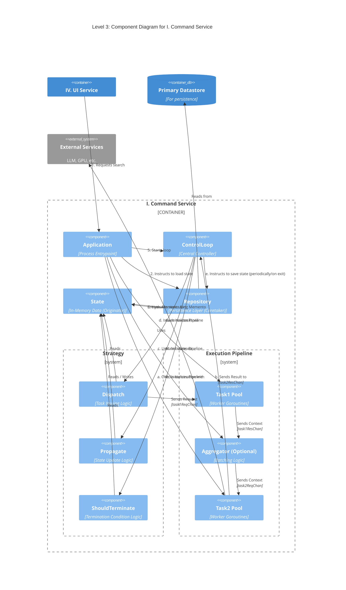
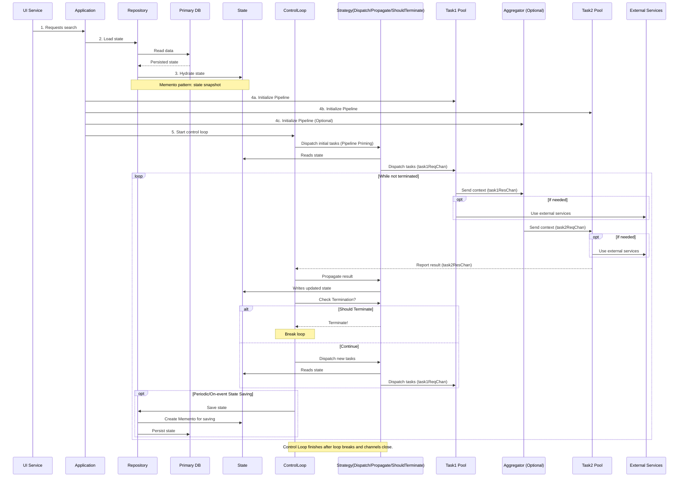

```mermaid
C4Component
    title Level 3: Component Diagram for I. Command Service

    %% --- External Dependencies & Actors ---
    Container(ui_service, "IV. UI Service")
    ContainerDb(primary_db, "Primary Datastore", "For persistence")
    System_Ext(external_services, "External Services", "LLM, GPU, etc.")

    Container_Boundary(command_service, "I. Command Service") {
        Component(application, "Application", "Process Entrypoint")
        Component(control_loop, "ControlLoop", "Central Controller")
        Component(state, "State", "In-Memory Data (Originator)")
        Component(repository, "Repository", "Persistence Layer (Caretaker)")

        Boundary(strategy, "Strategy") {
            Component(dispatch, "Dispatch", "Task Issuing Logic")
            Component(propagate, "Propagate", "State Update Logic")
            Component(should_terminate, "ShouldTerminate", "Termination Condition Logic")
        }
        
        Boundary(pipeline, "Execution Pipeline") {
            Component(task1_pool, "Task1 Pool", "Worker Goroutines")
            Component(aggregator, "Aggregator (Optional)", "Batching Logic")
            Component(task2_pool, "Task2 Pool", "Worker Goroutines")
        }
    }

    %% --- Initialization & Persistence Flow ---
    Rel(ui_service, application, "1. Requests search")
    Rel(application, repository, "2. Instructs to load state")
    Rel(repository, primary_db, "Reads from")
    Rel(repository, state, "3. Hydrates state using Memento")
    Rel(application, task1_pool, "4a. Initializes Pipeline")
    Rel(application, task2_pool, "4b. Initializes Pipeline")
    Rel(application, aggregator, "4c. Initializes Pipeline")
    Rel(application, control_loop, "5. Starts loop")


    %% --- Core Control Loop ---
    Rel(control_loop, should_terminate, "a. Checks termination with")
    Rel(control_loop, propagate, "c. Updates state via")
    Rel(control_loop, dispatch, "d. Issues new tasks via")
    Rel(control_loop, repository, "e. Instructs to save state (periodically/on exit)")


    %% --- State Access & Memento Pattern ---
    Rel(dispatch, state, "Reads")
    Rel(propagate, state, "Reads / Writes")
    Rel(should_terminate, state, "Reads")
    Rel_Back(state, repository, "Creates Memento for")
    

    %% --- Data Pipeline Flow ---
    Rel(dispatch, task1_pool, "Sends Request", "task1ReqChan")
    Rel(task1_pool, aggregator, "Sends Context", "task1ResChan")
    Rel(aggregator, task2_pool, "Sends Context", "task2ReqChan")
    Rel(task2_pool, control_loop, "b. Sends Result to", "task2ResChan")
    Rel(task2_pool, external_services, "Uses")
```

```mermaid
sequenceDiagram
    participant UI as UI Service
    participant App as Application
    participant Repo as Repository
    participant DB as Primary DB
    participant St as State
    participant CL as ControlLoop
    participant Str as Strategy(Dispatch/Propagate/ShouldTerminate)
    participant T1 as Task1 Pool
    participant Agg as Aggregator (Optional)
    participant T2 as Task2 Pool
    participant Ext as External Services

    %% Initialization flow
    UI->>App: 1. Requests search
    App->>Repo: 2. Load state
    Repo->>DB: Read data
    DB-->>Repo: Persisted state
    Repo->>St: 3. Hydrate state
    Note over Repo, St: Memento pattern: state snapshot
    App->>T1: 4a. Initialize Pipeline
    App->>T2: 4b. Initialize Pipeline
    App->>Agg: 4c. Initialize Pipeline (Optional)
    App->>CL: 5. Start control loop
    CL->>Str: Dispatch initial tasks (Pipeline Priming)
    Str->>St: Reads state
    Str->>T1: Dispatch tasks (task1ReqChan)

    %% Main Event-Driven Loop (Waits for results from T2)
    loop While not terminated
        %% Async pipeline processing leading to a result
        T1->>Agg: Send context (task1ResChan)
        opt If needed
            T1->>Ext: Use external services
        end
        Agg->>T2: Send context (task2ReqChan)
        opt If needed
            T2->>Ext: Use external services
        end
        
        %% Control loop reacts to a result
        T2-->>CL: Report result (task2ResChan)

        CL->>Str: Propagate result
        Str->>St: Writes updated state

        CL->>Str: Check Termination?
        alt Should Terminate
            Str-->>CL: Terminate!
            Note over CL: Break loop
        else Continue
            CL->>Str: Dispatch new tasks
            Str->>St: Reads state
            Str->>T1: Dispatch tasks (task1ReqChan)
        end

        opt Periodic/On-event State Saving
            CL->>Repo: Save state
            Repo->>St: Create Memento for saving
            Repo->>DB: Persist state
        end
    end
    Note over CL, Str: Control Loop finishes after loop breaks and channels close.
```