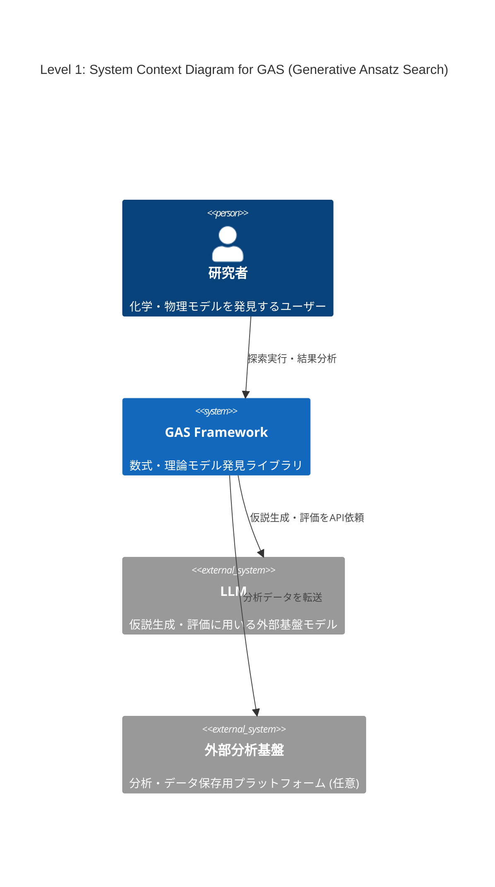
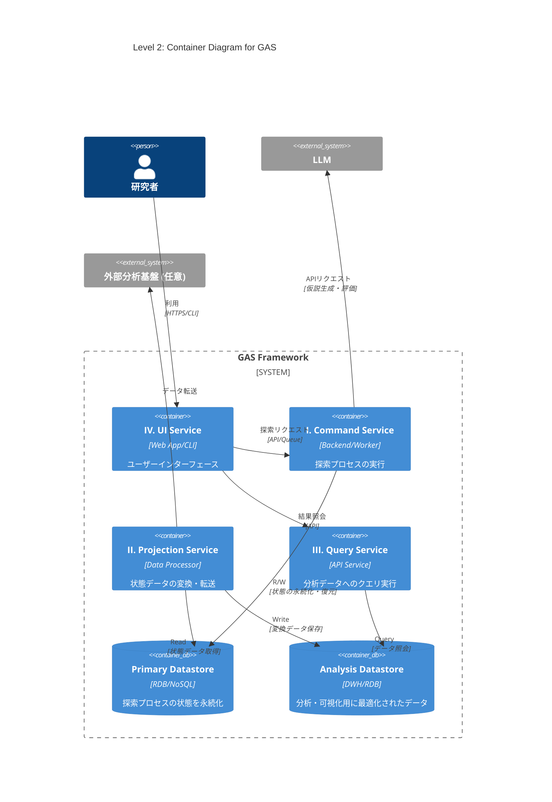
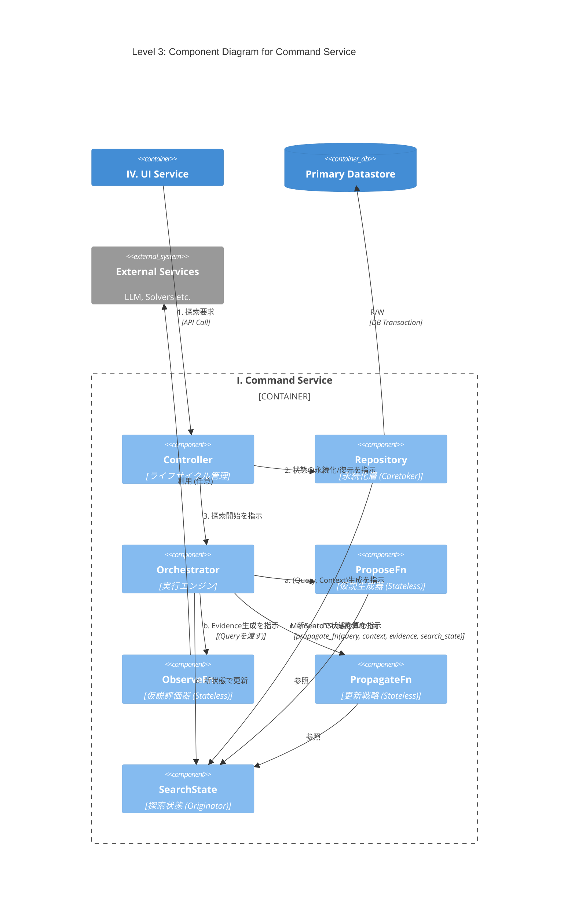
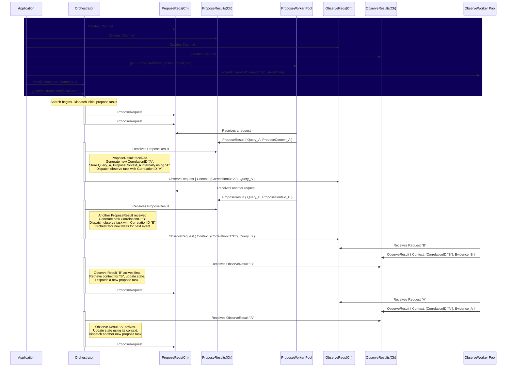

# C4 Model

## Level 1: System Context Diagram (システムコンテキスト図)

GASシステム、ユーザー（研究者）、主要な外部システムとの関係性を示す。

## Level 2: Container Diagram (コンテナ図)

GASライブラリを構成する4つのサービスと2つのデータストアをコンテナとして示す。

## Level 3: Component Diagram for Command Service

`Command Service`の内部コンポーネントと、`Orchestrator`が管理する状態遷移フローを示す。

# SequenceDiagram

