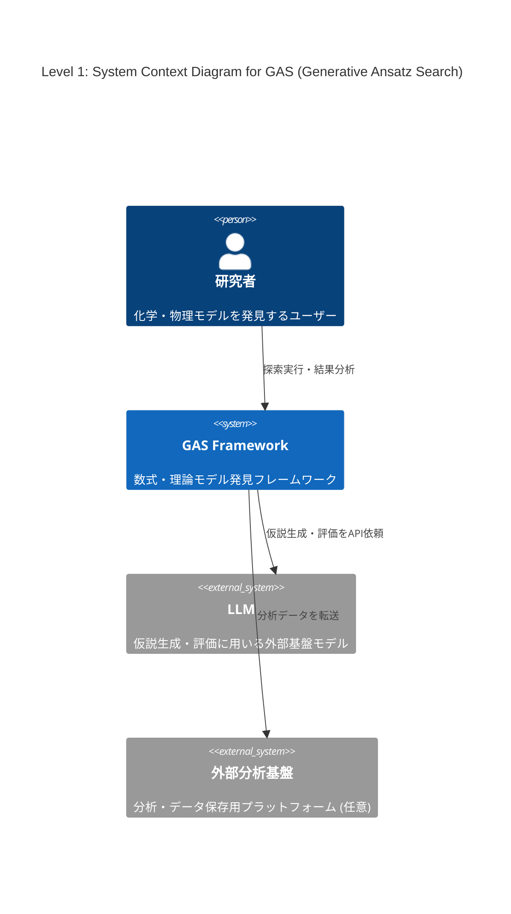
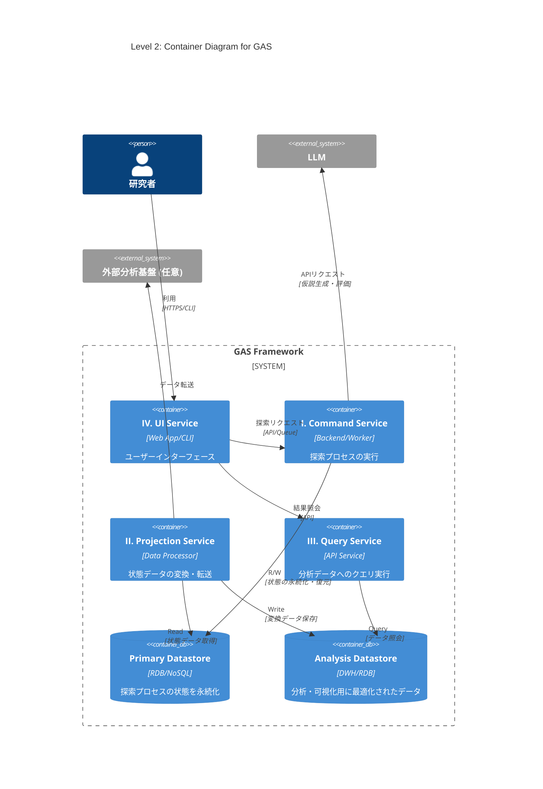
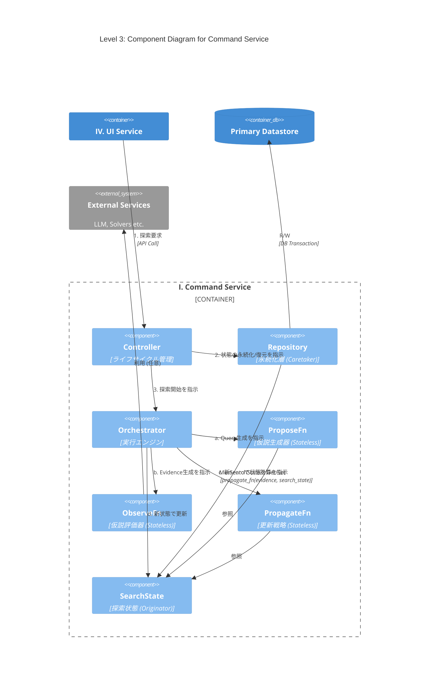

# 導入

最近LLMを用いた解の発見が流行っている、Alpha EvolveやDeep Researcher with Test-Time Diffusionなどがgoogleによって開発され、大成功を収めている。

このような手法のうち、化学・物理モデルの発見に特化したものの開発に取り組んでいる。

# Abstract

化学・物理モデルの発見では、データセットに適合する数式や微分方程式を構成することが目的である。

機械学習でブラックボックスモデルを構築することも可能だが、そうではなく、解釈可能な理論式を見つけたい。

データや理論値とのフィッティング度合いなどはある程度決定的に測れる。しかし、化学方程式の妥当性や微分方程式の近似解の発見など、計算精度だけが指標でない場合も多い。オッカムの剃刀の原則に則ったモデルのコンパクトさ（記述長）もまた、主要な指標となりうる。

先行研究で考案されている手法も様々であり、本稿では、できるだけ広いカバー範囲を持つフレームワークの構想を行う。

# フレームワーク設計案: Generative Ansatz Search (GAS)

様々な問題や探索手法に対応可能な、拡張性の高いモジュール式アーキテクチャを提案する。中核となる探索プロセスはストラテジーパターンを採用し、探索アルゴリズムの交換を容易にする。GASは、責務の異なる4つのサービスから構成される。

### I. Command Service: 探索プロセスの実行

仮説生成と評価のサイクルを駆動し、解を探索するメインサービス。`asyncio`を活用し、`ProposerFn`のLLM API呼び出しや`ObserveFn`のGPU計算といったI/Oバウンドなタスクを効率的に処理する。

* **`Controller` (システムのライフサイクル管理)**

    * **役割**: 探索プロセスのライフサイクル（開始、再開、中断、終了）と、状態永続化のタイミング（ポリシー）を管理する。
    * **実装**: 実行構成に基づき各コンポーネントを準備する。`Repository`を介して`SearchState`を初期化（新規作成またはDBから復元）後、`Orchestrator`に渡して探索を開始させる。定義されたポリシーに基づき`Repository`に永続化を指示する。

* **`Orchestrator` (実行エンジン)**

    * **役割**: 探索ループを駆動し、インメモリの`SearchState`を管理する。
    * **実装**: 以下の探索サイクルを駆動する。
      1.  `ProposeFn`を呼び出し、評価対象の仮説群 `Query` を得る。
      2.  `ObserveFn`を呼び出し、`Query`を評価して `Evidence` を得る。
      3.  `PropagateFn`を呼び出し、`Query`,`Evidence`,`SearchState`から次期`SearchState` を計算する。
      4. 自身の管理する状態を次期`SearchState`で更新する。

* **`ProposeFn` (仮説生成器)**

    * **役割**: `SearchState`に基づき、検証可能な仮説（Ansatz）の集合 `Query` を取得する。
    * **実装**: `SearchState`（例: 親個体群）を参照し、LLMなどを活用して新たな`Query`を生成する。状態の読み書きは行わないステートレスな関数として実装し、ExplorationとExploitationのバランスを調整する。

* **`ObserveFn` (仮説評価器)**

    * **役割**: 仮説群 `Query` を評価し、その結果(`Evidence`)を生成する。
    * **実装**: `Query`に対し、シミュレーションやデータフィッティングなどの定量的・定性的評価を実行する。状態の読み書きを行わないステートレスな関数である。

* **`PropagateFn` (更新戦略)**

    * **役割**: 評価対象となった仮説群 (`Query`)、その評価結果 (`Evidence`)、そして現行の`SearchState`に基づき、次期`SearchState`を計算する。
    * **実装**: ステートレス関数`new_search_state = propagate_fn(query, evidence, search_state)`として実装する。これにより状態管理が`Orchestrator`に集約され、状態遷移の予測可能性とテスト容易性が向上する。

* **`SearchState` (探索状態/Originator)**

    * **役割**: 探索プロセスにおける全状態（仮説、スコア、系統など）をインメモリで一元管理する。
    * **実装**: 状態のスナップショットとして`Memento`を生成、または`Memento`から状態を復元するインターフェースを提供し、永続化ロジックから自身を分離する。

* **`Repository` (永続化層/Caretaker)**
    * **役割**: `SearchState`の永続化と復元を担う。
    * **実装**: `Controller`の指示に基づき、`SearchState`から`Memento`を取得し、トランザクション内でデータベースに永続化する。また、データベースから`Memento`を復元し、`SearchState`を再構築する。

* **`Memento` (状態スナップショット)**
    * **役割**: `SearchState`の内部状態を保持するデータ転送オブジェクト(DTO)。
    * **実装**: ビジネスロジックを持たず、`SearchState`と`Repository`間の状態転送に特化する。

### II. Projection Service: データの変換・転送

`Repository`が永続化した状態データを、分析に適した形式（例: テーブル形式）へ変換し、外部のデータウェアハウスや分析基盤へ転送する。

### III. Query Service: 状態の照会・可視化

`Projection Service`が生成した分析用データストアに対し、ユーザーがクエリを発行し、探索の進捗や結果を可視化するためのAPIバックエンド。

### IV. UI Service: ユーザーインターフェース

`Command Service`へのリクエスト送信による探索の実行・管理と、`Query Service`の呼び出しによる結果の可視化・分析機能を提供するWebアプリケーションまたはCLI。

# C4 Model

## Level 1: System Context Diagram (システムコンテキスト図)

GASシステム、ユーザー（研究者）、主要な外部システムとの関係性を示す。



## Level 2: Container Diagram (コンテナ図)

GASフレームワークを構成する4つのサービスと2つのデータストアをコンテナとして示す。



## Level 3: Component Diagram for Command Service

`Command Service`の内部コンポーネントと、`Orchestrator`が管理する状態遷移フローを示す。



# PoC1: MCTS
```python
import math
import random
import time
from dataclasses import dataclass, field, replace
from typing import Any, Callable, Dict, List, Tuple
from enum import Enum, auto


# =========================================================================
# MCTS PoC for Markov Decision Process (MDP) - GridWorld
#
# GAS (Generative Ansatz Search)の設計思想に基づいたMCTS実装。
# =========================================================================

# --- I. 環境定義 (Environment Definition - GridWorld MDP) ---
class Action(Enum):
    UP = auto()
    DOWN = auto()
    LEFT = auto()
    RIGHT = auto()


@dataclass(frozen=True)
class GridState:
    """GridWorldの状態（エージェントの位置）。ハッシュ可能。"""
    x: int
    y: int


class GridWorldEnvironment:
    """決定論的なGridWorld環境。"""

    def __init__(self, width: int, height: int, start: GridState, goal: GridState, obstacles: set[GridState], move_cost: float, goal_reward: float):
        self.width = width
        self.height = height
        self.start = start
        self.goal = goal
        self.obstacles = obstacles
        self.move_cost = move_cost
        self.goal_reward = goal_reward
        self.actions = list(Action)

    def is_terminal(self, state: GridState) -> bool:
        return state == self.goal

    def get_actions(self, state: GridState) -> list[Action]:
        if self.is_terminal(state):
            return []
        return self.actions

    def transition(self, state: GridState, action: Action) -> Tuple[GridState, float]:
        """状態遷移関数 T(s, a) -> s', r"""
        if self.is_terminal(state):
            return state, 0.0

        next_x, next_y = state.x, state.y
        if action == Action.UP:
            next_y -= 1
        elif action == Action.DOWN:
            next_y += 1
        elif action == Action.LEFT:
            next_x -= 1
        elif action == Action.RIGHT:
            next_x += 1

        if (0 <= next_x < self.width and 0 <= next_y < self.height and
                GridState(next_x, next_y) not in self.obstacles):
            next_state = GridState(next_x, next_y)
        else:
            next_state = state

        reward = self.goal_reward if next_state == self.goal else self.move_cost
        return next_state, reward


def new_gridworld_environment() -> GridWorldEnvironment:
    """標準的なGridWorld環境のファクトリー関数"""
    width, height = 6, 6
    start = GridState(0, 0)
    goal = GridState(5, 5)
    obstacles = set()
    for i in range(0, 4):
        obstacles.add(GridState(1, i))
    for i in range(2, 6):
        obstacles.add(GridState(3, i))
    return GridWorldEnvironment(width, height, start, goal, obstacles, move_cost=-0.1, goal_reward=10.0)


# --- II. 状態とデータ構造 (State & Data Structures) ---
@dataclass(frozen=True)
class Stats:
    """統計情報 (N: 訪問回数, Q: 累積報酬値)"""
    N: int = 0
    Q: float = 0.0

    @property
    def average_Q(self) -> float:
        return self.Q / self.N if self.N > 0 else 0.0


@dataclass(frozen=True)
class MDPPath:
    """探索されたパス。(s0, a0, r1, s1, ...)"""
    states: List[GridState] = field(default_factory=list)
    actions: List[Action] = field(default_factory=list)
    rewards: List[float] = field(default_factory=list)

    def append_start(self, state: GridState):
        if self.states:
            raise ValueError("Start state already exists.")
        return replace(self, states=[state])

    def append_transition(self, action: Action, reward: float, next_state: GridState):
        return replace(self,
                       states=self.states + [next_state],
                       actions=self.actions + [action],
                       rewards=self.rewards + [reward])


@dataclass(frozen=True)
class SearchState:
    """探索プロセスの主要な状態。探索木の情報を不変オブジェクトとして保持する。"""
    iteration: int
    q_stats: Dict[Tuple[GridState, Action], Stats]
    n_stats: Dict[GridState, int]
    summary: Dict[str, Any] = field(default_factory=dict)

    def get_q_stats(self, state: GridState, action: Action) -> Stats:
        return self.q_stats.get((state, action), Stats())

    def get_n_stats(self, state: GridState) -> int:
        return self.n_stats.get(state, 0)


type Evidence = float
"""ObserveFnが返す評価結果。（シミュレーション結果）"""


# --- III. コア関数のインターフェース定義 (Refactored) ---
ProposeFn = Callable[[SearchState], MDPPath]
ObserveFn = Callable[[MDPPath], Evidence]
PropagateFn = Callable[[MDPPath, Evidence, SearchState], SearchState]


# --- IV. コンポーネント実装 (MCTS Implementation - Refactored) ---
class MCTSComponents:
    """MCTSのコアロジック（Propose, Observe, Propagate）を保持するクラス。
    環境(env)を内部に保持し、副作用のない関数群を生成する。"""

    def __init__(self, exploration_constant: float, discount_factor: float, max_depth: int, env: GridWorldEnvironment):
        self.C = exploration_constant
        self.gamma = discount_factor
        self.max_depth = max_depth
        self.env = env

    # --- ProposeFn (Selection & Expansion) ---
    def _calculate_ucb1(self, stats: Stats, parent_N: int) -> float:
        if stats.N == 0:
            return float('inf')
        if parent_N == 0:
            return stats.average_Q
        exploitation = stats.average_Q
        exploration = self.C * math.sqrt(math.log(parent_N) / stats.N)
        return exploitation + exploration

    def propose_fn(self, search_state: SearchState) -> MDPPath:
        """Selection & Expansion: UCB1に基づき探索木をたどり、パスを選択・展開する。"""
        current_state = self.env.start
        path = MDPPath().append_start(current_state)
        depth = 0

        while not self.env.is_terminal(current_state) and depth < self.max_depth:
            actions = self.env.get_actions(current_state)
            parent_N = search_state.get_n_stats(current_state)
            best_action = max(actions, key=lambda a: self._calculate_ucb1(
                search_state.get_q_stats(current_state, a), parent_N))

            is_expansion = search_state.get_q_stats(
                current_state, best_action).N == 0

            next_state, reward = self.env.transition(
                current_state, best_action)
            path = path.append_transition(best_action, reward, next_state)
            current_state = next_state
            depth += 1
            if is_expansion:
                break
        return path

    # --- ObserveFn (Simulation/Rollout) ---
    def observe_fn(self, path_candidate: MDPPath) -> Evidence:
        """Simulation (Default Policy): パスの先端からランダムポリシーでロールアウトし、報酬を見積もる。"""
        current_state = path_candidate.states[-1]
        G_rollout = 0.0
        depth = len(path_candidate.states) - 1
        rollout_step = 0

        while not self.env.is_terminal(current_state) and depth < self.max_depth:
            actions = self.env.get_actions(current_state)
            if not actions:
                break
            action = random.choice(actions)
            next_state, reward = self.env.transition(current_state, action)
            G_rollout += (self.gamma ** rollout_step) * reward
            current_state = next_state
            depth += 1
            rollout_step += 1
        return G_rollout

    # --- PropagateFn (Backpropagation) ---
    def propagate_fn(self, query: MDPPath, evidence: Evidence, search_state: SearchState) -> SearchState:
        """Backpropagation: シミュレーション結果を用いて新しいSearchStateを生成する。"""
        next_q_stats = search_state.q_stats.copy()
        next_n_stats = search_state.n_stats.copy()
        path = query  # Use the query directly
        G = evidence

        for i in range(len(path.actions) - 1, -1, -1):
            state, action, reward = path.states[i], path.actions[i], path.rewards[i]
            G = reward + self.gamma * G
            sa_pair = (state, action)
            current_q_stats = next_q_stats.get(sa_pair, Stats())
            new_q_stats = Stats(N=current_q_stats.N + 1,
                                Q=current_q_stats.Q + G)
            next_q_stats[sa_pair] = new_q_stats
            next_n_stats[state] = next_n_stats.get(state, 0) + 1

        summary = {"iteration": search_state.iteration +
                   1, "estimated_return": G}
        return SearchState(
            iteration=search_state.iteration + 1,
            q_stats=next_q_stats,
            n_stats=next_n_stats,
            summary=summary,
        )


def new_mcts_components(exploration_constant: float, discount_factor: float, max_depth: int, environment: GridWorldEnvironment) -> Tuple[ProposeFn, ObserveFn, PropagateFn]:
    """MCTSコンポーネントのファクトリ関数。
    環境を内包した関数群を返す。"""
    mcts = MCTSComponents(exploration_constant,
                          discount_factor, max_depth, environment)
    return mcts.propose_fn, mcts.observe_fn, mcts.propagate_fn


# --- V. 実行エンジン (Execution Engine) ---
class Orchestrator:
    """探索ループを駆動し、状態管理を一元的に行う。環境には依存しない。"""

    def run(self, propose_fn: ProposeFn, observe_fn: ObserveFn, propagate_fn: PropagateFn,
            initial_search_state: SearchState, max_iterations: int) -> SearchState:

        search_state = initial_search_state
        start_time = time.time()

        while search_state.iteration < max_iterations:
            query = propose_fn(search_state)
            evidence = observe_fn(query)
            search_state = propagate_fn(query, evidence, search_state)

            if (search_state.iteration % (max_iterations // 10 or 1) == 0) or search_state.iteration == max_iterations:
                print(
                    f"イテレーション: {search_state.iteration:04d} | "
                    f"今回の推定リターン(割引あり): {search_state.summary.get('estimated_return', 0.0):.4f}"
                )

        end_time = time.time()
        print(f"\n探索時間: {end_time - start_time:.4f} 秒")
        return search_state


# --- VI. 結果の解釈と可視化 (Interpretation & Visualization) ---
def get_best_plan(search_state: SearchState, environment: GridWorldEnvironment) -> Tuple[MDPPath, float]:
    """探索結果から、現在の最良のプラン（行動系列）を抽出する。"""
    current_state = environment.start
    path = MDPPath().append_start(current_state)
    total_reward = 0.0
    max_plan_depth = environment.width * environment.height

    while not environment.is_terminal(current_state) and len(path.actions) < max_plan_depth:
        actions = environment.get_actions(current_state)
        visitable_actions = [
            a for a in actions if search_state.get_q_stats(current_state, a).N > 0]
        if not visitable_actions:
            # 未到達のノードで探索が終了した場合
            break

        # 訪問回数が最も多い行動を選択する（より安定した方策）
        # best_action = max(visitable_actions, key=lambda a: search_state.get_q_stats(current_state, a).N)

        # Q値が最も高い行動を選択する（最も貪欲な方策）
        best_action = max(visitable_actions, key=lambda a: search_state.get_q_stats(
            current_state, a).average_Q)

        next_state, reward = environment.transition(current_state, best_action)
        path = path.append_transition(best_action, reward, next_state)
        total_reward += reward
        current_state = next_state
    return path, total_reward


def visualize_gridworld(env: GridWorldEnvironment, plan: MDPPath):
    print("\n--- GridWorld Visualization ---")
    grid = [['.' for _ in range(env.width)] for _ in range(env.height)]
    for obs in env.obstacles:
        grid[obs.y][obs.x] = '#'

    # 軌跡を描画
    for state in plan.states:
        if grid[state.y][state.x] == '.':
            grid[state.y][state.x] = '*'

    # スタートとゴールを上書き
    grid[env.start.y][env.start.x] = 'S'
    grid[env.goal.y][env.goal.x] = 'G'

    # 軌跡上のスタートとゴール
    if plan.states and plan.states[0] == env.start:
        grid[env.start.y][env.start.x] = 'S*'
    if plan.states and plan.states[-1] == env.goal:
        grid[env.goal.y][env.goal.x] = 'G*'

    for row in grid:
        print(" ".join(f"{cell:<2}" for cell in row))
    print("-----------------------------\n")


# --- VII. エントリーポイント (Entry Point) ---
def main_controller():
    """依存性を注入し、Orchestratorを実行するエントリーポイント。"""
    print("--- GAS PoC: MCTS on MDP (GridWorld) [Refactored] ---")

    # --- 1. 設定 (Configuration) ---
    SEED = 42
    MAX_ITERATIONS = 5000
    EXPLORATION_CONSTANT = 20.0
    DISCOUNT_FACTOR = 0.99
    MAX_DEPTH = 100
    random.seed(SEED)

    # --- 2. 依存関係の初期化 (Dependency Injection) ---
    environment = new_gridworld_environment()
    propose_fn, observe_fn, propagate_fn = new_mcts_components(
        exploration_constant=EXPLORATION_CONSTANT,
        discount_factor=DISCOUNT_FACTOR,
        max_depth=MAX_DEPTH,
        environment=environment
    )
    orchestrator = Orchestrator()
    initial_search_state = SearchState(iteration=0, q_stats={}, n_stats={})

    # --- 3. 探索プロセスの実行 (Execution) ---
    print(f"\n--- 探索開始 (最大 {MAX_ITERATIONS} イテレーション) ---")
    visualize_gridworld(environment, MDPPath())

    final_search_state = orchestrator.run(
        propose_fn=propose_fn,
        observe_fn=observe_fn,
        propagate_fn=propagate_fn,
        initial_search_state=initial_search_state,
        max_iterations=MAX_ITERATIONS,
    )

    # --- 4. 結果の解釈と表示 (Interpretation & Reporting) ---
    print("\n--- 探索終了 ---")
    final_plan, final_reward = get_best_plan(final_search_state, environment)

    print(f"発見した最良報酬（割引なし）: {final_reward:.4f}")
    print(f"最良プラン (行動系列): {[a.name for a in final_plan.actions]}")
    visualize_gridworld(environment, final_plan)


if __name__ == '__main__':
    main_controller()
```

# Your Task
現在は、壁への進行や後戻りやループなど、明らかに無駄な探索を含んでいます。
枝刈りした方がいいと思う。
