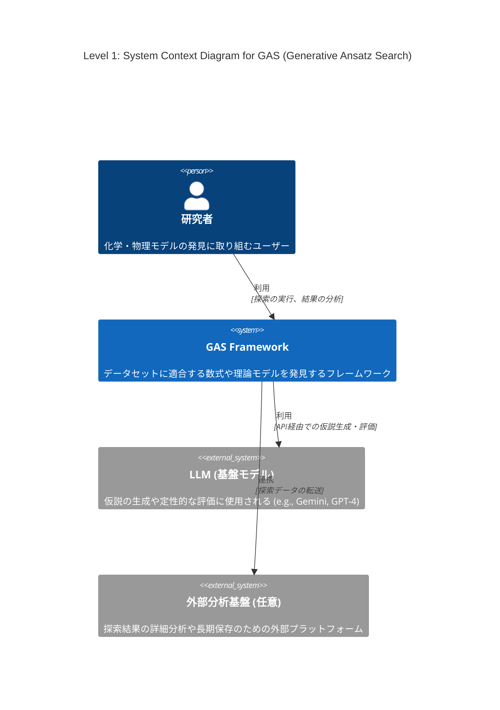
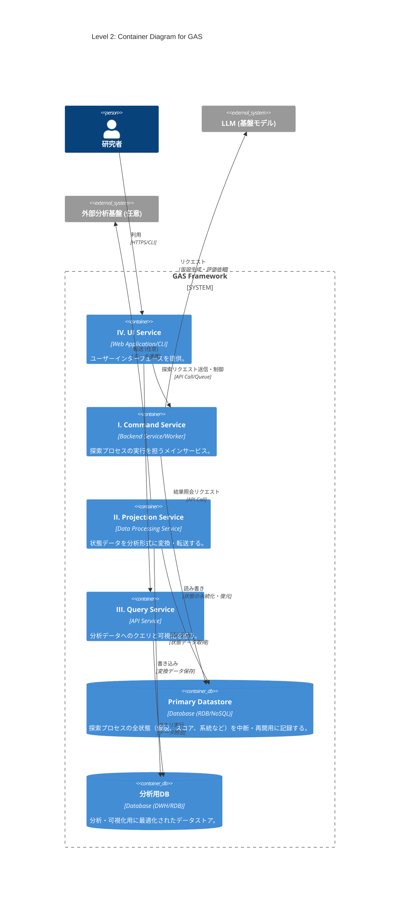
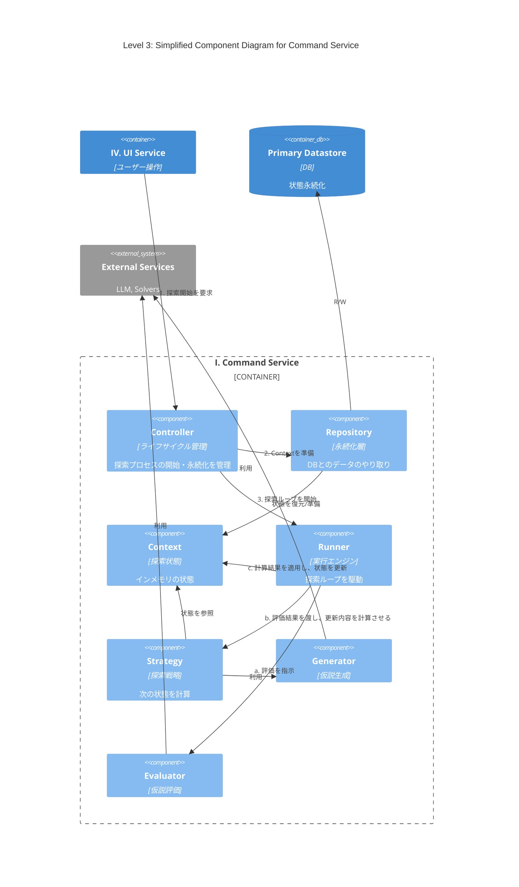

# 導入
最近LLMを用いた解の発見が流行っている、Alpha EvolveやDeep Researcher with Test-Time Diffusionなどがgoogleによって開発され、大成功を収めている

このような手法のうち、化学・物理モデルの発見に特化したものの開発に取り組んでいる

# Abstract

化学・物理モデルの発見ではデータセットに適合する数式や、微分方程式を構成することが目的である

機械学習でブラックボックスモデルを構築することも可能だが、そうではなく、意味のある理論式を見つけたい

データや理論値とのフィッティング度合いなどはある程度決定的に測れる

しかし化学方程式の場合や、微分方程式近似解の発見などで、計算精度だけが指標でない場合も多い

オッカムの剃刀の原則に則ったモデルのコンパクトさも主な指標となりうる

先行研究で考案されている手法も様々であり、私は今回、できるだけカバー範囲の広いフレームワークの構想を行っている

# フレームワーク設計案: Generative Ansatz Search (GAS)

様々な問題や探索手法に対応可能な、拡張性の高いモジュール式アーキテクチャを提案する。中核となる探索プロセスはストラテジーパターンを採用し、アルゴリズムの交換を容易にする。I ~ IVのインフラから構成することを考えている。

### I. Command Service: 探索プロセスの実行

仮説生成と評価のサイクルを駆動し、解を探索するメインサービス。`asyncio`を活用し、LLM APIやGPUなどのI/Oバウンドなタスクを効率的に処理する。ストラテジーパターンにより、多様な探索アルゴリズムに対応可能な設計を持つ。

* **`Controller` (システムのライフサイクル管理)**
    * **役割**: 探索プロセスのライフサイクル（開始、再開、中断、終了）と、状態永続化の**タイミング（ポリシー）**を管理する。
    * **実装**: 実行構成（戦略、パラメータ等）を準備し、`Repository`を介して`Context`を初期化（新規作成またはDBから復元）する。構成情報と`Context`を`Runner`に渡し、探索を開始させる。定期実行や終了時など、定義されたポリシーに基づき`Repository`へ永続化を指示する。

* **`Runner` (実行エンジン)**
    * **役割**: 評価と戦略実行のサイクルを駆動させることに特化したコンポーネント。
    * **実装**: `Controller`から`Strategy`と`Context`を受け取り、終了条件を満たすまで探索ループを駆動する。ループの各ステップで、**a. `Evaluator`による評価 → b. `Strategy`による更新内容の計算 → c. `Context`への適用**、というサイクルを実行する。状態管理の責務が`Runner`に集約される。

* **`Strategy` (探索戦略)**
    * **役割**: 遺伝的アルゴリズムやモンテカルロ木探索といった、特定の探索アルゴリズムの**核心ロジック**をカプセル化する。
    * **実装**: 探索の「1ステップ」における**状態遷移ロジック**を定義する`step`メソッドを持つ。`step`は現在の`Context`と`Evaluator`による評価結果を受け取り、`Generator`と協調して**状態の更新内容（updates）を計算し、それを返す**。`Context`の直接的な書き換えは行わず、計算に特化する（`optax`の設計思想に類似）。

* **`Generator` (仮説生成器)**
    * **役割**: 検証可能な仮説（Ansatz）を生成する**純粋な計算コンポーネント**。
    * **実装**: `Strategy`から**仮説生成に必要なデータ（例: 親となる個体群）**を受け取り、LLM等を活用して新たなAnsatzを生成し、その結果を`Strategy`に返す。状態の読み書きは直接行わない。

* **`Evaluator` (仮説評価器)**
    * **役割**: 与えられたAnsatzの有効性を評価する**純粋な計算コンポーネント**。
    * **実装**: `Runner`から**評価対象のAnsatz**を受け取り、定量的・定性的評価を実行してスコアを返す。状態の読み書きは直接行わない。
        * **定量的評価**: `optimizer`によるフィッティングや、`z3`等のSMTソルバーを用いた制約充足チェックを実行。
        * **定性的評価**: モデルの簡潔性や洞察などをLLMで評価。

* **`Context` (探索状態管理)**
    * **役割**: 探索プロセスの全状態（生成された仮説、スコア、系統など）をインメモリで一元管理する。
    * **実装**: 探索セッションの状態をカプセル化して保持する。自身の状態をスナップショット化する`Memento`オブジェクトを生成、または`Memento`から状態を復元するインターフェースを提供することで、永続化のロジックから分離されている (Originatorパターン)。

* **`Repository` (永続化層)**
    * **役割**: `Context`の永続化の**メカニズム**に特化したコンポーネント。
    * **実装**: `Controller`の指示に基づき、`Context`から`Memento`を取得し、データベースが扱いやすい形式にシリアライズして永続化する。逆に、データベースからデータを読み込み、`Memento`を介して`Context`の状態を復元する責務を持つ (Caretakerパターン)。

* **`Memento` (状態スナップショット)**
    * **役割**: 特定時点における`Context`の内部状態を保持するデータ転送オブジェクト(DTO)。
    * **実装**: 状態を保持するためのフィールドのみで構成され、ビジネスロジックは持たない。`Context`と`Repository`間の状態の受け渡しに用いられる。

## II. Projection Service: データの変換・転送

`Repository`が保存した状態データを、分析しやすい形式に変換したり、外部の分析基盤へ転送したりするサービス。

## III. Query Service: 状態の照会・可視化

Projectionされたデータに対して、人間が直接クエリを発行し、探索の進捗や結果を可視化・分析する。ProjectionされたDBへの認証情報などをもつバックエンド

## IV. UI Serivce: ユーザーインターフェース

Command Serivceにリクエストを送って探索してもらう。Query Serivceを呼び出して結果を確認する。

# C4 Model

## Level 1: System Context Diagram (システムコンテキスト図)

GASシステム全体の俯瞰図。システムがユーザー（研究者）や主要な外部システム（LLM、外部分析基盤）とどのように関わるかを示す。

## Level 2: Container Diagram (コンテナ図)

GASシステムを構成する主要な実行単位（コンテナ）を示します。設計案のI〜IVのサービスとデータストア（Primary Datastore、分析用DB）をコンテナとして定義している。

## Level 3: Component Diagram

「I. Command Service」コンテナ内部の構造を示す。`Controller`, `Search Engine`, `Generator`, `Evaluator`, `Context`といった主要コンポーネント間の連携を記述する。

