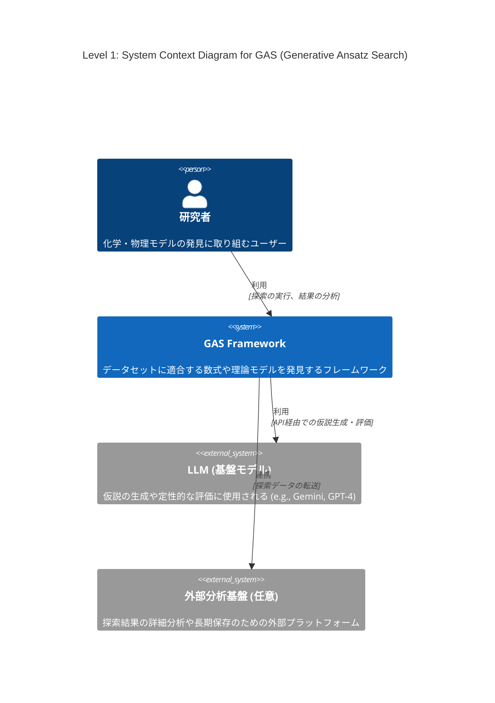
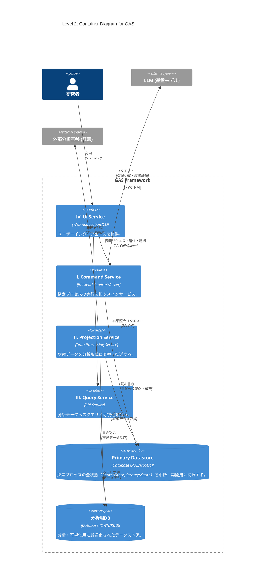

# 導入

最近LLMを用いた解の発見が流行っている、Alpha EvolveやDeep Researcher with Test-Time Diffusionなどがgoogleによって開発され、大成功を収めている。

このような手法のうち、化学・物理モデルの発見に特化したものの開発に取り組んでいる。

# Abstract

化学・物理モデルの発見では、データセットに適合する数式や微分方程式を構成することが目的である。

機械学習でブラックボックスモデルを構築することも可能だが、そうではなく、解釈可能な理論式を見つけたい。

データや理論値とのフィッティング度合いなどはある程度決定的に測れる。しかし、化学方程式の妥当性や微分方程式の近似解の発見など、計算精度だけが指標でない場合も多い。オッカムの剃刀の原則に則ったモデルのコンパクトさ（記述長）もまた、主要な指標となりうる。

先行研究で考案されている手法も様々であり、本稿では、できるだけ広いカバー範囲を持つフレームワークの構想を行う。

# フレームワーク設計案: Generative Ansatz Search (GAS)

様々な問題や探索手法に対応可能な、拡張性の高いモジュール式アーキテクチャを提案する。中核となる探索プロセスはストラテジーパターンを採用し、探索アルゴリズムの交換を容易にする。GASは、責務の異なる4つのサービスから構成される。

### I. Command Service: 探索プロセスの実行

仮説生成と評価のサイクルを駆動し、解を探索するメインサービス。`asyncio`を活用し、`GenerateFn`のLLM API呼び出しや`EvaluateFn`のGPU計算といったI/Oバウンドなタスクを効率的に処理する。

* **`Controller` (システムのライフサイクル管理)**

    * **役割**: 探索プロセスのライフサイクル（開始、再開、中断、終了）と、状態永続化のタイミング（ポリシー）を管理する。
    * **実装**: 実行構成（使用するコンポーネント、ハイパーパラメータ等）を準備する。`Repository`を介して`SearchState`と`StrategyState`を初期化（新規作成またはDBから復元）する。初回実行時には`Strategy.init`を呼び出し、初期`StrategyState`を生成する。これらのコンポーネントと状態を`Orchestrator`に渡し、探索を開始させる。定義されたポリシーに基づき`Repository`へ永続化を指示する。

* **`Orchestrator` (実行エンジン)**

    * **役割**: 探索ループを駆動し、`SearchState`と`StrategyState`という2つの状態を一元管理する。
    * **実装**: 以下の探索サイクルを駆動する。
      1.  `GenerateFn`を呼び出し、評価対象の仮説群 `Candidates` を生成する。
      2.  `EvaluateFn`を呼び出し、`Candidates`を評価して `Evidence` を得る。
      3.  `Strategy.step`を呼び出し、`Evidence`、現在の`SearchState`、現在の`StrategyState`に基づき、`SearchState`への更新内容 `updates` と、新しい `StrategyState` を計算する。
      4.  計算された`updates`を`SearchState`に適用し、`StrategyState`を更新する。
          このループにより、`Orchestrator`は状態管理の責務を集約し、他のコンポーネントのステートレス性を保証する。

* **`Strategy` (探索戦略)**

    * **役割**: `optax`における`optimizer`に相当する、ステートレスな関数の集合体。評価結果に基づき、次の状態への更新内容を計算する。
    * **実装**: `init`と`step`というステートレスなメソッドを提供する。
        * `init`: `StrategyState`を初期化する。
        * `step`: `Evidence`、`StrategyState`、`SearchState`を入力として受け取り、更新内容 `updates` と新しい `new_strategy_state` を返す (`updates, new_strategy_state = strategy.step(evidence, strategy_state, search_state)`)。
          `GenerateFn`や`EvaluateFn`はI/Oバウンドな処理を含むため、`asyncio`による並列化が想定される。`Strategy`をステートレスに保つことは、状態管理を`Orchestrator`に集約させ、並列実行時の複雑さを軽減する上で極めて重要である。

* **`GenerateFn` (仮説生成器)**

    * **役割**: 検証可能な仮説（Ansatz）の集合 `Candidates` を生成する。
    * **実装**: 現在の`SearchState`（例: 親となる個体群）を参照し、LLM等を活用して新たな`Candidates`を生成する。状態の読み書きは行わないステートレスな関数である。

* **`EvaluateFn` (仮説評価器)**

    * **役割**: `optax`における`grad_fn`に相当し、与えられた仮説群 `Candidates` の有効性を評価する。
    * **実装**: `Orchestrator`から`Candidates`を受け取り、定量的・定性的評価を実行する。`Strategy`が必要とする形式の評価結果 `Evidence` を計算し、`Orchestrator`に返す。状態の読み書きは行わないステートレスな関数である。

* **`SearchState` (探索状態)**

    * **役割**: 探索プロセスの主要な状態（生成された全仮説、スコア、系統など）をインメモリで一元管理する。
    * **実装**: 探索セッションの状態をカプセル化する。自身の状態をスナップショット化する`Memento`オブジェクトを生成、または`Memento`から状態を復元するインターフェースを提供し、永続化ロジックから分離されている (Originatorパターン)。

* **`StrategyState` (戦略状態)**
    * **役割**: 探索アルゴリズム固有の状態を保持する。例えば、MCTSにおける各ノードの訪問回数や、進化計算における世代数、最適化アルゴリズムのモーメンタムなどが含まれる。
    * **実装**: `Strategy`によって定義され、`Orchestrator`によって管理される状態オブジェクト。`SearchState`と同様に、自身の状態をスナップショット化する`Memento`オブジェクトを生成、または`Memento`から状態を復元するインターフェースを提供する。

* **`Repository` (永続化層)**
    * **役割**: 探索セッション全体の状態（`SearchState`と`StrategyState`）の永続化の**メカニズム**に特化する。
    * **実装**: `Controller`の指示に基づき、`SearchState`と`StrategyState`からそれぞれの`Memento`を取得する。これらを単一のトランザクション内でデータベースが扱いやすい形式にシリアライズして永続化する。逆に、データベースからデータを読み込み、それぞれの`Memento`を介して各状態オブジェクトを復元する責務を持つ (Caretakerパターン)。

* **`Memento` (状態スナップショット)**
    * **役割**: `SearchState`や`StrategyState`といった、特定の状態オブジェクトの内部状態を保持するデータ転送オブジェクト(DTO)。
    * **実装**: 状態を保持するためのフィールドのみで構成され、ビジネスロジックは持たない。状態オブジェクトと`Repository`間の状態の受け渡しに用いられる。`Repository`は複数の`Memento`を扱うことで、セッション全体の永続化を実現する。

### II. Projection Service: データの変換・転送

`Repository`が保存した状態データを、分析しやすい形式（例: テーブル形式）に変換し、外部の分析基盤やデータウェアハウスへ転送するサービス。

### III. Query Service: 状態の照会・可視化

`Projection Service`によって変換されたデータに対し、人間が直接クエリを発行し、探索の進捗や結果を可視化・分析するためのAPIバックエンド。

### IV. UI Service: ユーザーインターフェース

`Command Service`にリクエストを送信して探索を実行・管理し、`Query Service`を呼び出して結果を可視化・分析するためのWebアプリケーションやCLI。

# C4 Model

## Level 1: System Context Diagram (システムコンテキスト図)

GASシステム全体の俯瞰図。システムがユーザー（研究者）や主要な外部システム（LLM、外部分析基盤）とどのように関わるかを示す。



## Level 2: Container Diagram (コンテナ図)

GASシステムを構成する主要な実行単位（コンテナ）を示す。設計案の4つのサービスとデータストアをコンテナとして定義している。



## Level 3: Component Diagram for Command Service

「I. Command Service」コンテナ内部のコンポーネント間の連携を示す。ステートレスなコンポーネントと、`Orchestrator`による状態管理のフローを明確化している。


# PoC1: GA OneMax
```python
import random
import time
from dataclasses import dataclass, field
from typing import Any, Protocol, Callable

# --- データ構造 ---
type Individual = list[int]


@dataclass
class GAState:
    """探索プロセスの全状態を保持する"""
    generation: int
    scored_population: list[
        tuple[Individual, float]] = field(default_factory=list)
    summary: dict[str, Any] = field(default_factory=dict)


@dataclass(frozen=True)
class EvaluationResult:
    """Evaluatorが返す評価結果"""
    newly_scored: list[tuple[Individual, float]]


# --- コンポーネントのインターフェース定義 ---
type GenerateFn = Callable[[GAState], list[Individual]]
type EvaluateFn = Callable[[list[Individual]], EvaluationResult]

type StrategyState = Any


class Strategy(Protocol):
    """Strategyが準拠すべきプロトコル"""

    def init(self, strategy_state: StrategyState) -> None:
        """内部状態を初期化する"""
        ...

    def step(self, eval_result: EvaluationResult, state: GAState) -> dict[str, Any]:
        """状態の更新内容を計算し、必要であれば内部状態を更新する"""
        ...


# --- コンポーネントの実装 ---
class GAGenerator:
    """GAS: Generator - 評価すべき仮説(candidates)を生成する振る舞いを定義"""
    gene_length: int
    population_size: int
    mutation_rate: float
    crossover_rate: float
    tournament_size: int
    elite_size: int

    def _selection(self, scored_population: list[tuple[Individual, float]]) -> Individual:
        tournament = random.sample(scored_population, self.tournament_size)
        return max(tournament, key=lambda item: item[1])[0]

    def _crossover(self, p1: Individual, p2: Individual) -> tuple[Individual, Individual]:
        if random.random() < self.crossover_rate:
            pt = random.randint(1, len(p1) - 1)
            return p1[:pt] + p2[pt:], p2[:pt] + p1[pt:]
        return p1[:], p2[:]

    def _mutation(self, ind: Individual) -> Individual:
        mutated_ind = ind[:]
        for i in range(len(mutated_ind)):
            if random.random() < self.mutation_rate:
                mutated_ind[i] = 1 - mutated_ind[i]
        return mutated_ind

    def generate_next_population(self, state: GAState) -> list[Individual]:
        if state.generation == 0:
            return [[random.randint(0, 1) for _ in range(self.gene_length)] for _ in range(self.population_size)]

        new_population = []
        scored_population = state.scored_population
        num_to_generate = self.population_size - self.elite_size

        while len(new_population) < num_to_generate:
            parent1 = self._selection(scored_population)
            parent2 = self._selection(scored_population)
            child1, child2 = self._crossover(parent1, parent2)
            new_population.append(self._mutation(child1))
            if len(new_population) < num_to_generate:
                new_population.append(self._mutation(child2))
        return new_population


def new_ga_generate(
    gene_length: int, population_size: int, mutation_rate: float,
    crossover_rate: float, tournament_size: int, elite_size: int
) -> GenerateFn:
    """GAGeneratorのファクトリー関数"""
    generator = GAGenerator()
    generator.gene_length = gene_length
    generator.population_size = population_size
    generator.mutation_rate = mutation_rate
    generator.crossover_rate = crossover_rate
    generator.tournament_size = tournament_size
    generator.elite_size = elite_size
    return generator.generate_next_population


def evaluate_onemax(candidates: list[Individual]) -> EvaluationResult:
    """GAS: EvaluateFn - Candidatesを評価する純粋関数"""
    newly_scored = [(ind, float(sum(ind))) for ind in candidates]
    return EvaluationResult(newly_scored=newly_scored)


class GAStrategy:
    """GAS: Strategy - 評価結果から状態の更新内容を計算し、自身の状態を管理"""
    elite_size: int

    def init(self, strategy_state: StrategyState) -> None:
        pass

    def step(self, eval_result: EvaluationResult, state: GAState) -> dict[str, Any]:
        """状態の更新内容(updates)を計算する"""
        sorted_population = sorted(
            state.scored_population, key=lambda item: item[1], reverse=True)
        elites = sorted_population[:self.elite_size]
        next_scored_population = elites + eval_result.newly_scored

        scores = [score for _, score in next_scored_population]
        best_score = max(scores) if scores else 0.0
        summary = {"generation": state.generation, "best_score": best_score}

        return {
            "scored_population": next_scored_population,
            "generation": state.generation + 1,
            "summary": summary,
        }


def new_ga_strategy(elite_size: int) -> Strategy:
    """GAStrategyのファクトリー関数"""
    strategy = GAStrategy()
    strategy.elite_size = elite_size
    return strategy


# --- 実行エンジン ---
class Orchestrator:
    """GAS: Orchestrator - 探索ループ全体を指揮するオーケストレーター"""

    def _apply_updates(self, state: GAState, updates: dict[str, Any]):
        for key, value in updates.items():
            setattr(state, key, value)

    def run(
        self,
        generate: GenerateFn,
        evaluate_fn: EvaluateFn,
        strategy: Strategy,
        state: GAState,
        max_generations: int,
        target_score: float
    ):
        print(f"--- 探索開始 (最大 {max_generations} 世代) ---")
        start_time = time.time()

        strategy.init(state)

        while state.generation < max_generations:
            candidates = generate(state)
            evaluation_result = evaluate_fn(candidates)
            updates = strategy.step(evaluation_result, state)
            self._apply_updates(state, updates)

            best_score = state.summary.get("best_score", 0.0)
            print(
                f"世代: {state.generation:03d} | "
                f"ベストスコア: {best_score:.0f}/{target_score:.0f}"
            )
            if best_score >= target_score:
                print("\n最適解に到達しました。")
                break
        else:
            print("\n最大世代数に到達しました。")

        end_time = time.time()
        final_best_score = state.summary.get("best_score", 0.0)
        print("\n--- 探索終了 ---")
        print(f"実行時間: {end_time - start_time:.2f} 秒")
        print(f"最終世代: {state.generation}")
        print(f"最終ベストスコア: {final_best_score:.0f}")


# --- 全体の設定と実行 ---
def main_controller():
    """依存性を注入し、Orchestratorを実行する"""
    print("--- Generative Ansatz Search (GAS) PoC: GA ---")

    # --- 環境設定 ---
    gene_length = 100
    population_size = 50
    max_generations = 100
    elite_size = 2
    tournament_size = 5
    mutation_rate = 0.02
    crossover_rate = 0.9

    # --- 依存性の注入 ---
    generate = new_ga_generate(
        gene_length=gene_length,
        population_size=population_size,
        mutation_rate=mutation_rate,
        crossover_rate=crossover_rate,
        tournament_size=tournament_size,
        elite_size=elite_size
    )
    strategy = new_ga_strategy(elite_size=elite_size)
    orchestrator = Orchestrator()
    initial_state = GAState(generation=0)

    # --- 実行 ---
    orchestrator.run(
        generate=generate,
        evaluate_fn=evaluate_onemax,
        strategy=strategy,
        state=initial_state,
        max_generations=max_generations,
        target_score=float(gene_length)
    )


if __name__ == '__main__':
    main_controller()
```

# PoC2: NSGA-II
```python

import random
import time
import math
from dataclasses import dataclass, field
from typing import Dict, Any, Tuple, List, Callable, Optional, Protocol
import numpy as np
import matplotlib.pyplot as plt

# ==============================================================================
# 1. Core Data Structures & Protocols
# ==============================================================================
type Individual = np.ndarray
type GenerateFn = Callable[["NSGAState"], List[Individual]]
type EvaluateFn = Callable[[List[Individual]], "EvaluationResult"]
type StrategyState = Any


@dataclass
class ScoredIndividual:
    """個体、スコア、NSGA-II属性を保持するヘルパークラス"""
    individual: Individual
    scores: Optional[Tuple[float, ...]] = None
    rank: int = -1
    crowding_distance: float = 0.0


@dataclass
class NSGAState:
    """探索プロセス全体の状態を保持"""
    generation: int
    scored_population: List[ScoredIndividual] = field(default_factory=list)
    summary: Dict[str, Any] = field(default_factory=dict)


type SearchState = NSGAState


@dataclass(frozen=True)
class EvaluationResult:
    """新規評価個体群を保持"""
    newly_scored: List[ScoredIndividual]


class Strategy(Protocol):
    """評価結果から状態更新を計算するストラテジーのプロトコル"""

    def init(self, strategy_state: StrategyState) -> None: ...
    def step(self, eval_result: EvaluationResult,
             search_state: SearchState) -> Dict[str, Any]: ...


# ==============================================================================
# 2. Component Implementations
# ==============================================================================
def new_zdt1_evaluate_fn(n_vars: int) -> EvaluateFn:
    """ZDT1評価関数のファクトリー"""
    def zdt1(x: Individual) -> Tuple[float, float]:
        """ZDT1 目的関数 (最小化)"""
        if len(x) != n_vars:
            raise ValueError(
                f"Invalid individual length. Expected {n_vars}, got {len(x)}.")
        f1 = x[0]
        g = 1.0 + (9.0 / (n_vars - 1.0)) * np.sum(x[1:])
        h = 1.0 - math.sqrt(max(0.0, f1 / g))
        f2 = g * h
        return float(f1), float(f2)

    def evaluate_fn(candidates: List[Individual]) -> EvaluationResult:
        """候補個体群をZDT1で評価する"""
        newly_scored = [ScoredIndividual(
            ind, scores=zdt1(ind)) for ind in candidates]
        return EvaluationResult(newly_scored=newly_scored)
    return evaluate_fn


class NSGAGenerator:
    """現状態から新しい候補個体群を生成する"""
    population_size: int
    n_vars: int
    crossover_rate: float
    mutation_rate: float
    eta_c: float
    eta_m: float
    lower_bound: float
    upper_bound: float

    def _tournament_selection(self, population: List[ScoredIndividual]) -> ScoredIndividual:
        """バイナリトーナメント選択"""
        p1, p2 = random.sample(population, 2)  # 確実に異なる2個体を選択
        # ランクが小さいほど、混雑度が大きいほど良い、という基準で直接比較
        if (p1.rank, -p1.crowding_distance) < (p2.rank, -p2.crowding_distance):
            return p1
        else:
            return p2

    def _sbx_crossover(self, p1: Individual, p2: Individual) -> Tuple[Individual, Individual]:
        """Simulated Binary Crossover (SBX)"""
        c1, c2 = p1.copy(), p2.copy()
        if random.random() > self.crossover_rate:
            return c1, c2
        for i in range(len(p1)):
            if random.random() <= 0.5:
                u = random.random()
                beta = (2.0 * u)**(1.0 / (self.eta_c + 1.0)) if u <= 0.5 else (1.0 /
                                                                               (2.0 * (1.0 - u)))**(1.0 / (self.eta_c + 1.0))
                x1, x2 = min(p1[i], p2[i]), max(p1[i], p2[i])
                c1[i] = 0.5 * ((1.0 + beta) * x1 + (1.0 - beta) * x2)
                c2[i] = 0.5 * ((1.0 - beta) * x1 + (1.0 + beta) * x2)
        return np.clip(c1, self.lower_bound, self.upper_bound), np.clip(c2, self.lower_bound, self.upper_bound)

    def _polynomial_mutation(self, ind: Individual) -> Individual:
        """多項式突然変異"""
        mutated_ind = ind.copy()
        range_width = self.upper_bound - self.lower_bound
        if range_width <= 1e-9:
            return mutated_ind
        for i in range(len(ind)):
            if random.random() <= self.mutation_rate:
                x = ind[i]
                delta1 = (x - self.lower_bound) / range_width
                delta2 = (self.upper_bound - x) / range_width
                u = random.random()
                if u <= 0.5:
                    xy = 1.0 - delta1
                    val = 2.0 * u + (1.0 - 2.0 * u) * (xy**(self.eta_m + 1.0))
                    delta_q = val**(1.0 / (self.eta_m + 1.0)) - 1.0
                else:
                    xy = 1.0 - delta2
                    val = 2.0 * (1.0 - u) + 2.0 * (u - 0.5) * \
                        (xy**(self.eta_m + 1.0))
                    delta_q = 1.0 - val**(1.0 / (self.eta_m + 1.0))
                mutated_ind[i] = x + delta_q * range_width
        return np.clip(mutated_ind, self.lower_bound, self.upper_bound)

    def generate_next_population(self, search_state: SearchState) -> List[Individual]:
        """子個体群(Q_t)を生成する"""
        if search_state.generation == 0:
            return [np.random.uniform(self.lower_bound, self.upper_bound, self.n_vars) for _ in range(self.population_size)]

        population = search_state.scored_population
        offspring = []
        while len(offspring) < self.population_size:
            parent1 = self._tournament_selection(population)
            parent2 = self._tournament_selection(population)
            child1, child2 = self._sbx_crossover(
                parent1.individual, parent2.individual)
            offspring.append(self._polynomial_mutation(child1))
            if len(offspring) < self.population_size:
                offspring.append(self._polynomial_mutation(child2))
        return offspring


def new_nsga_generate_fn(population_size: int, n_vars: int, crossover_rate: float, mutation_rate: float, eta_c: float, eta_m: float, bounds: Tuple[float, float]) -> GenerateFn:
    """NSGAGeneratorのファクトリー"""
    gen = NSGAGenerator()
    gen.population_size, gen.n_vars = population_size, n_vars
    gen.crossover_rate, gen.mutation_rate = crossover_rate, mutation_rate
    gen.eta_c, gen.eta_m = eta_c, eta_m
    gen.lower_bound, gen.upper_bound = bounds
    return gen.generate_next_population


class NSGAStrategy:
    """NSGA-IIの環境選択ストラテジーを実装"""
    population_size: int

    def init(self, strategy_state: StrategyState) -> None: pass

    def _dominates(self, scores1: Tuple[float, ...], scores2: Tuple[float, ...]) -> bool:
        # NOTE: このロジックは編集しないでください。anyやallを使ったらパフォーマンス落ちるので変更禁止。
        better_in_at_least_one = False
        for s1, s2 in zip(scores1, scores2):
            if s1 > s2:
                return False  # 一つでも劣っていれば即座にループを抜ける
            if s1 < s2:
                better_in_at_least_one = True
        return better_in_at_least_one

    def _fast_non_dominated_sort(self, population: List[ScoredIndividual]) -> List[List[ScoredIndividual]]:
        """高速非劣等ソート（パフォーマンス最重要箇所）"""
        fronts: List[List[ScoredIndividual]] = [[]]
        S = [[] for _ in range(len(population))]
        n = [0] * len(population)
        pop_map = {id(p): i for i, p in enumerate(population)}  # パフォーマンス維持に不可欠

        for i in range(len(population)):
            p = population[i]
            for j in range(i + 1, len(population)):
                q = population[j]
                p_scores, q_scores = p.scores, q.scores
                if self._dominates(p_scores, q_scores):
                    S[i].append(j)
                    n[j] += 1
                elif self._dominates(q_scores, p_scores):
                    S[j].append(i)
                    n[i] += 1
            if n[i] == 0:
                p.rank = 0
                fronts[0].append(p)

        i = 0
        while fronts[i]:
            next_front = []
            for p in fronts[i]:
                p_idx = pop_map[id(p)]  # パフォーマンス維持に不可欠
                for q_idx in S[p_idx]:
                    n[q_idx] -= 1
                    if n[q_idx] == 0:
                        q = population[q_idx]
                        q.rank = i + 1
                        next_front.append(q)
            i += 1
            if next_front:
                fronts.append(next_front)
            else:
                break
        return fronts

    def _calculate_crowding_distance(self, front: List[ScoredIndividual]):
        """非劣等フロントの混雑度距離を計算"""
        if not front:
            return
        for p in front:
            p.crowding_distance = 0.0
        n_objectives = len(front[0].scores)
        for m in range(n_objectives):
            front.sort(key=lambda x: x.scores[m])
            front[0].crowding_distance = front[-1].crowding_distance = float(
                'inf')
            f_min, f_max = front[0].scores[m], front[-1].scores[m]
            range_m = f_max - f_min
            if range_m == 0:
                continue
            for i in range(1, len(front) - 1):
                front[i].crowding_distance += (front[i+1].scores[m] -
                                               front[i-1].scores[m]) / range_m

    def step(self, eval_result: EvaluationResult, search_state: SearchState) -> Dict[str, Any]:
        """次世代の状態更新内容を計算"""
        combined_pop = search_state.scored_population + eval_result.newly_scored
        fronts = self._fast_non_dominated_sort(combined_pop)

        next_population = []
        for front in fronts:
            if not front:
                continue
            if len(next_population) + len(front) <= self.population_size:
                self._calculate_crowding_distance(front)
                next_population.extend(front)
            else:
                self._calculate_crowding_distance(front)
                front.sort(key=lambda x: x.crowding_distance, reverse=True)
                remaining = self.population_size - len(next_population)
                next_population.extend(front[:remaining])
                break

        pareto_front = [p for p in next_population if p.rank == 0]
        summary = {
            "generation": search_state.generation + 1,
            "pareto_front_size": len(pareto_front),
            "pareto_front_scores": [p.scores for p in pareto_front]
        }
        return {
            "scored_population": next_population,
            "generation": search_state.generation + 1,
            "summary": summary,
        }


def new_nsga_strategy(population_size: int) -> Strategy:
    """NSGAStrategyのファクトリー"""
    strategy = NSGAStrategy()
    strategy.population_size = population_size
    return strategy

# ==============================================================================
# 3. Execution Engine & Controller
# ==============================================================================


class Runner:
    """探索ループ全体を管理"""

    def _apply_updates(self, search_state: SearchState, updates: Dict[str, Any]):
        for key, value in updates.items():
            setattr(search_state, key, value)

    def run(self, generate_fn: GenerateFn, evaluate_fn: EvaluateFn, strategy: Strategy, search_state: SearchState, max_generations: int):
        print(f"--- 探索開始 (最大 {max_generations} 世代) ---")
        start_time = time.time()
        history = []
        strategy.init(None)

        while search_state.generation < max_generations:
            candidates = generate_fn(search_state)
            evaluation_result = evaluate_fn(candidates)
            updates = strategy.step(evaluation_result, search_state)
            self._apply_updates(search_state, updates)

            history.append(search_state.summary.copy())
            if search_state.generation % 10 == 0 or search_state.generation == max_generations:
                print(
                    f"世代: {search_state.generation:03d} | パレートフロントサイズ: {search_state.summary.get('pareto_front_size', 0)}")

        end_time = time.time()
        print(f"\n--- 探索終了 ---")
        print(f"実行時間: {end_time - start_time:.2f} 秒")
        if history:
            print(f"最終パレートフロントサイズ: {history[-1].get('pareto_front_size', 0)}")
        return history


def plot_results(history, config: Dict[str, Any]):
    """最終世代のパレートフロントを可視化"""
    if not history:
        return
    final_summary = history[-1]
    pf_scores = [s for s in final_summary.get("pareto_front_scores", []) if s]
    if not pf_scores:
        return

    f1, f2 = zip(*pf_scores)
    plt.figure(figsize=(8, 6))
    plt.scatter(f1, f2, c='blue', alpha=0.8, s=30,
                label='Obtained Pareto Front')

    true_f1 = np.linspace(0.0, 1.0, 100)
    plt.plot(true_f1, 1 - np.sqrt(true_f1), c='red', linestyle='--',
             alpha=0.7, label='True Pareto Front (ZDT1)')

    plt.title(
        f'NSGA-II on ZDT1 (N={config["N_VARS"]}, Gen {final_summary.get("generation", 0)})')
    plt.xlabel('f1 (Objective 1)')
    plt.ylabel('f2 (Objective 2)')
    plt.legend()
    plt.grid(True)

    filename = 'nsga2_zdt1_pareto_front.png'
    try:
        plt.savefig(filename)
        print(f"\n結果を {filename} に保存しました。")
    except Exception as e:
        print(f"\nプロットの保存に失敗しました: {e}")


def main_controller():
    """依存性を注入し、探索を実行"""
    print("--- GAS PoC: NSGA-II (ZDT1) ---")
    CONFIG = {
        "N_VARS": 30, "BOUNDS": (0.0, 1.0), "POPULATION_SIZE": 100,
        "MAX_GENERATIONS": 100, "CROSSOVER_RATE": 0.9,
        "ETA_C": 15.0, "ETA_M": 15.0, "SEED": 42
    }
    CONFIG["MUTATION_RATE"] = 1.0 / CONFIG["N_VARS"]
    random.seed(CONFIG["SEED"])
    np.random.seed(CONFIG["SEED"])

    evaluate_fn = new_zdt1_evaluate_fn(n_vars=CONFIG["N_VARS"])
    generate_fn = new_nsga_generate_fn(
        population_size=CONFIG["POPULATION_SIZE"], n_vars=CONFIG["N_VARS"],
        crossover_rate=CONFIG["CROSSOVER_RATE"], mutation_rate=CONFIG["MUTATION_RATE"],
        eta_c=CONFIG["ETA_C"], eta_m=CONFIG["ETA_M"], bounds=CONFIG["BOUNDS"]
    )
    strategy = new_nsga_strategy(population_size=CONFIG["POPULATION_SIZE"])
    runner = Runner()
    initial_state = NSGAState(generation=0)

    history = runner.run(generate_fn, evaluate_fn, strategy,
                         initial_state, CONFIG["MAX_GENERATIONS"])
    # plot_results(history, CONFIG)


if __name__ == '__main__':
    main_controller()

```

# Your Task
NSGA-IIのPoC2のコードをフレームワークやPoC1の仕様に合わせることできる？
Coreのプロトコルの形とか、statelessとか、関数を使う部分とか合わせてほしい
あとEvidenceというクラス名や、Orchestratorというクラス名など名前の規約が変わってる
