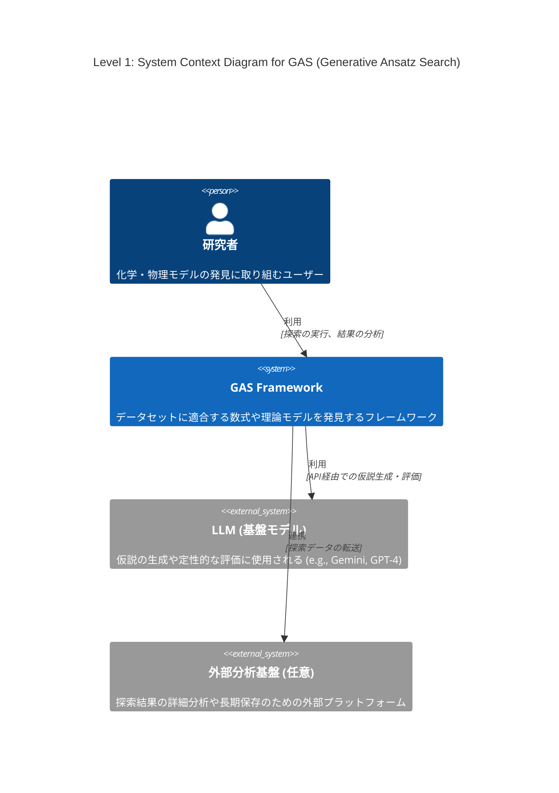
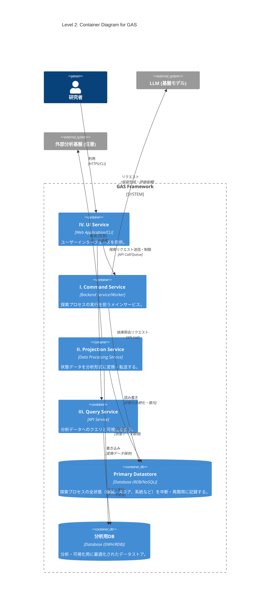

# 導入
最近LLMを用いた解の発見が流行っている、Alpha EvolveやDeep Researcher with Test-Time Diffusionなどがgoogleによって開発され、大成功を収めている

このような手法のうち、化学・物理モデルの発見に特化したものの開発に取り組んでいる

# Abstract

化学・物理モデルの発見ではデータセットに適合する数式や、微分方程式を構成することが目的である

機械学習でブラックボックスモデルを構築することも可能だが、そうではなく、意味のある理論式を見つけたい

データや理論値とのフィッティング度合いなどはある程度決定的に測れる

しかし化学方程式の場合や、微分方程式近似解の発見などで、計算精度だけが指標でない場合も多い

オッカムの剃刀の原則に則ったモデルのコンパクトさも主な指標となりうる

先行研究で考案されている手法も様々であり、私は今回、できるだけカバー範囲の広いフレームワークの構想を行っている

# フレームワーク設計案: Generative Ansatz Search (GAS)

様々な問題や探索手法に対応可能な、拡張性の高いモジュール式アーキテクチャを提案する。中核となる探索プロセスはストラテジーパターンを採用し、アルゴリズムの交換を容易にする。I ~ IVのインフラから構成することを考えている。

### I. Command Service: 探索プロセスの実行

仮説生成と評価のサイクルを駆動し、解を探索するメインサービス。`asyncio`を活用し、LLM APIやGPUなどのI/Oバウンドなタスクを効率的に処理する。ストラテジーパターンにより、多様な探索アルゴリズムに対応可能な設計を持つ。

* **`Controller` (システムのライフサイクル管理)**
    * **役割**: 探索プロセスのライフサイクル（開始、再開、中断、終了）と、状態永続化の**タイミング（ポリシー）**を管理する。
    * **実装**: 実行構成（使用するコンポーネント、ハイパーパラメータ等）を準備し、`Repository`を介して`State`を初期化（新規作成またはDBから復元）する。`Generator`, `Evaluator`, `Strategy` といったコンポーネント群、および`State`を`Runner`に渡し、探索を開始させる。定義されたポリシーに基づき`Repository`へ永続化を指示する。

* **`Runner` (実行エンジン)**
    * **役割**: 評価と戦略実行のサイクルを駆動させることに特化したコンポーネント。
    * **実装**: 終了条件を満たすまで探索ループを駆動する。ループの各ステップで、**1. `Generator`によるCandidates生成 → 2. `Evaluator`による評価 → 3. `Strategy`による更新内容の計算 → 4. `State`への適用**、というサイクルを実行する。状態管理の責務が`Runner`に集約される。

* **`Strategy` (探索戦略)**
    * **役割**: 評価結果に基づき、次の状態への**更新内容を計算する**、純粋な計算コンポーネント。`optax`における**`optimizer.update`（更新ルール）**に相当する。
    * **実装**: `Runner`から`EvaluationResult`（`grads`）と現在の`State`を受け取り、アルゴリズム固有のロジック（例: MCTSのBackpropagation、GAのエリート選択）に基づき、状態の更新内容（`updates`辞書）を計算して`Runner`に返す。状態の読み書きは直接行わない。

* **`Generator` (仮説生成器)**
    * **役割**: 検証可能な仮説（Ansatz）を生成する**純粋な計算コンポーネント**。
    * **実装**: `State`から**仮説生成に必要なデータ（例: 親となる個体群）**を参照し、LLM等を活用して新たなAnsatzを生成する。状態の読み書きは行わない。

* **`Evaluator` (仮説評価器)**
    * **役割**: 与えられた仮説`candidates`の有効性を評価する、純粋な計算コンポーネント。`optax`における**`grad_fn`（勾配計算関数）**に相当する。
    * **実装**: `Runner`から`Generator`が生成した仮説`candidates`を受け取り、定量的・定性的評価を実行する。`Strategy`が必要とする形式の評価結果を計算し、`Runner`に返す。状態の読み書きは直接行わない。

* **`State` (探索状態管理)**
    * **役割**: 探索プロセスの全状態（生成された仮説、スコア、系統など）をインメモリで一元管理する。
    * **実装**: 探索セッションの状態をカプセル化して保持する。自身の状態をスナップショット化する`Memento`オブジェクトを生成、または`Memento`から状態を復元するインターフェースを提供することで、永続化のロジックから分離されている (Originatorパターン)。

* **`Repository` (永続化層)**
    * **役割**: `State`の永続化の**メカニズム**に特化したコンポーネント。
    * **実装**: `Controller`の指示に基づき、`State`から`Memento`を取得し、データベースが扱いやすい形式にシリアライズして永続化する。逆に、データベースからデータを読み込み、`Memento`を介して`State`の状態を復元する責務を持つ (Caretakerパターン)。

* **`Memento` (状態スナップショット)**
    * **役割**: 特定時点における`State`の内部状態を保持するデータ転送オブジェクト(DTO)。
    * **実装**: 状態を保持するためのフィールドのみで構成され、ビジネスロジックは持たない。`State`と`Repository`間の状態の受け渡しに用いられる。

## II. Projection Service: データの変換・転送

`Repository`が保存した状態データを、分析しやすい形式に変換したり、外部の分析基盤へ転送したりするサービス。

## III. Query Service: 状態の照会・可視化

Projectionされたデータに対して、人間が直接クエリを発行し、探索の進捗や結果を可視化・分析する。ProjectionされたDBへの認証情報などをもつバックエンド

## IV. UI Serivce: ユーザーインターフェース

Command Serivceにリクエストを送って探索してもらう。Query Serivceを呼び出して結果を確認する。

# C4 Model

## Level 1: System Context Diagram (システムコンテキスト図)

GASシステム全体の俯瞰図。システムがユーザー（研究者）や主要な外部システム（LLM、外部分析基盤）とどのように関わるかを示す。



## Level 2: Container Diagram (コンテナ図)

GASシステムを構成する主要な実行単位（コンテナ）を示します。設計案のI〜IVのサービスとデータストア（Primary Datastore、分析用DB）をコンテナとして定義している。



## Level 3: Component Diagram

「I. Command Service」コンテナ内部の構造を示す。`Controller`, `Runner`, `Generator`, `Evaluator`, `State`といった主要コンポーネント間の連携を記述する。


# POC1: GA(OneMax)
```python
import random
import time
from dataclasses import dataclass, field
from typing import Dict, Any, Tuple, List

# ------------------------------------------------------------------------------
# I. 環境設定 (Environment / Problem Definition)
# ------------------------------------------------------------------------------
GENE_LENGTH = 100
POPULATION_SIZE = 50
MAX_GENERATIONS = 100
ELITE_SIZE = 2
TOURNAMENT_SIZE = 5
MUTATION_RATE = 0.02
CROSSOVER_RATE = 0.9

# ------------------------------------------------------------------------------
# II. State & Data Structures
# ------------------------------------------------------------------------------
Individual = List[int]


@dataclass
class GAState:
    """探索プロセスの全状態を保持する"""
    generation: int
    # 現世代の全個体とその評価スコア
    scored_population: List[Tuple[Individual, float]
                            ] = field(default_factory=list)
    # 各世代のサマリー情報
    summary: Dict[str, Any] = field(default_factory=dict)


@dataclass(frozen=True)
class EvaluationResult:
    """
    Evaluatorが返す評価結果。Strategyへの入力(grads相当)となる。
    """
    newly_scored: List[Tuple[Individual, float]]


# ------------------------------------------------------------------------------
# III. GAS Core Components
# ------------------------------------------------------------------------------
class GAGenerator:
    """
    GAS: Generator
    責務: 現在の状態(State)から、評価すべき仮説のバッチを生成する。
    GA実装: 現世代の評価済み個体群から、選択・交叉・突然変異を経て次世代の未評価個体群を生成する。
    """

    def __init__(self, mutation_rate: float, crossover_rate: float, tournament_size: int, elite_size: int):
        self.mutation_rate = mutation_rate
        self.crossover_rate = crossover_rate
        self.tournament_size = tournament_size
        self.elite_size = elite_size

    def _selection(self, scored_population: List[Tuple[Individual, float]]) -> Individual:
        tournament = random.sample(scored_population, self.tournament_size)
        return max(tournament, key=lambda item: item[1])[0]

    def _crossover(self, p1: Individual, p2: Individual) -> Tuple[Individual, Individual]:
        if random.random() < self.crossover_rate:
            pt = random.randint(1, len(p1) - 1)
            return p1[:pt] + p2[pt:], p2[:pt] + p1[pt:]
        return p1[:], p2[:]

    def _mutation(self, ind: Individual) -> Individual:
        mutated_ind = ind[:]
        for i in range(len(mutated_ind)):
            if random.random() < self.mutation_rate:
                mutated_ind[i] = 1 - mutated_ind[i]
        return mutated_ind

    def generate(self, state: GAState) -> List[Individual]:
        """次世代の評価対象となる個体群(candidates)を生成する"""
        if state.generation == 0:
            return [[random.randint(0, 1) for _ in range(GENE_LENGTH)] for _ in range(POPULATION_SIZE)]

        new_population = []
        scored_population = state.scored_population
        num_to_generate = POPULATION_SIZE - self.elite_size

        while len(new_population) < num_to_generate:
            parent1 = self._selection(scored_population)
            parent2 = self._selection(scored_population)
            child1, child2 = self._crossover(parent1, parent2)
            new_population.append(self._mutation(child1))
            if len(new_population) < num_to_generate:
                new_population.append(self._mutation(child2))

        return new_population


class OneMaxEvaluator:
    """
    GAS: Evaluator
    責務: Generatorが生成した仮説バッチを評価し、結果を返す。
    GA実装: 個体群(candidates)を受け取り、各個体の適応度を計算する。
    """

    def evaluate(self, candidates: List[Individual]) -> EvaluationResult:
        """個体群(candidates)を評価する"""
        newly_scored = [(ind, float(sum(ind)))
                        for ind in candidates]
        return EvaluationResult(newly_scored=newly_scored)


class GAStrategy:
    """
    GAS: Strategy
    責務: 評価結果と現在の状態から、状態の更新内容(updates)を計算する。
    GA実装: 現世代のエリート個体と、新たに評価された個体を結合し、次世代の評価済み個体群を構成する。
    """

    def __init__(self, elite_size: int):
        self.elite_size = elite_size

    def step(self, eval_result: EvaluationResult, state: GAState) -> Dict[str, Any]:
        """状態の更新内容(updates)を計算する"""
        sorted_population = sorted(
            state.scored_population, key=lambda item: item[1], reverse=True)
        elites = sorted_population[:self.elite_size]
        next_scored_population = elites + eval_result.newly_scored

        scores = [score for _, score in next_scored_population]
        best_score = max(scores) if scores else 0.0
        summary = {"generation": state.generation, "best_score": best_score}

        updates = {
            "scored_population": next_scored_population,
            "generation": state.generation + 1,
            "summary": summary,
        }
        return updates


# ------------------------------------------------------------------------------
# IV. Runner: 実行エンジン
# ------------------------------------------------------------------------------
class Runner:
    """
    GAS: Runner
    責務: 探索ループ全体を指揮するオーケストレーター。
    """

    def _apply_updates(self, state: GAState, updates: Dict[str, Any]):
        for key, value in updates.items():
            setattr(state, key, value)

    def run(
        self,
        generator: GAGenerator,
        evaluator: OneMaxEvaluator,
        strategy: GAStrategy,
        state: GAState,
        max_generations: int,
        target_score: float
    ):
        """
        探索ループを実行する。
        コンポーネントを個別の引数として受け取るように修正。
        """
        print(f"--- 探索開始 (最大 {max_generations} 世代) ---")
        start_time = time.time()
        best_score = 0.0

        while state.generation < max_generations:
            # --- 1. 仮説生成 (candidates Creation) ---
            candidates = generator.generate(state)

            # --- 2. 評価 (Gradient Calculation) ---
            evaluation_result = evaluator.evaluate(candidates)

            # --- 3. 更新内容の計算 (Optimizer Update) ---
            updates = strategy.step(evaluation_result, state)

            # --- 4. 適用 (Apply Updates) ---
            self._apply_updates(state, updates)

            # --- 5. ログ出力・終了判定 ---
            best_score = state.summary.get("best_score", 0.0)
            print(
                f"世代: {state.generation:03d} | "
                f"ベストスコア: {best_score:.0f}/{target_score:.0f}"
            )
            if best_score >= target_score:
                print("\n最適解に到達しました。")
                break

        if state.generation >= max_generations and best_score < target_score:
            print("\n最大世代数に到達しました。")

        end_time = time.time()
        final_best_score = state.summary.get("best_score", 0.0)
        print("\n--- 探索終了 ---")
        print(f"実行時間: {end_time - start_time:.2f} 秒")
        print(f"最終世代: {state.generation}")
        print(f"最終ベストスコア: {final_best_score:.0f}")


# ------------------------------------------------------------------------------
# V. Controller: 全体の設定と実行
# ------------------------------------------------------------------------------
def main_controller():
    """GAS: Controller (簡易版)"""
    print("--- Generative Ansatz Search (GAS) PoC: GA with Final Design ---")

    # 各コンポーネントを個別に初期化
    generator = GAGenerator(
        mutation_rate=MUTATION_RATE, crossover_rate=CROSSOVER_RATE,
        tournament_size=TOURNAMENT_SIZE, elite_size=ELITE_SIZE
    )
    evaluator = OneMaxEvaluator()
    strategy = GAStrategy(elite_size=ELITE_SIZE)
    runner = Runner()

    # 初期状態の定義
    initial_state = GAState(generation=0)

    # 実行: Runnerに各コンポーネントを直接渡す
    runner.run(
        generator=generator,
        evaluator=evaluator,
        strategy=strategy,
        state=initial_state,
        max_generations=MAX_GENERATIONS,
        target_score=float(GENE_LENGTH)
    )


if __name__ == '__main__':
    main_controller()

```

# PoC2: MCTS
```python
import math
import random
import time
from dataclasses import dataclass, field
from typing import Dict, Any, Tuple, List, Optional


# ------------------------------------------------------------------------------
# I. 環境設定 (Environment / Problem Definition)
# ------------------------------------------------------------------------------
@dataclass
class Node:
    """木のノード定義"""
    id: int
    reward: Optional[float] = None  # 葉ノードの場合のみ報酬を持つ
    children: List['Node'] = field(default_factory=list)

    def is_leaf(self) -> bool:
        return not self.children


def build_tree(depth: int, branching_factor: int, current_depth: int = 0, id_counter: int = 0) -> Tuple[Node, int]:
    """報酬がランダムな木を生成するヘルパー関数"""
    node = Node(id=id_counter)
    id_counter += 1
    if current_depth < depth:
        for _ in range(branching_factor):
            child, id_counter = build_tree(
                depth, branching_factor, current_depth + 1, id_counter)
            node.children.append(child)
    else:
        node.reward = random.random()
    return node, id_counter


class FixedTreeEnvironment:
    """固定された木構造の探索環境"""

    def __init__(self, tree_depth: int, branching_factor: int, seed: int = 42):
        self.tree_depth = tree_depth
        random.seed(seed)
        self.root, self.total_nodes = build_tree(tree_depth, branching_factor)
        self.best_reward = self._find_best_reward(self.root)

    def _find_best_reward(self, node: Node) -> float:
        """真の最大報酬を計算する（答え合わせ用）"""
        if node.is_leaf():
            return node.reward  # type: ignore
        return max(self._find_best_reward(child) for child in node.children)


# ------------------------------------------------------------------------------
# II. State & Data Structures
# ------------------------------------------------------------------------------
@dataclass(frozen=True)
class NodeStats:
    """各ノードの統計情報"""
    N: int = 0
    Q: float = 0.0


@dataclass
class MCTSState:
    """探索プロセスの全状態を保持する"""
    iteration: int
    tree_stats: Dict[int, NodeStats]
    summary: Dict[str, Any] = field(default_factory=dict)

    def get_stats(self, node_id: int) -> NodeStats:
        return self.tree_stats.get(node_id, NodeStats())


@dataclass(frozen=True)
class EvaluationResult:
    """
    Evaluatorが返す評価結果。Strategyへの入力(grads相当)となる。
    """
    path: List[Node]
    reward: float


# ------------------------------------------------------------------------------
# III. GAS Core Components
# ------------------------------------------------------------------------------
class MCTSGenerator:
    """
    GAS: Generator
    責務: 現在の状態(State)から、評価すべき仮説のバッチを生成する。
    optaxアナロジー: DataLoader / データ前処理
    MCTS実装: UCB1に基づき、次に探索すべき経路(path)を1つ生成する。
    """

    def __init__(self, exploration_constant: float):
        self.C = exploration_constant

    def _calculate_ucb1(self, child_stats: NodeStats, parent_N: int) -> float:
        if child_stats.N == 0:
            return float('inf')
        # 親の訪問回数が0の場合(ルートノードの初回)、探索項がlog(0)になるのを防ぐ
        if parent_N == 0:
            return child_stats.Q / child_stats.N
        exploitation = child_stats.Q / child_stats.N
        exploration = self.C * math.sqrt(math.log(parent_N) / child_stats.N)
        return exploitation + exploration

    def generate(self, state: MCTSState, environment: FixedTreeEnvironment) -> List[Node]:
        """仮説(path)を生成する"""
        node = environment.root
        path = [node]
        while not node.is_leaf():
            parent_N = state.get_stats(node.id).N

            # --- ERROR FIX ---
            # Nodeオブジェクトを辞書のキーとして使うとTypeErrorが発生するため修正。
            # 中間辞書を作成せず、max関数とlambda式で直接最もスコアの高い子ノードを選択する。
            best_child = max(
                node.children,
                key=lambda child: self._calculate_ucb1(
                    state.get_stats(child.id), parent_N)
            )

            node = best_child
            path.append(node)
        return path  # このpathが評価対象の"candidates"


class MCTSEvaluator:
    """
    GAS: Evaluator
    責務: Generatorが生成した仮説バッチを評価し、結果を返す。
    optaxアナロジー: grad_fn (勾配計算関数)
    MCTS実装: pathの終端ノードの報酬を観測(Simulation)し、更新に必要な情報を返す。
    """

    def evaluate(self, path_candidates: List[Node], environment: FixedTreeEnvironment) -> EvaluationResult:
        """仮説(path)を評価する"""
        leaf_node = path_candidates[-1]
        if not (leaf_node.is_leaf() and leaf_node.reward is not None):
            raise ValueError(
                "Evaluation path must end at a leaf node with a reward.")

        reward = leaf_node.reward
        return EvaluationResult(path=path_candidates, reward=reward)


class MCTSStrategy:
    """
    GAS: Strategy
    責務: 評価結果と現在の状態から、状態の更新内容(updates)を計算する。
    optaxアナロジー: optimizer.update (更新ルール)
    MCTS実装: 評価結果(pathとreward)に基づき、Backpropagation計算を行う。
    """

    def step(self, eval_result: EvaluationResult, state: MCTSState) -> Dict[str, Any]:
        """状態の更新内容(updates)を計算する"""
        next_tree_stats = state.tree_stats.copy()
        for node in eval_result.path:
            current_stats = state.get_stats(node.id)
            new_stats = NodeStats(
                N=current_stats.N + 1,
                Q=current_stats.Q + eval_result.reward
            )
            next_tree_stats[node.id] = new_stats

        summary = {"iteration": state.iteration,
                   "reward_obtained": eval_result.reward}
        updates = {
            "tree_stats": next_tree_stats,
            "iteration": state.iteration + 1,
            "summary": summary,
        }
        return updates


# ------------------------------------------------------------------------------
# IV. Runner: 実行エンジン
# ------------------------------------------------------------------------------
class Runner:
    """
    GAS: Runner
    責務: 探索ループ全体を指揮するオーケストレーター。
    optaxアナロジー: Training Loop
    """

    def _apply_updates(self, state: MCTSState, updates: Dict[str, Any]):
        """計算された更新内容を状態にアトミックに適用する"""
        for key, value in updates.items():
            setattr(state, key, value)

    def _get_best_path(self, state: MCTSState, environment: FixedTreeEnvironment) -> Tuple[List[Node], float]:
        """現在の統計情報から最も有望な経路を選択する"""
        node = environment.root
        path = [node]
        while not node.is_leaf():
            visitable_children = [
                c for c in node.children if state.get_stats(c.id).N > 0]
            if not visitable_children:
                break

            best_child = max(
                visitable_children,
                key=lambda c: state.get_stats(
                    c.id).Q / state.get_stats(c.id).N
            )
            node = best_child
            path.append(node)

        return (path, path[-1].reward if path[-1].reward is not None else 0.0) if path[-1].is_leaf() else (path, 0.0)

    def run(self, generator: MCTSGenerator, evaluator: MCTSEvaluator, strategy: MCTSStrategy, state: MCTSState, environment: FixedTreeEnvironment, max_iterations: int):
        print(f"--- 探索開始 (最大 {max_iterations} イテレーション) ---")
        print(
            f"環境: 深さ={environment.tree_depth}, ノード数={environment.total_nodes}")
        print(f"目標（真の最大報酬）: {environment.best_reward:.4f}")
        start_time = time.time()

        while state.iteration < max_iterations:
            # --- 1. 仮説生成 (candidates Creation) ---
            path_candidates = generator.generate(state, environment)

            # --- 2. 評価 (Gradient Calculation) ---
            evaluation_result = evaluator.evaluate(
                path_candidates, environment)

            # --- 3. 更新内容の計算 (Optimizer Update) ---
            updates = strategy.step(evaluation_result, state)

            # --- 4. 適用 (Apply Updates) ---
            self._apply_updates(state, updates)

            # --- 5. ログ出力 ---
            if (state.iteration % (max_iterations // 10 or 1) == 0) or state.iteration == max_iterations:
                _, best_reward = self._get_best_path(state, environment)
                print(
                    f"イテレーション: {state.iteration:04d} | "
                    f"今回の報酬: {state.summary['reward_obtained']:.4f} | "
                    f"現在の推定最良報酬: {best_reward:.4f}"
                )

        end_time = time.time()
        final_path, final_reward = self._get_best_path(state, environment)
        print("\n--- 探索終了 ---")
        print(f"実行時間: {end_time - start_time:.4f} 秒")
        print(
            f"発見した最良報酬: {final_reward:.4f} (目標: {environment.best_reward:.4f})")
        print(f"最良経路 (Node IDs): {[node.id for node in final_path]}")


# ------------------------------------------------------------------------------
# V. Controller: 全体の設定と実行
# ------------------------------------------------------------------------------
def main_controller():
    """GAS: Controller (簡易版)"""
    print("--- Generative Ansatz Search (GAS) PoC: MCTS with Final Design ---")

    # 設定
    TREE_DEPTH = 8
    BRANCHING_FACTOR = 2
    MAX_ITERATIONS = 200
    EXPLORATION_CONSTANT = math.sqrt(2)

    # 環境の初期化
    environment = FixedTreeEnvironment(TREE_DEPTH, BRANCHING_FACTOR)

    # 各コンポーネント(インフラ)の初期化と集約
    generator = MCTSGenerator(exploration_constant=EXPLORATION_CONSTANT)
    evaluator = MCTSEvaluator()
    strategy = MCTSStrategy()

    # 初期状態の定義
    initial_state = MCTSState(iteration=0, tree_stats={})

    # 実行エンジンの初期化と実行
    runner = Runner()
    runner.run(
        generator=generator,
        evaluator=evaluator,
        strategy=strategy,
        state=initial_state,
        environment=environment,
        max_iterations=MAX_ITERATIONS
    )


if __name__ == '__main__':
    main_controller()
```

# PoC3: NSGA-II
```python
import random
import time
import math
from dataclasses import dataclass, field
from typing import Dict, Any, Tuple, List, Callable, Optional
import numpy as np
import matplotlib.pyplot as plt

# ------------------------------------------------------------------------------
# I. 環境設定 (Environment / Problem Definition) - ZDT1
# ------------------------------------------------------------------------------
# ZDT1 パラメータ
N_VARS = 30  # 変数の数
BOUNDS = (0.0, 1.0)  # 変数の範囲

# NSGA-II ハイパーパラメータ
POPULATION_SIZE = 100
MAX_GENERATIONS = 100  # PoCの世代数
CROSSOVER_RATE = 0.9
MUTATION_RATE = 1.0 / N_VARS
# SBXと多項式突然変異の分布指数
ETA_C = 15.0
ETA_M = 15.0


def zdt1(x: np.ndarray) -> Tuple[float, float]:
    """ZDT1 目的関数 (最小化)"""
    # f1(x) = x[0]
    f1 = x[0]
    # g(x) = 1 + 9/(n-1) * sum(x_i) for i=2 to n
    g = 1.0 + (9.0 / (N_VARS - 1.0)) * np.sum(x[1:])
    # h(x) = 1 - sqrt(f1/g). g >= 1.0.
    h = 1.0 - math.sqrt(f1 / g)
    # f2(x) = g(x) * h(x)
    f2 = g * h
    return float(f1), float(f2)


# ------------------------------------------------------------------------------
# II. State & Data Structures
# ------------------------------------------------------------------------------
# 個体は遺伝子ベクトル (numpy配列)
Individual = np.ndarray


@dataclass
class ScoredIndividual:
    """個体とその評価値、NSGA-IIの属性を保持するヘルパークラス"""
    individual: Individual
    scores: Optional[Tuple[float, ...]] = None
    rank: int = -1
    crowding_distance: float = 0.0


@dataclass
class NSGAState:
    """GAS: State。探索プロセスの全状態を保持する。"""
    generation: int
    # 現世代の評価済み個体群 (P_t)
    scored_population: List[ScoredIndividual] = field(default_factory=list)
    summary: Dict[str, Any] = field(default_factory=dict)


@dataclass(frozen=True)
class EvaluationResult:
    """GAS: EvaluationResult。新たに評価された子個体群 (Q_t)"""
    newly_scored: List[ScoredIndividual]


# ------------------------------------------------------------------------------
# III. GAS Core Components
# ------------------------------------------------------------------------------
class NSGAGenerator:
    """
    GAS: Generator
    責務: State(P_t)から、評価すべき仮説のバッチ（子個体群 Q_t）を生成する。
    """

    def __init__(self, crossover_rate: float, mutation_rate: float, eta_c: float, eta_m: float, bounds: Tuple[float, float]):
        self.crossover_rate = crossover_rate
        self.mutation_rate = mutation_rate
        self.eta_c = eta_c
        self.eta_m = eta_m
        self.lower_bound, self.upper_bound = bounds

    def _tournament_selection(self, population: List[ScoredIndividual]) -> ScoredIndividual:
        """混雑度トーナメント選択 (バイナリトーナメント)"""
        p1 = random.choice(population)
        p2 = random.choice(population)

        # ランク優先、次に混雑度距離優先
        if p1.rank < p2.rank:
            return p1
        elif p2.rank < p1.rank:
            return p2
        elif p1.crowding_distance > p2.crowding_distance:
            return p1
        else:
            return p2

    def _sbx_crossover(self, p1: Individual, p2: Individual) -> Tuple[Individual, Individual]:
        """Simulated Binary Crossover (SBX)"""
        c1, c2 = p1.copy(), p2.copy()
        if random.random() <= self.crossover_rate:
            for i in range(len(p1)):
                if random.random() <= 0.5:
                    u = random.random()
                    if u <= 0.5:
                        beta = (2.0 * u)**(1.0 / (self.eta_c + 1.0))
                    else:
                        # uが1.0に近い場合の数値的安定性を考慮
                        if u >= 1.0 - 1e-9:
                            beta = 1.0
                        else:
                            beta = (1.0 / (2.0 * (1.0 - u))
                                    )**(1.0 / (self.eta_c + 1.0))

                    x1 = min(p1[i], p2[i])
                    x2 = max(p1[i], p2[i])
                    c1[i] = 0.5 * ((x1 + x2) - beta * (x2 - x1))
                    c2[i] = 0.5 * ((x1 + x2) + beta * (x2 - x1))

        # 境界内にクリップ
        c1 = np.clip(c1, self.lower_bound, self.upper_bound)
        c2 = np.clip(c2, self.lower_bound, self.upper_bound)
        return c1, c2

    def _polynomial_mutation(self, ind: Individual) -> Individual:
        """多項式突然変異"""
        mutated_ind = ind.copy()
        for i in range(len(ind)):
            if random.random() <= self.mutation_rate:
                u = random.random()
                if u <= 0.5:
                    delta = (2.0 * u)**(1.0 / (self.eta_m + 1.0)) - 1.0
                else:
                    delta = 1.0 - (2.0 * (1.0 - u))**(1.0 / (self.eta_m + 1.0))
                mutated_ind[i] = ind[i] + delta

        # 境界内にクリップ
        mutated_ind = np.clip(mutated_ind, self.lower_bound, self.upper_bound)
        return mutated_ind

    def generate(self, state: NSGAState) -> List[Individual]:
        """子個体群(Q_t)を生成する"""
        # 初期世代 (Gen 0)
        if state.generation == 0:
            return [np.random.uniform(self.lower_bound, self.upper_bound, N_VARS) for _ in range(POPULATION_SIZE)]

        # 第1世代以降
        population = state.scored_population
        new_population = []

        while len(new_population) < POPULATION_SIZE:
            parent1 = self._tournament_selection(population)
            parent2 = self._tournament_selection(population)
            child1, child2 = self._sbx_crossover(
                parent1.individual, parent2.individual)
            new_population.append(self._polynomial_mutation(child1))
            if len(new_population) < POPULATION_SIZE:
                new_population.append(self._polynomial_mutation(child2))

        return new_population


class ZDT1Evaluator:
    """
    GAS: Evaluator
    責務: 仮説バッチ(Q_t)を評価し、結果を返す。
    """

    def __init__(self, objective_fn: Callable[[Individual], Tuple[float, ...]]):
        self.objective_fn = objective_fn

    def evaluate(self, candidates: List[Individual]) -> EvaluationResult:
        newly_scored = []
        for ind in candidates:
            scores = self.objective_fn(ind)
            newly_scored.append(ScoredIndividual(
                individual=ind, scores=scores))
        return EvaluationResult(newly_scored=newly_scored)


class NSGAStrategy:
    """
    GAS: Strategy
    責務: 評価結果と現在の状態から、状態の更新内容(updates)を計算する。
    実装: P_tとQ_tを結合し(R_t)、非劣等ソートと混雑度距離を用いて次世代(P_t+1)を選択する。
    """

    def __init__(self, population_size: int):
        self.population_size = population_size

    def _dominates(self, scores1: Tuple[float, ...], scores2: Tuple[float, ...]) -> bool:
        """scores1がscores2を支配しているか判定する (最小化)"""
        better_in_at_least_one = False
        for s1, s2 in zip(scores1, scores2):
            if s1 > s2:
                return False
            if s1 < s2:
                better_in_at_least_one = True
        return better_in_at_least_one

    def _fast_non_dominated_sort(self, population: List[ScoredIndividual]) -> List[List[ScoredIndividual]]:
        """高速非劣等ソート (FNDS)"""
        fronts = [[]]
        S = [[] for _ in range(len(population))]  # S[i]: 個体iが支配するインデックスリスト
        n = [0] * len(population)  # n[i]: 個体iを支配する個体の数

        # オブジェクトIDからインデックスへのマッピング
        pop_map = {id(p): i for i, p in enumerate(population)}

        # 支配関係の計算と第1フロントの特定
        for i, p in enumerate(population):
            for j, q in enumerate(population):
                if i == j:
                    continue
                if self._dominates(p.scores, q.scores):  # type: ignore
                    S[i].append(j)
                elif self._dominates(q.scores, p.scores):  # type: ignore
                    n[i] += 1

            if n[i] == 0:
                p.rank = 0  # ランク0が最良
                fronts[0].append(p)

        # 第2フロント以降の計算
        i = 0
        # ループ条件：インデックスがリストの範囲内であることを確認
        while i < len(fronts):
            current_front = fronts[i]
            if not current_front:
                break

            next_front = []
            for p in current_front:
                p_idx = pop_map[id(p)]
                for q_idx in S[p_idx]:
                    n[q_idx] -= 1
                    if n[q_idx] == 0:
                        q = population[q_idx]
                        q.rank = i + 1
                        next_front.append(q)

            if next_front:
                fronts.append(next_front)

            i += 1

        return fronts

    def _calculate_crowding_distance(self, front: List[ScoredIndividual]):
        """混雑度距離の計算"""
        if not front:
            return

        for p in front:
            p.crowding_distance = 0.0

        n_objectives = len(front[0].scores)  # type: ignore

        for m in range(n_objectives):
            front.sort(key=lambda x: x.scores[m])  # type: ignore

            # 両端には無限大の距離を割り当てる
            front[0].crowding_distance = float('inf')
            front[-1].crowding_distance = float('inf')

            f_min = front[0].scores[m]  # type: ignore
            f_max = front[-1].scores[m]  # type: ignore
            range_m = f_max - f_min

            if range_m == 0:
                continue

            # 中間の個体の距離を計算 (正規化)
            for i in range(1, len(front) - 1):
                front[i].crowding_distance += \
                    (front[i+1].scores[m] -  # type: ignore
                     front[i-1].scores[m]) / range_m  # type: ignore

    def step(self, eval_result: EvaluationResult, state: NSGAState) -> Dict[str, Any]:
        """状態の更新内容(updates)を計算する。"""

        # 1. 親(P_t)と子(Q_t)を結合 (R_t)
        combined_population = state.scored_population + eval_result.newly_scored

        # 2. R_tに対して高速非劣等ソートを実行
        fronts = self._fast_non_dominated_sort(combined_population)

        # 3. 次世代個体群(P_t+1)を選択
        next_population = []
        for front in fronts:
            if not front:
                continue

            if len(next_population) + len(front) <= self.population_size:
                # 4. フロント全体が収まる場合
                self._calculate_crowding_distance(front)
                next_population.extend(front)
            else:
                # 5. 個体数がNを超える場合（臨界フロント）
                if len(next_population) == self.population_size:
                    break

                self._calculate_crowding_distance(front)
                # 混雑度距離で降順ソートし、残りの枠を埋める
                front.sort(key=lambda x: x.crowding_distance, reverse=True)
                remaining_slots = self.population_size - len(next_population)
                next_population.extend(front[:remaining_slots])
                break

        # サマリー情報の更新
        pareto_front = [p for p in next_population if p.rank == 0]
        summary = {
            "generation": state.generation,
            "pareto_front_size": len(pareto_front),
            "pareto_front_scores": [p.scores for p in pareto_front]
        }

        updates = {
            "scored_population": next_population,
            "generation": state.generation + 1,
            "summary": summary,
        }
        return updates


# ------------------------------------------------------------------------------
# IV. Runner: 実行エンジン
# ------------------------------------------------------------------------------
class Runner:
    """
    GAS: Runner
    責務: 探索ループ全体を指揮するオーケストレーター。
    """

    def _apply_updates(self, state: NSGAState, updates: Dict[str, Any]):
        for key, value in updates.items():
            setattr(state, key, value)

    def run(
        self,
        generator: NSGAGenerator,
        evaluator: ZDT1Evaluator,
        strategy: NSGAStrategy,
        state: NSGAState,
        max_generations: int
    ):
        print(f"--- 探索開始 (最大 {max_generations} 世代) ---")
        start_time = time.time()
        history = []

        while state.generation < max_generations:
            # --- 1. 仮説生成 (Generator: P_t -> Q_t) ---
            candidates = generator.generate(state)

            # --- 2. 評価 (Evaluator: Q_t 評価) ---
            evaluation_result = evaluator.evaluate(candidates)

            # --- 3. 更新内容の計算 (Strategy: P_t + Q_t -> P_t+1) ---
            updates = strategy.step(evaluation_result, state)

            # --- 4. 適用 (Apply Updates) ---
            self._apply_updates(state, updates)

            # --- 5. ログ出力 ---
            history.append(state.summary.copy())
            pareto_size = state.summary.get("pareto_front_size", 0)
            if state.generation % 10 == 0 or state.generation == max_generations:
                print(
                    f"世代: {state.generation:03d} | パレートフロントサイズ: {pareto_size}")

        end_time = time.time()
        print("\n--- 探索終了 ---")
        print(f"実行時間: {end_time - start_time:.2f} 秒")
        if history:
            final_pareto_size = history[-1].get("pareto_front_size", 0)
            print(f"最終パレートフロントサイズ: {final_pareto_size}")
        return history


# ------------------------------------------------------------------------------
# V. Controller: 全体の設定と実行
# ------------------------------------------------------------------------------
def plot_results(history):
    """結果の可視化 (最終世代のパレートフロント)"""
    if not history:
        return

    final_summary = history[-1]
    pf_scores = final_summary.get("pareto_front_scores", [])

    if pf_scores:
        f1 = [s[0] for s in pf_scores]
        f2 = [s[1] for s in pf_scores]

        plt.figure(figsize=(8, 6))
        plt.scatter(f1, f2, c='blue', alpha=0.8, s=30,
                    label='Obtained Pareto Front')

        # ZDT1の真のパレートフロント（参考）
        true_f1 = np.linspace(0.0, 1.0, 100)
        true_f2 = 1 - np.sqrt(true_f1)
        plt.plot(true_f1, true_f2, c='red', linestyle='--',
                 alpha=0.7, label='True Pareto Front')

        plt.title(
            f'NSGA-II on ZDT1 (Generation {final_summary["generation"]})')
        plt.xlabel('f1 (Objective 1)')
        plt.ylabel('f2 (Objective 2)')
        plt.legend()
        plt.grid(True)
        # plt.show() # 環境によっては表示されない場合があります
        plt.savefig('nsga2_zdt1_pareto_front.png')


def main_controller():
    """GAS: Controller"""
    print("--- Generative Ansatz Search (GAS) PoC: NSGA-II (ZDT1) ---")

    # 再現性のため乱数シードを固定
    SEED = 42
    random.seed(SEED)
    np.random.seed(SEED)

    # 各コンポーネントを初期化 (依存性の注入)
    generator = NSGAGenerator(
        crossover_rate=CROSSOVER_RATE, mutation_rate=MUTATION_RATE,
        eta_c=ETA_C, eta_m=ETA_M, bounds=BOUNDS
    )
    evaluator = ZDT1Evaluator(objective_fn=zdt1)
    strategy = NSGAStrategy(population_size=POPULATION_SIZE)
    runner = Runner()

    # 初期状態の定義
    initial_state = NSGAState(generation=0)

    # 実行
    history = runner.run(
        generator=generator, evaluator=evaluator, strategy=strategy,
        state=initial_state, max_generations=MAX_GENERATIONS
    )

    # 結果の可視化
    plot_results(history)


if __name__ == '__main__':
    main_controller()
```
