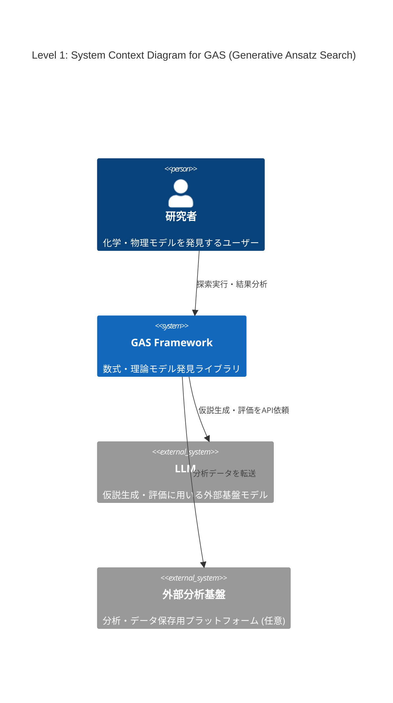
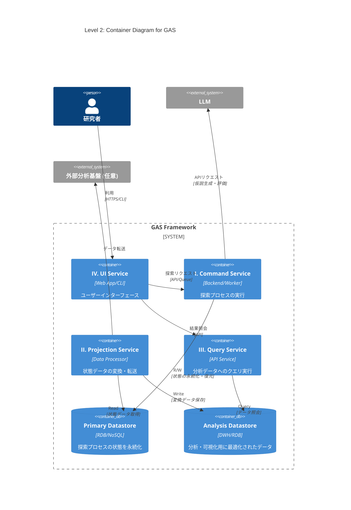
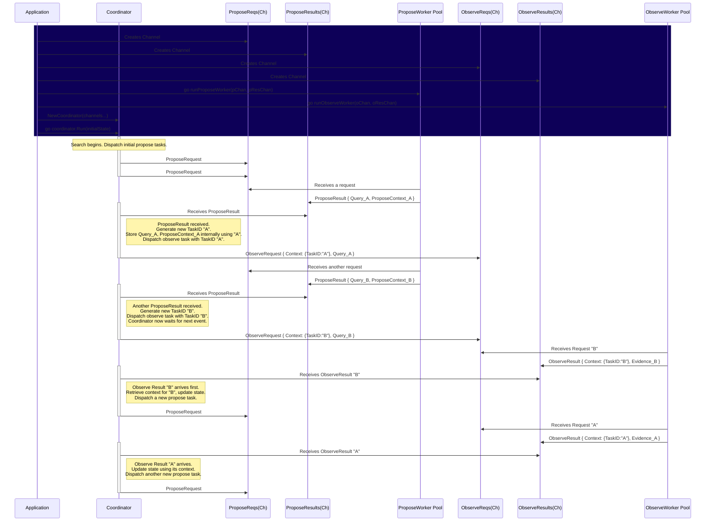

# 導入

最近LLMを用いた解の発見が流行っている、Alpha EvolveやDeep Researcher with Test-Time Diffusionなどがgoogleによって開発され、大成功を収めている。

このような手法のうち、化学・物理モデルの発見に特化したものの開発に取り組んでいる。

# Abstract

化学・物理モデルの発見では、データセットに適合する数式や微分方程式を構成することが目的である。

機械学習でブラックボックスモデルを構築することも可能だが、そうではなく、解釈可能な理論式を見つけたい。

データや理論値とのフィッティング度合いなどはある程度決定的に測れる。しかし、化学方程式の妥当性や微分方程式の近似解の発見など、計算精度だけが指標でない場合も多い。オッカムの剃刀の原則に則ったモデルのコンパクトさ（記述長）もまた、主要な指標となりうる。

先行研究で考案されている手法も様々であり、本稿では、できるだけ広いカバー範囲を持つライブラリの構想を行う。

# ライブラリ設計案: Generative Ansatz Search (GAS)

様々な問題や探索手法に対応可能な、拡張性の高いモジュール式アーキテクチャを提案する。中核となる探索プロセスはストラテジーパターンを採用し、探索アルゴリズムの交換を容易にする。GASは、責務の異なる4つのサービスから構成される。

## I. Command Service: 探索プロセスの実行

仮説生成と評価のサイクルを駆動し、解を探索するメインサービス。`asyncio`を活用し、`ProposeFn`のLLM API呼び出しや`ObserveFn`のGPU計算といったI/Oバウンドなタスクを効率的に処理する。リアルタイムロギングはstateとは関係ないイベントとしてQueueを用いて実装する予定。
 
* **`Controller` (システムのライフサイクル管理)**

    * **役割**: 探索プロセスのライフサイクル（開始、再開、中断、終了）と、状態永続化のタイミング（ポリシー）を管理する。
    * **実装**: 実行構成に基づき各コンポーネントを準備する。`Repository`を介して`SearchState`を初期化（新規作成またはDBから復元）後、`Orchestrator`に渡して探索を開始させる。定義されたポリシーに基づき`Repository`に永続化を指示する。

* **`Orchestrator` (実行エンジン)**

    * **役割**: 探索ループを駆動し、インメモリの`SearchState`を管理する。
    * **実装**: 以下の探索サイクルを駆動する。
      1.  `ProposeFn`を呼び出し、評価対象の仮説群`Query`と、その生成文脈`Context`を得る。
      2.  `ObserveFn`を呼び出し、`Query`を評価して `Evidence` を得る。
      3.  `PropagateFn`を呼び出し、`Query`,`Context`,`Evidence`,`SearchState`から次期`SearchState` を計算する。
      4. 自身の管理する状態を次期`SearchState`で更新する。

* **`ProposeFn` (仮説生成器)**

    * **役割**: `SearchState`に基づき、検証可能な仮説（Ansatz）の集合`Query`と、`PropagateFn`で状態更新に用いるための文脈情報`Context`を取得する。
    * **実装**: `SearchState`（例: 親個体群）を参照し、LLMなどを活用して新たな`Query`と`Context`(例: 親子関係)を生成する。状態の読み書きは行わないステートレスな関数として実装し、ExplorationとExploitationのバランスを調整する。

* **`ObserveFn` (仮説評価器)**

    * **役割**: 仮説群 `Query` を評価し、その結果(`Evidence`)を生成する。
    * **実装**: `Query`に対し、シミュレーションやデータフィッティングなどの定量的・定性的評価を実行する。状態の読み書きを行わないステートレスな関数である。

* **`PropagateFn` (更新戦略)**

    * **役割**: 評価対象となった仮説群 (`Query`)、その生成文脈(`Context`)、評価結果 (`Evidence`)、そして現行の`SearchState`に基づき、次期`SearchState`を計算する。
    * **実装**: ステートレス関数`new_search_state = propagate_fn(query, context, evidence, search_state)`として実装する。これにより状態管理が`Orchestrator`に集約され、状態遷移の予測可能性とテスト容易性が向上する。

* **`SearchState` (探索状態/Originator)**

    * **役割**: 探索プロセスにおける全状態（仮説、スコア、系統など）をインメモリで一元管理する。
    * **実装**: 状態のスナップショットとして`Memento`を生成、または`Memento`から状態を復元するインターフェースを提供し、永続化ロジックから自身を分離する。

* **`Repository` (永続化層/Caretaker)**
    * **役割**: `SearchState`の永続化と復元を担う。
    * **実装**: `Controller`の指示に基づき、`SearchState`から`Memento`を取得し、トランザクション内でデータベースに永続化する。また、データベースから`Memento`を復元し、`SearchState`を再構築する。

* **`Memento` (状態スナップショット)**
    * **役割**: `SearchState`の内部状態を保持するデータ転送オブジェクト(DTO)。
    * **実装**: ビジネスロジックを持たず、`SearchState`と`Repository`間の状態転送に特化する。

## II. Projection Service: データの変換・転送

`Repository`が永続化した状態データを、分析に適した形式（例: テーブル形式）へ変換し、外部のデータウェアハウスや分析基盤へ転送する。

## III. Query Service: 状態の照会・可視化

`Projection Service`が生成した分析用データストアに対し、ユーザーがクエリを発行し、探索の進捗や結果を可視化するためのAPIバックエンド。

## IV. UI Service: ユーザーインターフェース

`Command Service`へのリクエスト送信による探索の実行・管理と、`Query Service`の呼び出しによる結果の可視化・分析機能を提供するWebアプリケーションまたはCLI。

# C4 Model

## Level 1: System Context Diagram (システムコンテキスト図)

GASシステム、ユーザー（研究者）、主要な外部システムとの関係性を示す。



## Level 2: Container Diagram (コンテナ図)

GASライブラリを構成する4つのサービスと2つのデータストアをコンテナとして示す。



## Level 3: Component Diagram for Command Service

`Command Service`の内部コンポーネントと、`Orchestrator`が管理する状態遷移フローを示す。


# The Framework (work in progress)
```python
from typing import Callable, Tuple, Awaitable

# --- Strategy定義 ---
# NOTE: Python 3.12以降で利用可能なGenericsの文法(PEP 695)を使用
type ProposeFn[SearchState, Query, Context] = \
    Callable[[SearchState], Awaitable[Tuple[Query, Context]]]
type ObserveFn[Query, Evidence] = Callable[[Query], Awaitable[Evidence]]
type PropagateFn[SearchState, Query, Context, Evidence] = \
    Callable[[SearchState, Query, Context, Evidence], SearchState]
type TerminationStrategy[SearchState] = Callable[[SearchState], bool]

type OrchestrateFn[SearchState] = \
    Callable[[], Awaitable[SearchState]]


def new_orchestrate[SearchState, Query, Context, Evidence](
    initial_state: SearchState,
    propose: ProposeFn[SearchState, Query, Context],
    observe: ObserveFn[Query, Evidence],
    propagate: PropagateFn[SearchState, Query, Context, Evidence],
    termination_strategy: TerminationStrategy[SearchState],
) -> OrchestrateFn[SearchState]:
    async def orchestrate() -> SearchState:
        state = initial_state
        while not termination_strategy(state):
            query, context = await propose(state) # batched propose
            evidence = await observe(query) # batched observe
            state = propagate(state, query, context, evidence)
        return state

    return orchestrate
```

# FIXME
現在の設計モデルでは、島全体の世代進化を1cycleとしてwhile loopを回し、同期島モデルを行うことは可能だが、完全な非同期島モデルは実現できない

# NOTE
* **Share Memory By Communicating**
  * queueやchannelとstatelessなworkerと、状態変化を一元化したcoordinatorの組み合わせ
* **島ごとの並列化は間違っている**
  I/Oバウンドになることが想定されるのはproposeとobserveであり、それぞれを非同期化した上で、島ごとの並列進化はstateを工夫して論理的に実装されるべき
  「非同期化はI/Oバウンドな部分のみ」「Workerはステートレスな最小単位」「並列化はCoordinatorが論理的に実装する」
  stateの更新計算は無視できるほど少ない計算量。ここだけ同期的でも、本質的にはmutex.lockと等価であり、完全な非同期島モデルと言えるのではないか
* **並列化のカギはproposeとobserve**
  それぞれのproposeやobserveが、独立しているか状態変化を伴うかによって、並列化可能かどうか決まる
  例えば非同期島モデルGAは両方並列化可能、MCTSの場合はVirtual Lossを用いた並列化だが、proposeがI/Oバウンドではなく前の選択が次の選択に影響を与えるので、並列化/非同期化が原理的に不可能で、observeのみ並列化可能
* **Elixir/OTP**
  proposeとobserveをactorとしたモデルなのではないか？その場合genserverがcoordinator(orchestrator)で、別でsupervisorを用意するのはベストプラクティスなのではないか

# Thinking
asyncio.queueおよびchanなどでは以下のようになるのでは？
```go
// inFlightObservation は、Observe中のタスクの関連情報を保持します。
type inFlightObservation struct {
	Query          any
	ProposeContext any 
}

// Coordinatorのフィールド
type Coordinator struct {
    // ...
	inFlightObservations map[string]inFlightObservation // Key: TaskID
    // ...
}

func (c *Coordinator) Run(ctx context.Context, initialState any, initialTaskNum int) (finalState any, err error) {
	c.searchState = initialState
	c.inFlightObservations = make(map[string]inFlightObservation)

	// 探索の起点として、初期タスクを複数発行する
	for i := 0; i < initialTaskNum; i++ {
		c.dispatchProposeRequest()
	}

	for {
        // ... 終了条件チェック ...

		select {
		case res := <-c.proposeResults:
			c.dispatchObserveRequest(res)

		case res := <-c.observeResults:
			c.propagateState(res)
			c.dispatchProposeRequest()

		case <-ctx.Done():
			return nil, errors.New("orchestration cancelled")
		}
	}
}

// dispatchProposeRequest は、新しいProposeタスクをワーカーに依頼します。
func (c *Coordinator) dispatchProposeRequest() {
	req := ProposeRequest{
		SearchState: c.searchState, // Read-Onlyなスナップショットとして渡す
	}
	c.proposeRequests <- req
}

// dispatchObserveRequest は、Propose結果に基づきObserveタスクをワーカーに依頼します。
func (c *Coordinator) dispatchObserveRequest(res ProposeResult) {
	taskID := generateNewTaskID() // UUIDなどで一意なIDを生成
	
	// Observe中のタスクとして登録
	c.inFlightObservations[taskID] = inFlightObservation{
		Query:          res.Query,
		ProposeContext: res.ProposeContext, // ドメインのContextを保存
	}

	req := ObserveRequest{
		Context: TaskContext{TaskID: taskID}, // システム追跡用のContext
		Query:   res.Query,
	}
	c.observeRequests <- req
}

// propagateState の中で...
func (c *Coordinator) propagateState(res ObserveResult) error {
	taskID := res.Context.TaskID
	
	// 実行中のタスク情報を取り出す
	observation, ok := c.inFlightObservations[taskID] // ★ ObserveResultのTaskIDを使って対応する情報を検索
	
	// 状態遷移関数を呼び出し
	newState, err := c.propagateFn(
		c.searchState,
		observation.Query,
		observation.ProposeContext, // ★ 保存しておいたProposeContextをここで使う (島モデルGAにおける島のIDなど)
		res.Evidence,
	)
    // ...
    c.searchState = newState
	delete(c.inFlightObservations, taskID) // 追跡マップから削除
	return nil
}
```
もし同期型島モデルに戻りたい場合でも、「世代」や「サイクル」という概念は、物理的な実装から切り離し、Orchestratorが実行する**論理的な「戦略(Strategy)」または「ポリシー(Policy)」**として扱うことが可能そう。

# SequenceDiagram


# Your Task
goの概念コードとsequenceDiagramの間に不整合がないか、しっかり確認してください。
また、TaskIDをObserve直前で発行すべきか、ProposeContextにも含めるべきか、考察してください。
