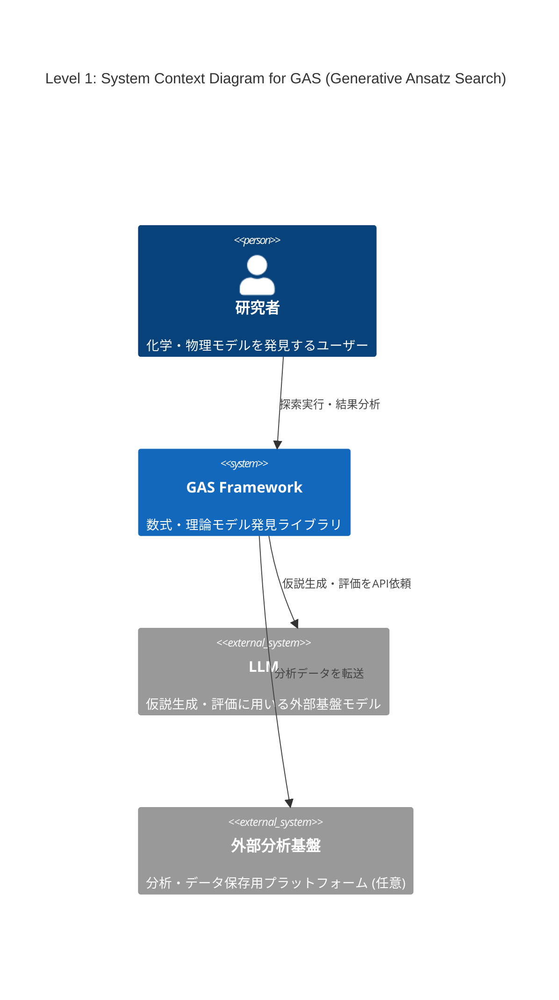
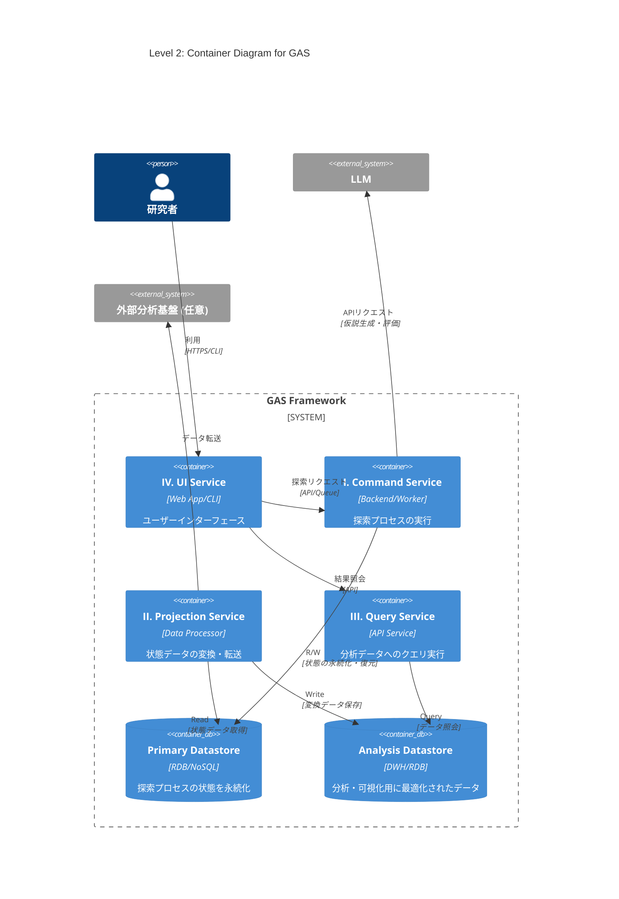

# 導入

最近LLMを用いた解の発見が流行っている、Alpha EvolveやDeep Researcher with Test-Time Diffusionなどがgoogleによって開発され、大成功を収めている。

このような手法のうち、化学・物理モデルの発見に特化したものの開発に取り組んでいる。

# Abstract

化学・物理モデルの発見では、データセットに適合する数式や微分方程式を構成することが目的である。

機械学習でブラックボックスモデルを構築することも可能だが、そうではなく、解釈可能な理論式を見つけたい。

データや理論値とのフィッティング度合いなどはある程度決定的に測れる。しかし、化学方程式の妥当性や微分方程式の近似解の発見など、計算精度だけが指標でない場合も多い。オッカムの剃刀の原則に則ったモデルのコンパクトさ（記述長）もまた、主要な指標となりうる。

先行研究で考案されている手法も様々であり、本稿では、できるだけ広いカバー範囲を持つライブラリの構想を行う。

# ライブラリ設計案: Generative Ansatz Search (GAS)

様々な問題や探索手法に対応可能な、拡張性の高いモジュール式アーキテクチャを提案する。中核となる探索プロセスはストラテジーパターンを採用し、探索アルゴリズムの交換を容易にする。GASは、責務の異なる4つのサービスから構成される。

## I. Command Service: 探索プロセスの実行

仮説生成と評価のサイクルを駆動し、解を探索するメインサービス。`asyncio`を活用し、`ProposeFn`のLLM API呼び出しや`ObserveFn`のGPU計算といったI/Oバウンドなタスクを効率的に処理する。リアルタイムロギングはstateとは関係ないイベントとしてQueueを用いて実装する予定。
 
* **`Controller` (システムのライフサイクル管理)**

    * **役割**: 探索プロセスのライフサイクル（開始、再開、中断、終了）と、状態永続化のタイミング（ポリシー）を管理する。
    * **実装**: 実行構成に基づき各コンポーネントを準備する。`Repository`を介して`SearchState`を初期化（新規作成またはDBから復元）後、`Orchestrator`に渡して探索を開始させる。定義されたポリシーに基づき`Repository`に永続化を指示する。

* **`Orchestrator` (実行エンジン)**

    * **役割**: 探索ループを駆動し、インメモリの`SearchState`を管理する。
    * **実装**: 以下の探索サイクルを駆動する。
      1.  `ProposeFn`を呼び出し、評価対象の仮説群`Query`と、その生成文脈`Context`を得る。
      2.  `ObserveFn`を呼び出し、`Query`を評価して `Evidence` を得る。
      3.  `PropagateFn`を呼び出し、`Query`,`Context`,`Evidence`,`SearchState`から次期`SearchState` を計算する。
      4. 自身の管理する状態を次期`SearchState`で更新する。

* **`ProposeFn` (仮説生成器)**

    * **役割**: `SearchState`に基づき、検証可能な仮説（Ansatz）の集合`Query`と、`PropagateFn`で状態更新に用いるための文脈情報`Context`を取得する。
    * **実装**: `SearchState`（例: 親個体群）を参照し、LLMなどを活用して新たな`Query`と`Context`(例: 親子関係)を生成する。状態の読み書きは行わないステートレスな関数として実装し、ExplorationとExploitationのバランスを調整する。

* **`ObserveFn` (仮説評価器)**

    * **役割**: 仮説群 `Query` を評価し、その結果(`Evidence`)を生成する。
    * **実装**: `Query`に対し、シミュレーションやデータフィッティングなどの定量的・定性的評価を実行する。状態の読み書きを行わないステートレスな関数である。

* **`PropagateFn` (更新戦略)**

    * **役割**: 評価対象となった仮説群 (`Query`)、その生成文脈(`Context`)、評価結果 (`Evidence`)、そして現行の`SearchState`に基づき、次期`SearchState`を計算する。
    * **実装**: ステートレス関数`new_search_state = propagate_fn(query, context, evidence, search_state)`として実装する。これにより状態管理が`Orchestrator`に集約され、状態遷移の予測可能性とテスト容易性が向上する。

* **`SearchState` (探索状態/Originator)**

    * **役割**: 探索プロセスにおける全状態（仮説、スコア、系統など）をインメモリで一元管理する。
    * **実装**: 状態のスナップショットとして`Memento`を生成、または`Memento`から状態を復元するインターフェースを提供し、永続化ロジックから自身を分離する。

* **`Repository` (永続化層/Caretaker)**
    * **役割**: `SearchState`の永続化と復元を担う。
    * **実装**: `Controller`の指示に基づき、`SearchState`から`Memento`を取得し、トランザクション内でデータベースに永続化する。また、データベースから`Memento`を復元し、`SearchState`を再構築する。

* **`Memento` (状態スナップショット)**
    * **役割**: `SearchState`の内部状態を保持するデータ転送オブジェクト(DTO)。
    * **実装**: ビジネスロジックを持たず、`SearchState`と`Repository`間の状態転送に特化する。

## II. Projection Service: データの変換・転送

`Repository`が永続化した状態データを、分析に適した形式（例: テーブル形式）へ変換し、外部のデータウェアハウスや分析基盤へ転送する。

## III. Query Service: 状態の照会・可視化

`Projection Service`が生成した分析用データストアに対し、ユーザーがクエリを発行し、探索の進捗や結果を可視化するためのAPIバックエンド。

## IV. UI Service: ユーザーインターフェース

`Command Service`へのリクエスト送信による探索の実行・管理と、`Query Service`の呼び出しによる結果の可視化・分析機能を提供するWebアプリケーションまたはCLI。

# C4 Model

## Level 1: System Context Diagram (システムコンテキスト図)

GASシステム、ユーザー（研究者）、主要な外部システムとの関係性を示す。



## Level 2: Container Diagram (コンテナ図)

GASライブラリを構成する4つのサービスと2つのデータストアをコンテナとして示す。



## Level 3: Component Diagram for Command Service

`Command Service`の内部コンポーネントと、`Orchestrator`が管理する状態遷移フローを示す。


# PoC

## Island Model GA
```python
import random
import math
import time
import copy
from dataclasses import dataclass, field
from typing import Any, Callable, List, Tuple, Dict

# =========================================================================
# GAS PoC: Island Model GA for Function Optimization (Rastrigin)
# =========================================================================

# --- I. 型定義とデータ構造 (Type Definitions & Data Structures) ---

# Ansatz（解候補）はfloatのリスト
type Ansatz = List[float]
# ScoredIndividualは (Ansatz, スコア) のタプル
type ScoredIndividual = Tuple[Ansatz, float]

# Queryは評価対象の仮説(Ansatz)のリストに。出自情報はContextへ分離。
type Query = List[Ansatz]
# Contextを追加。このPoCでは、各Ansatzがどの島に由来するかを示すindexのリスト。
type Context = List[int]


@dataclass(frozen=True)
class IslandState:
    """単一の島の状態。スコア付き母集団を保持する（イミュータブル）。"""
    scored_population: List[ScoredIndividual] = field(default_factory=list)


@dataclass(frozen=True)
class SearchState:
    """探索プロセスの全状態。複数の島を管理する (Originator)。"""
    generation: int
    islands: List[IslandState] = field(default_factory=list)
    summary: Dict[str, Any] = field(default_factory=dict)


@dataclass(frozen=True)
class Evidence:
    """ObserveFnが返す評価結果。Queryに対応するスコアのリスト。"""
    scores: List[float]


ProposeFn = Callable[[SearchState], Tuple[Query, Context]]
ObserveFn = Callable[[Query], Evidence]
PropagateFn = Callable[[Query, Context, Evidence, SearchState], SearchState]


# --- II. ObserveFn: 仮説評価器 (Rastrigin Function) ---
def rastrigin(x: Ansatz) -> float:
    """Rastrigin関数。最小値は x=(0,...,0) で f(x)=0。"""
    ...


def observe_rastrigin_fn(query: Query) -> Evidence:
    """Rastrigin関数を用いてQueryを評価するObserveFnの実装。"""
    ...

# --- III. ProposeFn: 仮説生成器 (Island Model GA) ---
class IslandGAProposer:
    """島モデルGA（実数値コーディング）に基づくProposeFnのロジック。"""

    def __init__(self, dimensions: int, search_range: Tuple[float, float], n_islands: int, population_per_island: int,
                 tournament_size: int, crossover_rate: float, blx_alpha: float,
                 mutation_rate: float, mutation_sigma: float, elite_size: int):
        ...

    def _selection(self, scored_population: List[ScoredIndividual]) -> Ansatz:
        ...

    def _crossover_blx_alpha(self, p1: Ansatz, p2: Ansatz) -> Tuple[Ansatz, Ansatz]:
        ...

    def _mutation_gaussian(self, ind: Ansatz) -> Ansatz:
        ...

    # --- Propose Logic ---
    def propose_fn(self, state: SearchState) -> Tuple[Query, Context]:
        """SearchStateに基づき、次世代の評価対象(Query)とその文脈(Context)を生成する。"""
        ...

    def _initialize_population(self) -> Tuple[Query, Context]:
        """初期母集団と、それに対応するContextを生成する。"""
        ...

    def _evolve_island(self, island: IslandState) -> List[Ansatz]:
        """単一の島を進化させ、新しいAnsatzのリストを返す。"""
        ...


def new_island_ga_propose_fn(**kwargs) -> ProposeFn:
    proposer = IslandGAProposer(**kwargs)
    return proposer.propose_fn


# --- IV. PropagateFn: 更新戦略 (Island Model GA) ---
class IslandGAPropagator:
    """島モデルGAの更新戦略（世代交代と移住）を実装するクラス。"""

    def __init__(self, elite_size: int, migration_interval: int, migration_size: int):
        ...

    def propagate_fn(self, query: Query, context: Context, evidence: Evidence, search_state: SearchState) -> SearchState:
        """評価結果と現行状態から、次期SearchStateを計算する。"""
        ...

    def _distribute_results(self, query: Query, context: Context, evidence: Evidence, n_islands: int) -> Dict[int, List[ScoredIndividual]]:
        """評価結果を島インデックスごとに整理する。"""
        ...

    def _update_islands(self, search_state: SearchState, newly_scored_by_island: Dict[int, List[ScoredIndividual]]) -> List[IslandState]:
        ...

    def _migration(self, islands: List[IslandState]) -> List[IslandState]:
        ...

    def _finalize_state(self, search_state: SearchState, next_islands: List[IslandState], migration_occurred: bool) -> SearchState:
        ...


def new_island_ga_propagate_fn(**kwargs) -> PropagateFn:
    propagator = IslandGAPropagator(**kwargs)
    return propagator.propagate_fn


# --- V. 実行エンジン (Execution Engine) ---
class Orchestrator:
    """探索ループを駆動し、インメモリのSearchStateを一元管理する。"""

    def run(self, propose_fn: ProposeFn, observe_fn: ObserveFn, propagate_fn: PropagateFn,
            initial_search_state: SearchState, max_generations: int, target_score: float):
        print(f"--- 探索開始 (最大 {max_generations} 世代) ---")
        start_time = time.time()
        search_state = initial_search_state

        while search_state.generation < max_generations:
            query, context = propose_fn(search_state)
            evidence = observe_fn(query)
            search_state = propagate_fn(query, context, evidence, search_state)

            self._log_progress(search_state, target_score)
            best_score = search_state.summary.get("best_score", float('inf'))
            if best_score <= target_score:
                print(f"\n目標スコア ({target_score}) に到達しました。")
                break
        else:
            print("\n最大世代数に到達しました。")
        self._finalize(search_state, start_time)

    def _log_progress(self, search_state: SearchState, target_score: float):
        ...

    def _finalize(self, search_state: SearchState, start_time: float):
        ...


# --- VI. エントリーポイント (Controller) ---
def main_controller():
    ...


if __name__ == "__main__":
    main_controller()
```

## MCTS
```python
import math
import random
import time
from dataclasses import dataclass, field, replace
from typing import Any, Callable, Dict, List, Tuple
from enum import Enum, auto


# =========================================================================
# MCTS PoC for Markov Decision Process (MDP) - GridWorld
# =========================================================================

# --- I. 環境定義 (Environment Definition - GridWorld MDP) ---
class Action(Enum):
    UP = auto()
    DOWN = auto()
    LEFT = auto()
    RIGHT = auto()


@dataclass(frozen=True)
class GridState:
    """GridWorldの状態（エージェントの位置）。ハッシュ可能。"""
    x: int
    y: int


class GridWorldEnvironment:
    """決定論的なGridWorld環境。"""

    def __init__(self, width: int, height: int, start: GridState, goal: GridState, obstacles: set[GridState], move_cost: float, goal_reward: float):
        ...

    def is_terminal(self, state: GridState) -> bool:
        ...

    def get_actions(self, state: GridState) -> list[Action]:
        ...

    def transition(self, state: GridState, action: Action) -> Tuple[GridState, float]:
        """状態遷移関数 T(s, a) -> s', r"""
        ...


def new_gridworld_environment() -> GridWorldEnvironment:
    """標準的なGridWorld環境のファクトリー関数"""
    width, height = 6, 6
    start = GridState(0, 0)
    goal = GridState(5, 5)
    obstacles = set()
    for i in range(0, 4):
        obstacles.add(GridState(1, i))
    for i in range(2, 6):
        obstacles.add(GridState(3, i))
    obstacles.add(GridState(5, 3))

    return GridWorldEnvironment(width, height, start, goal, obstacles, move_cost=-2.0, goal_reward=10.0)


# --- II. 状態とデータ構造 (State & Data Structures) ---
@dataclass(frozen=True)
class Stats:
    """統計情報 (N: 訪問回数, Q: 累積報酬値)"""
    N: int = 0
    Q: float = 0.0

    @property
    def average_Q(self) -> float:
        return self.Q / self.N if self.N > 0 else 0.0


@dataclass(frozen=True)
class Query:
    """探索されたパス。(s0, a0, r1, s1, ...)"""
    states: List[GridState] = field(default_factory=list)
    actions: List[Action] = field(default_factory=list)
    rewards: List[float] = field(default_factory=list)

    def append_start(self, state: GridState):
        ...

    def append_transition(self, action: Action, reward: float, next_state: GridState):
        ...


# Context: ProposeFnでQueryを生成する際の文脈情報。
Context = Dict[str, Any]
# Evidence: ObserveFnが返す評価結果。（シミュレーション結果）
Evidence = float


@dataclass(frozen=True)
class SearchState:
    """探索プロセスの主要な状態。探索木の情報を不変オブジェクトとして保持する。"""
    iteration: int
    q_stats: Dict[Tuple[GridState, Action], Stats]
    n_stats: Dict[GridState, int]
    summary: Dict[str, Any] = field(default_factory=dict)

    def get_q_stats(self, state: GridState, action: Action) -> Stats:
        return self.q_stats.get((state, action), Stats())

    def get_n_stats(self, state: GridState) -> int:
        return self.n_stats.get(state, 0)


# --- III. コア関数のインターフェース定義 (Design-Aligned) ---
ProposeFn = Callable[[SearchState], Tuple[Query, Context]]
ObserveFn = Callable[[Query], Evidence]
PropagateFn = Callable[[Query, Context, Evidence, SearchState], SearchState]


# --- IV. コンポーネント実装 (MCTS Implementation) ---
class MCTSComponents:
    """MCTSのコアロジック（Propose, Observe, Propagate）を保持するクラス。"""

    def __init__(self, exploration_constant: float, discount_factor: float, max_depth: int, env: GridWorldEnvironment):
        ...

    def _calculate_ucb1(self, stats: Stats, parent_N: int) -> float:
        ...

    def propose_fn(self, search_state: SearchState) -> Tuple[Query, Context]:
        """Selection & Expansion: UCB1に基づき探索木をたどり、パス(Query)と空の文脈(Context)を生成する。"""
        ...

    def observe_fn(self, path_candidate: Query) -> Evidence:
        """Simulation (Default Policy): パスの先端からランダムポリシーでロールアウトし、報酬を見積もる。"""
        ...

    def propagate_fn(self, query: Query, context: Context, evidence: Evidence, search_state: SearchState) -> SearchState:
        """Backpropagation: シミュレーション結果を用いて新しいSearchStateを生成する。"""
        ...


def new_mcts_components(exploration_constant: float, discount_factor: float, max_depth: int, environment: GridWorldEnvironment) -> Tuple[ProposeFn, ObserveFn, PropagateFn]:
    """MCTSコンポーネントのファクトリー関数。"""
    mcts = MCTSComponents(exploration_constant,
                          discount_factor, max_depth, environment)
    return mcts.propose_fn, mcts.observe_fn, mcts.propagate_fn


# --- V. 実行エンジン (Execution Engine) ---
class Orchestrator:
    """探索ループを駆動し、状態管理を一元的に行う。環境には依存しない。"""

    def run(self, propose_fn: ProposeFn, observe_fn: ObserveFn, propagate_fn: PropagateFn,
            initial_search_state: SearchState, max_iterations: int) -> SearchState:

        search_state = initial_search_state
        start_time = time.time()

        while search_state.iteration < max_iterations:
            query, context = propose_fn(search_state)
            evidence = observe_fn(query)
            search_state = propagate_fn(query, context, evidence, search_state)

            if (search_state.iteration % (max_iterations // 10 or 1) == 0) or search_state.iteration == max_iterations:
                print(
                    f"イテレーション: {search_state.iteration:04d} | "
                    f"今回の推定リターン(割引あり): {search_state.summary.get('estimated_return', 0.0):.4f}"
                )

        end_time = time.time()
        print(f"\n探索時間: {end_time - start_time:.4f} 秒")
        return search_state


# --- VI. 結果の解釈と可視化 (Interpretation & Visualization) ---
def get_best_plan(search_state: SearchState, environment: GridWorldEnvironment) -> Tuple[Query, float]:
    """探索結果から、現在の最良のプラン（行動系列）を抽出する。"""
    ...


def visualize_gridworld(env: GridWorldEnvironment, plan: Query):
    ...

# --- VII. エントリーポイント (Entry Point) ---
def main_controller():
    """依存性を注入し、Orchestratorを実行するエントリーポイント。"""
    ...


if __name__ == '__main__':
    main_controller()
```

# The Library (work in progress)
```python
from typing import Protocol, Callable, Tuple

# --- Strategy定義 ---
# NOTE: Python 3.12以降で利用可能なGenericsの文法(PEP 695)を使用(Rust/Go/TSどれもがTypeVarを用いないため**TypeVarは禁止**)
type ProposeFn[SearchState, Query, Context] = \
    Callable[[SearchState], Tuple[Query, Context]]
type ObserveFn[Evidence, Query] = Callable[[Query], Evidence]
type PropagateFn[Query, Context, Evidence, SearchState] = \
    Callable[[Query, Context, Evidence, SearchState], SearchState]
```

# The Framework (work in progress)
```python
from typing import Callable, Tuple, Awaitable

# --- Strategy定義 ---
# NOTE: Python 3.12以降で利用可能なGenericsの文法(PEP 695)を使用
type ProposeFn[SearchState, Query, Context] = \
    Callable[[SearchState], Awaitable[Tuple[Query, Context]]]
type ObserveFn[Query, Evidence] = Callable[[Query], Awaitable[Evidence]]
type PropagateFn[SearchState, Query, Context, Evidence] = \
    Callable[[SearchState, Query, Context, Evidence], SearchState]
type TerminationStrategy[SearchState] = Callable[[SearchState], bool]

type OrchestrateFn[SearchState] = \
    Callable[[], Awaitable[SearchState]]


def new_orchestrate[SearchState, Query, Context, Evidence](
    initial_state: SearchState,
    propose: ProposeFn[SearchState, Query, Context],
    observe: ObserveFn[Query, Evidence],
    propagate: PropagateFn[SearchState, Query, Context, Evidence],
    termination_strategy: TerminationStrategy[SearchState],
) -> OrchestrateFn[SearchState]:
    async def orchestrate() -> SearchState:
        state = initial_state
        while not termination_strategy(state):
            query, context = await propose(state)
            evidence = await observe(query)
            state = propagate(state, query, context, evidence)
        return state

    return orchestrate
```

# Question
runしか持たないorchestratorはクラスである必要もなく、無駄をそぎ落とした結果現在のframework草案に落ち着いた。
proposeとobserveのそれぞれでasyncio.gatherすることを考えてたけど、よく考えてみたらqueueを使った並列化もできる？
要するに
```python
query_queue, context = await propose(state) # pipelineをつないで即座に終了
evidence = observe(query_queue) # 内部的にはproposeが大量に提案してきているのをobserveしている
state = propagate(state, query_queue, context, evidence) # query_queueは消費されているのでevidenceに記録が必要
```
として、proposeとobserveを実装可能？
そしてその実装にはなにかメリットがある？
