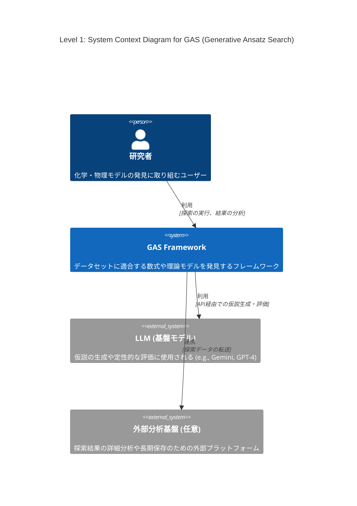
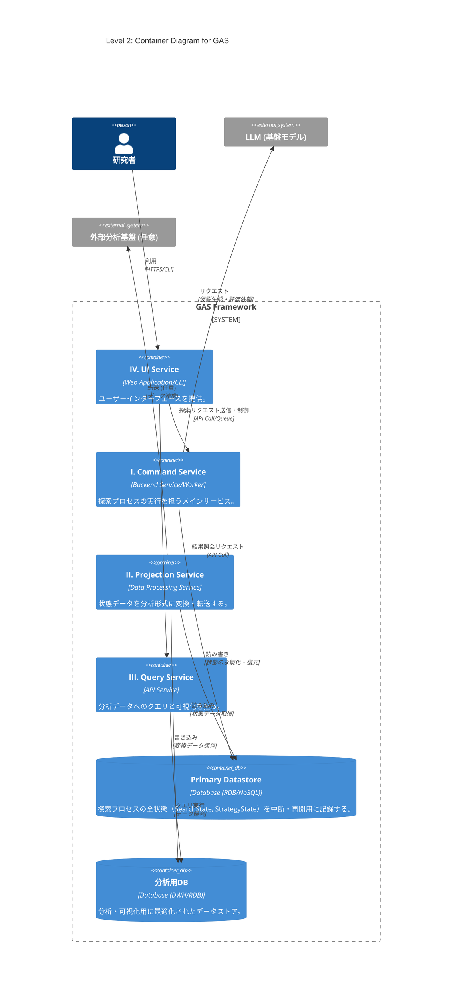
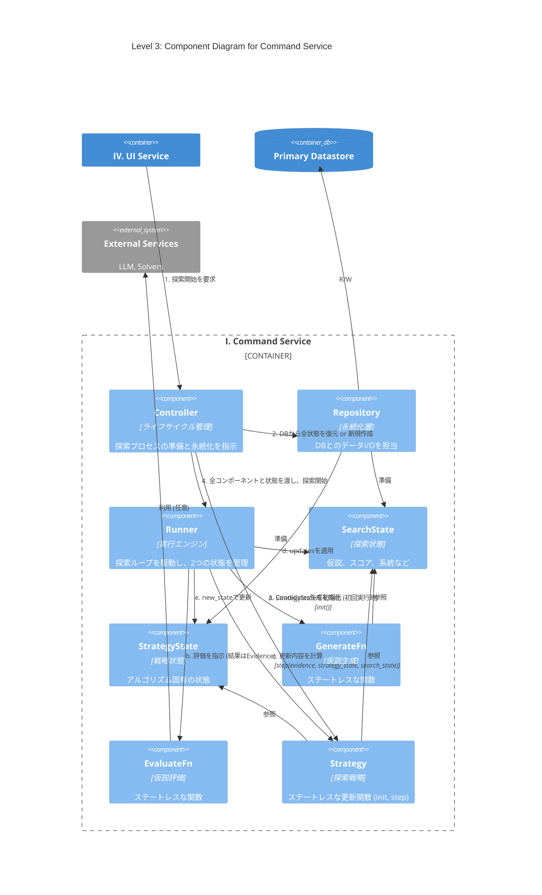

# 導入

最近LLMを用いた解の発見が流行っている、Alpha EvolveやDeep Researcher with Test-Time Diffusionなどがgoogleによって開発され、大成功を収めている。

このような手法のうち、化学・物理モデルの発見に特化したものの開発に取り組んでいる。

# Abstract

化学・物理モデルの発見では、データセットに適合する数式や微分方程式を構成することが目的である。

機械学習でブラックボックスモデルを構築することも可能だが、そうではなく、解釈可能な理論式を見つけたい。

データや理論値とのフィッティング度合いなどはある程度決定的に測れる。しかし、化学方程式の妥当性や微分方程式の近似解の発見など、計算精度だけが指標でない場合も多い。オッカムの剃刀の原則に則ったモデルのコンパクトさ（記述長）もまた、主要な指標となりうる。

先行研究で考案されている手法も様々であり、本稿では、できるだけ広いカバー範囲を持つフレームワークの構想を行う。

# フレームワーク設計案: Generative Ansatz Search (GAS)

様々な問題や探索手法に対応可能な、拡張性の高いモジュール式アーキテクチャを提案する。中核となる探索プロセスはストラテジーパターンを採用し、探索アルゴリズムの交換を容易にする。GASは、責務の異なる4つのサービスから構成される。

### I. Command Service: 探索プロセスの実行

仮説生成と評価のサイクルを駆動し、解を探索するメインサービス。`asyncio`を活用し、`GenerateFn`のLLM API呼び出しや`EvaluateFn`のGPU計算といったI/Oバウンドなタスクを効率的に処理する。

* **`Controller` (システムのライフサイクル管理)**

    * **役割**: 探索プロセスのライフサイクル（開始、再開、中断、終了）と、状態永続化のタイミング（ポリシー）を管理する。
    * **実装**: 実行構成（使用するコンポーネント、ハイパーパラメータ等）を準備する。`Repository`を介して`SearchState`と`StrategyState`を初期化（新規作成またはDBから復元）する。初回実行時には`Strategy.init`を呼び出し、初期`StrategyState`を生成する。これらのコンポーネントと状態を`Runner`に渡し、探索を開始させる。定義されたポリシーに基づき`Repository`へ永続化を指示する。

* **`Runner` (実行エンジン)**

    * **役割**: 探索ループを駆動し、`SearchState`と`StrategyState`という2つの状態を一元管理する。
    * **実装**: 以下の探索サイクルを駆動する。
      1.  `GenerateFn`を呼び出し、評価対象の仮説群 `Candidates` を生成する。
      2.  `EvaluateFn`を呼び出し、`Candidates`を評価して `Evidence` を得る。
      3.  `Strategy.step`を呼び出し、`Evidence`、現在の`SearchState`、現在の`StrategyState`に基づき、`SearchState`への更新内容 `updates` と、新しい `StrategyState` を計算する。
      4.  計算された`updates`を`SearchState`に適用し、`StrategyState`を更新する。
          このループにより、`Runner`は状態管理の責務を集約し、他のコンポーネントのステートレス性を保証する。

* **`Strategy` (探索戦略)**

    * **役割**: `optax`における`optimizer`に相当する、ステートレスな関数の集合体。評価結果に基づき、次の状態への更新内容を計算する。
    * **実装**: `init`と`step`というステートレスなメソッドを提供する。
        * `init`: `StrategyState`を初期化する。
        * `step`: `Evidence`、`StrategyState`、`SearchState`を入力として受け取り、更新内容 `updates` と新しい `new_strategy_state` を返す (`updates, new_strategy_state = strategy.step(evidence, strategy_state, search_state)`)。
          `GenerateFn`や`EvaluateFn`はI/Oバウンドな処理を含むため、`asyncio`による並列化が想定される。`Strategy`をステートレスに保つことは、状態管理を`Runner`に集約させ、並列実行時の複雑さを軽減する上で極めて重要である。

* **`GenerateFn` (仮説生成器)**

    * **役割**: 検証可能な仮説（Ansatz）の集合 `Candidates` を生成する。
    * **実装**: 現在の`SearchState`（例: 親となる個体群）を参照し、LLM等を活用して新たな`Candidates`を生成する。状態の読み書きは行わないステートレスな関数である。

* **`EvaluateFn` (仮説評価器)**

    * **役割**: `optax`における`grad_fn`に相当し、与えられた仮説群 `Candidates` の有効性を評価する。
    * **実装**: `Runner`から`Candidates`を受け取り、定量的・定性的評価を実行する。`Strategy`が必要とする形式の評価結果 `Evidence` を計算し、`Runner`に返す。状態の読み書きは行わないステートレスな関数である。

* **`SearchState` (探索状態)**

    * **役割**: 探索プロセスの主要な状態（生成された全仮説、スコア、系統など）をインメモリで一元管理する。
    * **実装**: 探索セッションの状態をカプセル化する。自身の状態をスナップショット化する`Memento`オブジェクトを生成、または`Memento`から状態を復元するインターフェースを提供し、永続化ロジックから分離されている (Originatorパターン)。

* **`StrategyState` (戦略状態)**
    * **役割**: 探索アルゴリズム固有の状態を保持する。例えば、MCTSにおける各ノードの訪問回数や、進化計算における世代数、最適化アルゴリズムのモーメンタムなどが含まれる。
    * **実装**: `Strategy`によって定義され、`Runner`によって管理される状態オブジェクト。`SearchState`と同様に、自身の状態をスナップショット化する`Memento`オブジェクトを生成、または`Memento`から状態を復元するインターフェースを提供する。

* **`Repository` (永続化層)**
    * **役割**: 探索セッション全体の状態（`SearchState`と`StrategyState`）の永続化の**メカニズム**に特化する。
    * **実装**: `Controller`の指示に基づき、`SearchState`と`StrategyState`からそれぞれの`Memento`を取得する。これらを単一のトランザクション内でデータベースが扱いやすい形式にシリアライズして永続化する。逆に、データベースからデータを読み込み、それぞれの`Memento`を介して各状態オブジェクトを復元する責務を持つ (Caretakerパターン)。

* **`Memento` (状態スナップショット)**
    * **役割**: `SearchState`や`StrategyState`といった、特定の状態オブジェクトの内部状態を保持するデータ転送オブジェクト(DTO)。
    * **実装**: 状態を保持するためのフィールドのみで構成され、ビジネスロジックは持たない。状態オブジェクトと`Repository`間の状態の受け渡しに用いられる。`Repository`は複数の`Memento`を扱うことで、セッション全体の永続化を実現する。

### II. Projection Service: データの変換・転送

`Repository`が保存した状態データを、分析しやすい形式（例: テーブル形式）に変換し、外部の分析基盤やデータウェアハウスへ転送するサービス。

### III. Query Service: 状態の照会・可視化

`Projection Service`によって変換されたデータに対し、人間が直接クエリを発行し、探索の進捗や結果を可視化・分析するためのAPIバックエンド。

### IV. UI Service: ユーザーインターフェース

`Command Service`にリクエストを送信して探索を実行・管理し、`Query Service`を呼び出して結果を可視化・分析するためのWebアプリケーションやCLI。

# C4 Model

## Level 1: System Context Diagram (システムコンテキスト図)

GASシステム全体の俯瞰図。システムがユーザー（研究者）や主要な外部システム（LLM、外部分析基盤）とどのように関わるかを示す。

## Level 2: Container Diagram (コンテナ図)

GASシステムを構成する主要な実行単位（コンテナ）を示す。設計案の4つのサービスとデータストアをコンテナとして定義している。

## Level 3: Component Diagram for Command Service

「I. Command Service」コンテナ内部のコンポーネント間の連携を示す。ステートレスなコンポーネントと、`Runner`による状態管理のフローを明確化している。

