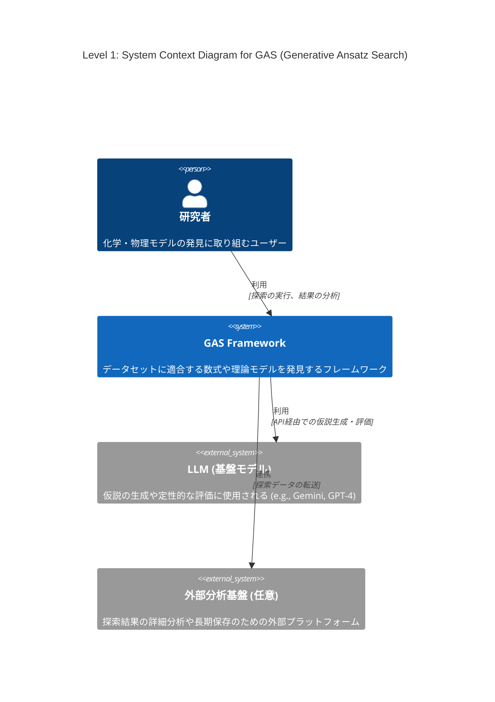
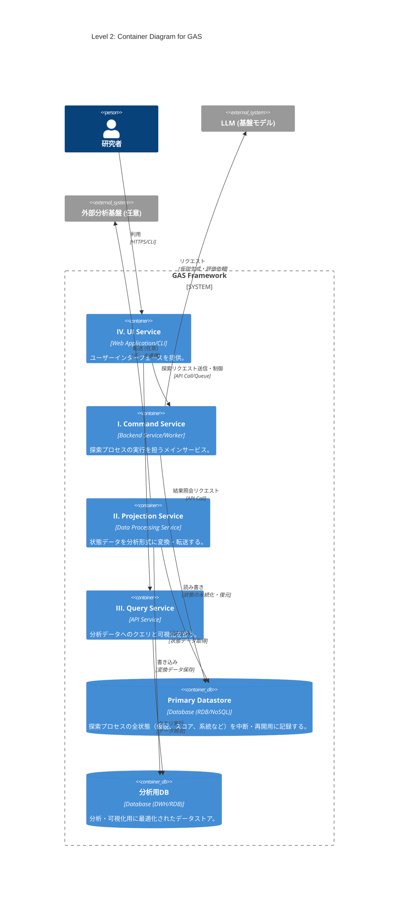
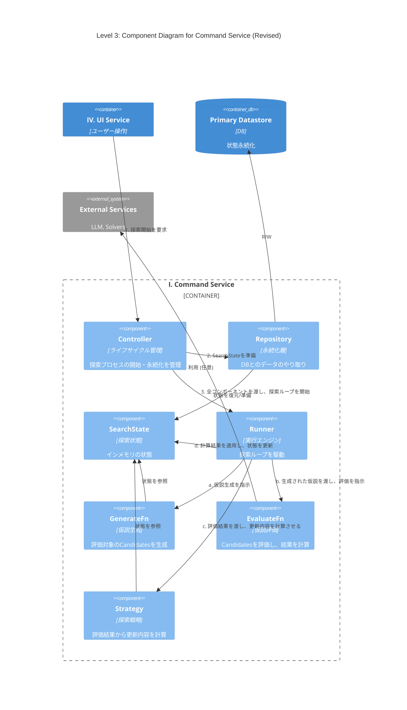

# 導入
最近LLMを用いた解の発見が流行っている、Alpha EvolveやDeep Researcher with Test-Time Diffusionなどがgoogleによって開発され、大成功を収めている

このような手法のうち、化学・物理モデルの発見に特化したものの開発に取り組んでいる

# Abstract

化学・物理モデルの発見ではデータセットに適合する数式や、微分方程式を構成することが目的である

機械学習でブラックボックスモデルを構築することも可能だが、そうではなく、意味のある理論式を見つけたい

データや理論値とのフィッティング度合いなどはある程度決定的に測れる

しかし化学方程式の場合や、微分方程式近似解の発見などで、計算精度だけが指標でない場合も多い

オッカムの剃刀の原則に則ったモデルのコンパクトさ、記述長も主な指標となりうる

先行研究で考案されている手法も様々であり、私は今回、できるだけカバー範囲の広いフレームワークの構想を行っている

# フレームワーク設計案: Generative Ansatz Search (GAS)

様々な問題や探索手法に対応可能な、拡張性の高いモジュール式アーキテクチャを提案する。中核となる探索プロセスはストラテジーパターンを採用し、アルゴリズムの交換を容易にする。I ~ IVのインフラから構成することを考えている。

### I. Command Service: 探索プロセスの実行

仮説生成と評価のサイクルを駆動し、解を探索するメインサービス。`asyncio`を活用し、`GenerateFn`のLLM APIの使用や`EvaluateFn`のGPUなどのI/Oバウンドなタスクを効率的に処理する。ストラテジーパターンにより、多様な探索アルゴリズムに対応可能な設計を持つ。

* **`Controller` (システムのライフサイクル管理)**
    * **役割**: 探索プロセスのライフサイクル（開始、再開、中断、終了）と、状態永続化の**タイミング（ポリシー）**を管理する。
    * **実装**: 実行構成（使用するコンポーネント、ハイパーパラメータ等）を準備し、`Repository`を介して`SearchState`を初期化（新規作成またはDBから復元）する。`GenerateFn`, `EvaluateFn`, `Strategy` といったコンポーネント群、および`SearchState`を`Runner`に渡し、探索を開始させる。定義されたポリシーに基づき`Repository`へ永続化を指示する。

* **`Runner` (実行エンジン)**
    * **役割**: 評価と戦略実行のサイクルを駆動させることに特化したコンポーネント。
    * **実装**: 探索ループを駆動する。ループの各ステップで、**1. `GenerateFn`でcandidates生成 → 2. `EvaluateFn`による評価 → 3. `Strategy`による更新内容の計算 → 4. `SearchState`への適用**、というサイクルを実行する。状態管理の責務が`Runner`に集約される。

* **`Strategy` (探索戦略)**
    * **役割**: 評価結果に基づき、次の状態への更新内容を計算する。`optax`における`optimizer.update`（更新ルール）に相当する。
    * **実装**: `Runner`から`EvaluationResult`（`grads`）と現在の`SearchState`を受け取り、アルゴリズム固有のロジック（例: MCTSのBackpropagation、GAのエリート選択）に基づき、状態の更新内容（`updates`辞書）を計算して`Runner`に返す。StrategyStateも用意すると適応的な戦略にも対応できるのでそのようなプロトコルにする。

* **`GenerateFn` (仮説生成器)**
    * **役割**: 検証可能な仮説（Ansatz）を生成する
    * **実装**: `SearchState`から仮説生成に必要なデータ（例: 親となる個体群）を参照し、LLM等を活用して新たなAnsatzを生成する。状態の読み書きは行わない。

* **`EvaluateFn` (仮説評価器)**
    * **役割**: 与えられた仮説`candidates`の有効性を評価する。`optax`における**`grad_fn`（勾配計算関数）**に相当する。
    * **実装**: `Runner`から`GenerateFn`が生成した仮説`candidates`を受け取り、定量的・定性的評価を実行する。`Strategy`が必要とする形式の評価結果を計算し、`Runner`に返す。状態の読み書きは行わない。

* **`SearchState` (探索状態管理)**
    * **役割**: 探索プロセスの全状態（生成された仮説、スコア、系統など）をインメモリで一元管理する。
    * **実装**: 探索セッションの状態をカプセル化して保持する。自身の状態をスナップショット化する`Memento`オブジェクトを生成、または`Memento`から状態を復元するインターフェースを提供することで、永続化のロジックから分離されている (Originatorパターン)。

* **`Repository` (永続化層)**
    * **役割**: `SearchState`の永続化の**メカニズム**に特化したコンポーネント。
    * **実装**: `Controller`の指示に基づき、`SearchState`から`Memento`を取得し、データベースが扱いやすい形式にシリアライズして永続化する。逆に、データベースからデータを読み込み、`Memento`を介して`SearchState`の状態を復元する責務を持つ (Caretakerパターン)。

* **`Memento` (状態スナップショット)**
    * **役割**: 特定時点における`SearchState`の内部状態を保持するデータ転送オブジェクト(DTO)。
    * **実装**: 状態を保持するためのフィールドのみで構成され、ビジネスロジックは持たない。`SearchState`と`Repository`間の状態の受け渡しに用いられる。

## II. Projection Service: データの変換・転送

`Repository`が保存した状態データを、分析しやすい形式に変換したり、外部の分析基盤へ転送したりするサービス。

## III. Query Service: 状態の照会・可視化

Projectionされたデータに対して、人間が直接クエリを発行し、探索の進捗や結果を可視化・分析する。ProjectionされたDBへの認証情報などをもつバックエンド

## IV. UI Serivce: ユーザーインターフェース

Command Serivceにリクエストを送って探索してもらう。Query Serivceを呼び出して結果を確認する。

# C4 Model

## Level 1: System Context Diagram (システムコンテキスト図)

GASシステム全体の俯瞰図。システムがユーザー（研究者）や主要な外部システム（LLM、外部分析基盤）とどのように関わるかを示す。



## Level 2: Container Diagram (コンテナ図)

GASシステムを構成する主要な実行単位（コンテナ）を示します。設計案のI〜IVのサービスとデータストア（Primary Datastore、分析用DB）をコンテナとして定義している。



## Level 3: Component Diagram

「I. Command Service」コンテナ内部の構造を示す。`Controller`, `Runner`, `GenerateFn`, `EvaluateFn`, `SearchState`といった主要コンポーネント間の連携を記述する。



# PoC1: MCTS
```python
import random
import time
from dataclasses import dataclass, field
from typing import Any, Protocol, Callable

# --- データ構造 ---
type Individual = list[int]


@dataclass
class GAState:
    """探索プロセスの全状態を保持する"""
    generation: int
    scored_population: list[
        tuple[Individual, float]] = field(default_factory=list)
    summary: dict[str, Any] = field(default_factory=dict)


@dataclass(frozen=True)
class EvaluationResult:
    """Evaluatorが返す評価結果"""
    newly_scored: list[tuple[Individual, float]]


# --- コンポーネントのインターフェース定義 ---
type GenerateFn = Callable[[GAState], list[Individual]]
type EvaluateFn = Callable[[list[Individual]], EvaluationResult]

type StrategyState = Any


class Strategy(Protocol):
    """Strategyが準拠すべきプロトコル"""

    def init(self, strategy_state: StrategyState) -> None:
        """内部状態を初期化する"""
        ...

    def step(self, eval_result: EvaluationResult, state: GAState) -> dict[str, Any]:
        """状態の更新内容を計算し、必要であれば内部状態を更新する"""
        ...


# --- コンポーネントの実装 ---
class GAGenerator:
    """GAS: Generator - 評価すべき仮説(candidates)を生成する振る舞いを定義"""
    gene_length: int
    population_size: int
    mutation_rate: float
    crossover_rate: float
    tournament_size: int
    elite_size: int

    def _selection(self, scored_population: list[tuple[Individual, float]]) -> Individual:
        tournament = random.sample(scored_population, self.tournament_size)
        return max(tournament, key=lambda item: item[1])[0]

    def _crossover(self, p1: Individual, p2: Individual) -> tuple[Individual, Individual]:
        if random.random() < self.crossover_rate:
            pt = random.randint(1, len(p1) - 1)
            return p1[:pt] + p2[pt:], p2[:pt] + p1[pt:]
        return p1[:], p2[:]

    def _mutation(self, ind: Individual) -> Individual:
        mutated_ind = ind[:]
        for i in range(len(mutated_ind)):
            if random.random() < self.mutation_rate:
                mutated_ind[i] = 1 - mutated_ind[i]
        return mutated_ind

    def generate_next_population(self, state: GAState) -> list[Individual]:
        if state.generation == 0:
            return [[random.randint(0, 1) for _ in range(self.gene_length)] for _ in range(self.population_size)]

        new_population = []
        scored_population = state.scored_population
        num_to_generate = self.population_size - self.elite_size

        while len(new_population) < num_to_generate:
            parent1 = self._selection(scored_population)
            parent2 = self._selection(scored_population)
            child1, child2 = self._crossover(parent1, parent2)
            new_population.append(self._mutation(child1))
            if len(new_population) < num_to_generate:
                new_population.append(self._mutation(child2))
        return new_population


def new_ga_generate(
    gene_length: int, population_size: int, mutation_rate: float,
    crossover_rate: float, tournament_size: int, elite_size: int
) -> GenerateFn:
    """GAGeneratorのファクトリー関数"""
    generator = GAGenerator()
    generator.gene_length = gene_length
    generator.population_size = population_size
    generator.mutation_rate = mutation_rate
    generator.crossover_rate = crossover_rate
    generator.tournament_size = tournament_size
    generator.elite_size = elite_size
    return generator.generate_next_population


def evaluate_onemax(candidates: list[Individual]) -> EvaluationResult:
    """GAS: EvaluateFn - Candidatesを評価する純粋関数"""
    newly_scored = [(ind, float(sum(ind))) for ind in candidates]
    return EvaluationResult(newly_scored=newly_scored)


class GAStrategy:
    """GAS: Strategy - 評価結果から状態の更新内容を計算し、自身の状態を管理"""
    elite_size: int

    def init(self, strategy_state: StrategyState) -> None:
        pass

    def step(self, eval_result: EvaluationResult, state: GAState) -> dict[str, Any]:
        """状態の更新内容(updates)を計算する"""
        sorted_population = sorted(
            state.scored_population, key=lambda item: item[1], reverse=True)
        elites = sorted_population[:self.elite_size]
        next_scored_population = elites + eval_result.newly_scored

        scores = [score for _, score in next_scored_population]
        best_score = max(scores) if scores else 0.0
        summary = {"generation": state.generation, "best_score": best_score}

        return {
            "scored_population": next_scored_population,
            "generation": state.generation + 1,
            "summary": summary,
        }


def new_ga_strategy(elite_size: int) -> Strategy:
    """GAStrategyのファクトリー関数"""
    strategy = GAStrategy()
    strategy.elite_size = elite_size
    return strategy


# --- 実行エンジン ---
class Runner:
    """GAS: Runner - 探索ループ全体を指揮するオーケストレーター"""

    def _apply_updates(self, state: GAState, updates: dict[str, Any]):
        for key, value in updates.items():
            setattr(state, key, value)

    def run(
        self,
        generate: GenerateFn,
        evaluate_fn: EvaluateFn,
        strategy: Strategy,
        state: GAState,
        max_generations: int,
        target_score: float
    ):
        print(f"--- 探索開始 (最大 {max_generations} 世代) ---")
        start_time = time.time()

        strategy.init(state)

        while state.generation < max_generations:
            candidates = generate(state)
            evaluation_result = evaluate_fn(candidates)
            updates = strategy.step(evaluation_result, state)
            self._apply_updates(state, updates)

            best_score = state.summary.get("best_score", 0.0)
            print(
                f"世代: {state.generation:03d} | "
                f"ベストスコア: {best_score:.0f}/{target_score:.0f}"
            )
            if best_score >= target_score:
                print("\n最適解に到達しました。")
                break
        else:
            print("\n最大世代数に到達しました。")

        end_time = time.time()
        final_best_score = state.summary.get("best_score", 0.0)
        print("\n--- 探索終了 ---")
        print(f"実行時間: {end_time - start_time:.2f} 秒")
        print(f"最終世代: {state.generation}")
        print(f"最終ベストスコア: {final_best_score:.0f}")


# --- 全体の設定と実行 ---
def main_controller():
    """依存性を注入し、Runnerを実行する"""
    print("--- Generative Ansatz Search (GAS) PoC: GA ---")

    # --- 環境設定 ---
    gene_length = 100
    population_size = 50
    max_generations = 100
    elite_size = 2
    tournament_size = 5
    mutation_rate = 0.02
    crossover_rate = 0.9

    # --- 依存性の注入 ---
    generate = new_ga_generate(
        gene_length=gene_length,
        population_size=population_size,
        mutation_rate=mutation_rate,
        crossover_rate=crossover_rate,
        tournament_size=tournament_size,
        elite_size=elite_size
    )
    strategy = new_ga_strategy(elite_size=elite_size)
    runner = Runner()
    initial_state = GAState(generation=0)

    # --- 実行 ---
    runner.run(
        generate=generate,
        evaluate_fn=evaluate_onemax,
        strategy=strategy,
        state=initial_state,
        max_generations=max_generations,
        target_score=float(gene_length)
    )


if __name__ == '__main__':
    main_controller()
```

# PoC2: NSGA-II
```python
import random
import time
import math
from dataclasses import dataclass, field
from typing import Dict, Any, Tuple, List, Callable, Optional, Protocol
import numpy as np
import matplotlib.pyplot as plt

# ==============================================================================
# GAS Framework: Core Data Structures & Protocols (設計案に基づく定義)
# ==============================================================================

# ------------------------------------------------------------------------------
# I. State & Data Structures (状態とデータ構造)
# ------------------------------------------------------------------------------

# Python 3.12 Type Alias
# 個体表現 (このPoCでは実数ベクトル)
type Individual = np.ndarray


@dataclass
class ScoredIndividual:
    """個体とその評価値、およびアルゴリズム固有の属性を保持するヘルパークラス"""
    individual: Individual
    scores: Optional[Tuple[float, ...]] = None
    # NSGA-II specific attributes
    rank: int = -1
    crowding_distance: float = 0.0


@dataclass
class NSGAState:
    """GAS: SearchState。探索プロセスの全状態を保持する。"""
    generation: int
    # 現世代の評価済み個体群 (P_t)
    scored_population: List[ScoredIndividual] = field(default_factory=list)
    summary: Dict[str, Any] = field(default_factory=dict)


# このPoCでのSearchStateの実体
type SearchState = NSGAState


@dataclass(frozen=True)
class EvaluationResult:
    """GAS: EvaluationResult。新たに評価された仮説群 (Q_t)"""
    newly_scored: List[ScoredIndividual]


# ------------------------------------------------------------------------------
# II. GAS Core Components: Protocols (コンポーネントのインターフェース)
# ------------------------------------------------------------------------------
# 仮説生成関数の型定義
type GenerateFn = Callable[[SearchState], List[Individual]]
# 仮説評価関数の型定義
type EvaluateFn = Callable[[List[Individual]], EvaluationResult]

# Strategyが保持する内部状態の型定義 (適応的な戦略用。今回は不使用だが定義する)
type StrategyState = Any


class Strategy(Protocol):
    """
    GAS: Strategy プロトコル。
    評価結果に基づき、次の状態への更新内容を計算する。optax準拠。
    """

    def init(self, strategy_state: StrategyState) -> None:
        """内部状態を初期化する (optaxのoptimizer.initに相当)"""
        ...

    def step(self, eval_result: EvaluationResult, search_state: SearchState) -> Dict[str, Any]:
        """状態の更新内容を計算し、必要であれば内部状態を更新する (optaxのoptimizer.updateに相当)"""
        ...


# ==============================================================================
# GAS Framework: Implementations (NSGA-II for ZDT1)
# ==============================================================================

# ------------------------------------------------------------------------------
# III. Component Implementations (コンポーネントの実装)
# ------------------------------------------------------------------------------

# --- A. EvaluateFn (ZDT1 Evaluator) ---
def new_zdt1_evaluate_fn(n_vars: int) -> EvaluateFn:
    """
    ZDT1評価関数のファクトリー関数。EvaluateFnを返す。
    グローバル変数を使わず、n_varsをクロージャで保持する。
    """

    def zdt1(x: Individual) -> Tuple[float, float]:
        """ZDT1 目的関数 (最小化)"""
        if len(x) != n_vars:
            raise ValueError(
                f"Invalid individual length. Expected {n_vars}, got {len(x)}.")

        # f1(x) = x[0]
        f1 = x[0]
        # g(x) = 1 + 9/(n-1) * sum(x_i) for i=2 to n
        g = 1.0 + (9.0 / (n_vars - 1.0)) * np.sum(x[1:])

        # h(x) = 1 - sqrt(f1/g).
        # ZDT1では f1>=0, g>=1.0 だが、数値誤差による負の平方根を避けるためmax(0.0, ...)を使用
        h = 1.0 - math.sqrt(max(0.0, f1 / g))
        # f2(x) = g(x) * h(x)
        f2 = g * h
        return float(f1), float(f2)

    def evaluate_fn(candidates: List[Individual]) -> EvaluationResult:
        """GAS: EvaluateFnの実体。Candidatesを評価する純粋関数。"""
        newly_scored = []
        for ind in candidates:
            scores = zdt1(ind)
            newly_scored.append(ScoredIndividual(
                individual=ind, scores=scores))
        return EvaluationResult(newly_scored=newly_scored)

    return evaluate_fn


# --- B. GenerateFn (NSGA-II Generator) ---
class NSGAGenerator:
    """
    GAS: GenerateFnの実装クラス。
    責務: State(P_t)から、評価すべき仮説のバッチ（子個体群 Q_t）を生成するロジック。
    コーディングルールに基づき、__init__は使用せず、ファクトリー関数で設定される。
    """
    # 設定値 (Factoryで注入される)
    population_size: int
    n_vars: int
    crossover_rate: float
    mutation_rate: float
    eta_c: float  # SBXの分布指数
    eta_m: float  # 多項式突然変異の分布指数
    lower_bound: float
    upper_bound: float

    def _tournament_selection(self, population: List[ScoredIndividual]) -> ScoredIndividual:
        """混雑度トーナメント選択 (バイナリトーナメント)"""
        # 2つの個体をランダムに選択
        p1 = random.choice(population)
        p2 = random.choice(population)

        # NSGA-IIの選択基準: ランク優先、次に混雑度距離優先
        if p1.rank < p2.rank:
            return p1
        elif p2.rank < p1.rank:
            return p2
        elif p1.crowding_distance > p2.crowding_distance:
            return p1
        else:
            return p2

    def _sbx_crossover(self, p1: Individual, p2: Individual) -> Tuple[Individual, Individual]:
        """Simulated Binary Crossover (SBX)"""
        c1, c2 = p1.copy(), p2.copy()

        if random.random() <= self.crossover_rate:
            for i in range(len(p1)):
                # 変数ごとに交叉を行うか判定 (通常0.5)
                if random.random() <= 0.5:
                    u = random.random()

                    # beta（広がり係数）の計算
                    if u <= 0.5:
                        beta = (2.0 * u)**(1.0 / (self.eta_c + 1.0))
                    else:
                        # uが1.0に近い場合の数値的安定性を考慮
                        if u >= 1.0 - 1e-9:
                            beta = 1.0
                        else:
                            try:
                                beta = (1.0 / (2.0 * (1.0 - u))
                                        )**(1.0 / (self.eta_c + 1.0))
                            except OverflowError:
                                # uが1に非常に近い場合、betaが無限大になる可能性がある
                                beta = float('inf')

                    # 親の値をソート（小さい方をx1, 大きい方をx2とする）
                    x1 = min(p1[i], p2[i])
                    x2 = max(p1[i], p2[i])

                    # 子の生成 (数学的に明確な形式で記述)
                    # C1 = 0.5 * [(1+beta)*X1 + (1-beta)*X2]
                    # C2 = 0.5 * [(1-beta)*X1 + (1+beta)*X2]

                    if math.isinf(beta):
                        # betaが無限大の場合の簡易的な処理（交叉しない）
                        pass
                    else:
                        c1[i] = 0.5 * ((1.0 + beta) * x1 + (1.0 - beta) * x2)
                        c2[i] = 0.5 * ((1.0 - beta) * x1 + (1.0 + beta) * x2)

        # 境界内にクリップ
        c1 = np.clip(c1, self.lower_bound, self.upper_bound)
        c2 = np.clip(c2, self.lower_bound, self.upper_bound)
        return c1, c2

    def _polynomial_mutation(self, ind: Individual) -> Individual:
        """
        多項式突然変異 (Polynomial Mutation)
        境界を考慮した標準的な実装 (Deb & Agrawal) を使用し、アルゴリズムを洗練させる。
        """
        mutated_ind = ind.copy()
        range_width = self.upper_bound - self.lower_bound

        if range_width <= 1e-9:
            return mutated_ind

        for i in range(len(ind)):
            if random.random() <= self.mutation_rate:
                x = ind[i]

                # 境界までの正規化された距離
                delta1 = (x - self.lower_bound) / range_width
                delta2 = (self.upper_bound - x) / range_width

                u = random.random()

                # 変異量 (delta_q) の計算
                if u <= 0.5:
                    # 境界に近い場合の計算式の調整
                    xy = 1.0 - delta1
                    val = 2.0 * u + (1.0 - 2.0 * u) * (xy**(self.eta_m + 1.0))
                    delta_q = val**(1.0 / (self.eta_m + 1.0)) - 1.0
                else:
                    xy = 1.0 - delta2
                    val = 2.0 * (1.0 - u) + 2.0 * (u - 0.5) * \
                        (xy**(self.eta_m + 1.0))
                    delta_q = 1.0 - val**(1.0 / (self.eta_m + 1.0))

                # 変異の適用
                mutated_ind[i] = x + delta_q * range_width

        # 最終的に境界内にクリップ（数値誤差対策）
        mutated_ind = np.clip(mutated_ind, self.lower_bound, self.upper_bound)
        return mutated_ind

    def generate_next_population(self, search_state: SearchState) -> List[Individual]:
        """子個体群(Q_t)を生成する。GenerateFnの実体。"""
        # 初期世代 (Gen 0)
        if search_state.generation == 0:
            # ランダムな初期集団を生成
            return [np.random.uniform(self.lower_bound, self.upper_bound, self.n_vars) for _ in range(self.population_size)]

        # 第1世代以降
        population = search_state.scored_population
        new_population = []

        while len(new_population) < self.population_size:
            # 選択、交叉、突然変異
            parent1 = self._tournament_selection(population)
            parent2 = self._tournament_selection(population)

            child1, child2 = self._sbx_crossover(
                parent1.individual, parent2.individual)

            new_population.append(self._polynomial_mutation(child1))
            if len(new_population) < self.population_size:
                new_population.append(self._polynomial_mutation(child2))

        return new_population


def new_nsga_generate_fn(
    population_size: int, n_vars: int, crossover_rate: float, mutation_rate: float,
    eta_c: float, eta_m: float, bounds: Tuple[float, float]
) -> GenerateFn:
    """NSGAGeneratorのファクトリー関数。GenerateFnを返す。"""
    generator = NSGAGenerator()
    generator.population_size = population_size
    generator.n_vars = n_vars
    generator.crossover_rate = crossover_rate
    generator.mutation_rate = mutation_rate
    generator.eta_c = eta_c
    generator.eta_m = eta_m
    generator.lower_bound, generator.upper_bound = bounds
    # インスタンスメソッドをGenerateFnとして返す
    return generator.generate_next_population


# --- C. Strategy (NSGA-II Strategy) ---
class NSGAStrategy:
    """
    GAS: Strategyの実装クラス。
    責務: 評価結果と現在の状態から、状態の更新内容(updates)を計算する (環境選択)。
    実装: P_tとQ_tを結合し(R_t)、非劣等ソートと混雑度距離を用いて次世代(P_t+1)を選択する。
    """
    population_size: int  # Factoryで注入される

    def init(self, strategy_state: StrategyState) -> None:
        """Strategyの初期化。今回はステートレスなので何もしない。"""
        pass

    def _dominates(self, scores1: Tuple[float, ...], scores2: Tuple[float, ...]) -> bool:
        """scores1がscores2を支配しているか判定する (最小化問題)"""
        better_in_at_least_one = False
        for s1, s2 in zip(scores1, scores2):
            if s1 > s2:
                # 1つの目的でも劣っている場合は支配しない
                return False
            if s1 < s2:
                better_in_at_least_one = True
        # 全ての目的で同等以上であり、かつ少なくとも1つの目的で優れている場合
        return better_in_at_least_one

    def _fast_non_dominated_sort(self, population: List[ScoredIndividual]) -> List[List[ScoredIndividual]]:
        """高速非劣等ソート (FNDS) - 効率化された実装"""
        fronts: List[List[ScoredIndividual]] = [[]]
        S = [[] for _ in range(len(population))]  # S[i]: 個体iが支配する個体のインデックスリスト
        n = [0] * len(population)  # n[i]: 個体iを支配する個体の数 (被支配度)

        # オブジェクトIDからインデックスへのマッピング（後続の処理で利用）
        pop_map = {id(p): i for i, p in enumerate(population)}

        # 支配関係の計算 (O(M*N^2))
        # 組み合わせ（i < j）で比較することで、比較回数を約半分にする
        for i in range(len(population)):
            p = population[i]
            for j in range(i + 1, len(population)):
                q = population[j]

                # scoresはOptionalだが、この時点では評価済み前提
                p_scores = p.scores
                q_scores = q.scores

                if self._dominates(p_scores, q_scores):  # type: ignore
                    # pがqを支配
                    S[i].append(j)
                    n[j] += 1
                elif self._dominates(q_scores, p_scores):  # type: ignore
                    # qがpを支配
                    S[j].append(i)
                    n[i] += 1

            # 第1フロントの特定
            if n[i] == 0:
                p.rank = 0  # ランク0が最良
                fronts[0].append(p)

        # 第2フロント以降の計算 (O(N^2))
        i = 0
        while fronts[i]:
            next_front = []
            for p in fronts[i]:
                p_idx = pop_map[id(p)]
                # pが支配している個体群qについて
                for q_idx in S[p_idx]:
                    n[q_idx] -= 1
                    # qを支配する個体が他になくなったら（被支配度が0）、次のフロントへ追加
                    if n[q_idx] == 0:
                        q = population[q_idx]
                        q.rank = i + 1
                        next_front.append(q)

            i += 1
            if next_front:
                fronts.append(next_front)
            else:
                # 次のフロントが空なら終了
                break

        return fronts

    def _calculate_crowding_distance(self, front: List[ScoredIndividual]):
        """混雑度距離の計算 (Crowding Distance)"""
        if not front:
            return

        # 距離を初期化
        for p in front:
            p.crowding_distance = 0.0

        # スコアが存在することを確認
        if front[0].scores is None:
            return

        n_objectives = len(front[0].scores)

        # 各目的関数mについて計算 (O(M*NlogN))
        for m in range(n_objectives):
            # m番目の目的関数でソート
            front.sort(key=lambda x: x.scores[m])  # type: ignore

            # 両端（最小値と最大値）には無限大の距離を割り当てる（多様性確保のため）
            front[0].crowding_distance = float('inf')
            front[-1].crowding_distance = float('inf')

            f_min = front[0].scores[m]
            f_max = front[-1].scores[m]  # type: ignore
            range_m = f_max - f_min

            # 目的関数の値の範囲が0の場合（全個体が同じ値）はスキップ
            if range_m == 0:
                continue

            # 中間の個体の距離を計算 (正規化された距離)
            for i in range(1, len(front) - 1):
                # 前後の個体との差分を正規化したものを加算
                front[i].crowding_distance += \
                    (front[i+1].scores[m] -  # type: ignore
                     front[i-1].scores[m]) / range_m  # type: ignore

    def step(self, eval_result: EvaluationResult, search_state: SearchState) -> Dict[str, Any]:
        """状態の更新内容(updates)を計算する。"""

        # 1. 親(P_t)と子(Q_t)を結合 (R_t = P_t U Q_t)
        # 初回(Gen 0)はP_tは空
        combined_population = search_state.scored_population + eval_result.newly_scored

        # 2. R_tに対して高速非劣等ソートを実行
        fronts = self._fast_non_dominated_sort(combined_population)

        # 3. 次世代個体群(P_t+1)を選択
        next_population = []
        for front in fronts:
            if not front:
                continue

            if len(next_population) + len(front) <= self.population_size:
                # 4. フロント全体が収まる場合
                # このフロントの混雑度距離を計算（選択には使わなくても、次世代のトーナメント選択で使うため必須）
                self._calculate_crowding_distance(front)
                next_population.extend(front)
            else:
                # 5. 個体数がNを超える場合（臨界フロント）
                if len(next_population) == self.population_size:
                    break

                # 臨界フロントの混雑度距離を計算
                self._calculate_crowding_distance(front)
                # 混雑度距離で降順ソートし、残りの枠を埋める
                front.sort(key=lambda x: x.crowding_distance, reverse=True)
                remaining_slots = self.population_size - len(next_population)
                next_population.extend(front[:remaining_slots])
                break

        # サマリー情報の更新
        # パレートフロント（ランク0の個体群）を特定
        pareto_front = [p for p in next_population if p.rank == 0]

        summary = {
            "generation": search_state.generation + 1,
            "pareto_front_size": len(pareto_front),
            "pareto_front_scores": [p.scores for p in pareto_front]
        }

        # 状態の更新内容を定義
        updates = {
            "scored_population": next_population,
            "generation": search_state.generation + 1,
            "summary": summary,
        }
        return updates


def new_nsga_strategy(population_size: int) -> Strategy:
    """NSGAStrategyのファクトリー関数。Strategyプロトコルを返す。"""
    strategy = NSGAStrategy()
    strategy.population_size = population_size
    # Strategyプロトコルに準拠したインスタンスを返す
    return strategy


# ==============================================================================
# GAS Framework: Execution Engine (実行エンジン)
# ==============================================================================

# ------------------------------------------------------------------------------
# IV. Runner (実行エンジン)
# ------------------------------------------------------------------------------
class Runner:
    """
    GAS: Runner
    責務: 探索ループ全体を指揮するオーケストレーター。
    """

    def _apply_updates(self, search_state: SearchState, updates: Dict[str, Any]):
        """状態に更新内容を適用するヘルパー関数"""
        for key, value in updates.items():
            setattr(search_state, key, value)

    def run(
        self,
        generate_fn: GenerateFn,
        evaluate_fn: EvaluateFn,
        strategy: Strategy,
        search_state: SearchState,
        max_generations: int
    ):
        print(f"--- 探索開始 (最大 {max_generations} 世代) ---")
        start_time = time.time()
        history = []

        # Strategyの初期化
        # 今回はStrategyStateは使用しないが、フレームワークの一貫性のため呼び出す
        strategy.init(None)

        # 探索ループ
        while search_state.generation < max_generations:
            # --- 1. 仮説生成 (GenerateFn: P_t -> Q_t) ---
            candidates = generate_fn(search_state)

            # --- 2. 評価 (EvaluateFn: Q_t 評価) ---
            evaluation_result = evaluate_fn(candidates)

            # --- 3. 更新内容の計算 (Strategy: P_t + Q_t -> P_t+1) ---
            updates = strategy.step(evaluation_result, search_state)

            # --- 4. 適用 (Apply Updates) ---
            # 状態を更新 (P_t+1へ遷移)
            self._apply_updates(search_state, updates)

            # --- 5. ログ出力 ---
            history.append(search_state.summary.copy())
            pareto_size = search_state.summary.get("pareto_front_size", 0)

            # 進捗表示 (更新後の世代数を表示)
            if search_state.generation % 10 == 0 or search_state.generation == max_generations:
                print(
                    f"世代: {search_state.generation:03d} | パレートフロントサイズ: {pareto_size}")

        end_time = time.time()
        print("\n--- 探索終了 ---")
        print(f"実行時間: {end_time - start_time:.2f} 秒")
        print(f"最終世代: {search_state.generation}")
        if history:
            final_pareto_size = history[-1].get("pareto_front_size", 0)
            print(f"最終パレートフロントサイズ: {final_pareto_size}")
        return history


# ==============================================================================
# Application Entry Point (アプリケーション実行)
# ==============================================================================

# ------------------------------------------------------------------------------
# V. Controller (コントローラーとユーティリティ)
# ------------------------------------------------------------------------------
def plot_results(history, config: Dict[str, Any]):
    """結果の可視化 (最終世代のパレートフロント)"""
    if not history:
        return

    final_summary = history[-1]
    pf_scores = final_summary.get("pareto_front_scores", [])
    final_generation = final_summary.get("generation", 0)

    if pf_scores:
        # scoresがNoneでないことを確認してリストを作成
        f1 = [s[0] for s in pf_scores if s is not None]
        f2 = [s[1] for s in pf_scores if s is not None]

        plt.figure(figsize=(8, 6))
        plt.scatter(f1, f2, c='blue', alpha=0.8, s=30,
                    label='Obtained Pareto Front')

        # ZDT1の真のパレートフロント（参考）: f2 = 1 - sqrt(f1)
        true_f1 = np.linspace(0.0, 1.0, 100)
        true_f2 = 1 - np.sqrt(true_f1)
        plt.plot(true_f1, true_f2, c='red', linestyle='--',
                 alpha=0.7, label='True Pareto Front (ZDT1)')

        plt.title(
            f'NSGA-II on ZDT1 (N={config["N_VARS"]}, Gen {final_generation})')
        plt.xlabel('f1 (Objective 1)')
        plt.ylabel('f2 (Objective 2)')
        plt.legend()
        plt.grid(True)

        # ファイル保存
        filename = f'nsga2_zdt1_pareto_front.png'
        try:
            # plt.show() # GUI環境であれば表示
            plt.savefig(filename)
            print(f"\n結果を {filename} に保存しました。")
        except Exception as e:
            print(f"\nプロットの保存に失敗しました: {e}")


def main_controller():
    """GAS: Controller。依存性を注入し、Runnerを実行する。"""
    print("--- Generative Ansatz Search (GAS) PoC: NSGA-II (ZDT1) ---")

    # --- 環境設定 (Configuration) ---
    CONFIG = {
        # ZDT1 パラメータ
        "N_VARS": 30,
        "BOUNDS": (0.0, 1.0),
        # NSGA-II ハイパーパラメータ
        "POPULATION_SIZE": 100,
        "MAX_GENERATIONS": 100,  # PoCの世代数
        "CROSSOVER_RATE": 0.9,
        # SBXと多項式突然変異の分布指数 (PoC2の設定値を踏襲)
        "ETA_C": 15.0,
        "ETA_M": 15.0,
        "SEED": 42
    }
    # 突然変異率は変数数に基づいて計算 (1/N)
    CONFIG["MUTATION_RATE"] = 1.0 / CONFIG["N_VARS"]

    # 再現性のため乱数シードを固定
    random.seed(CONFIG["SEED"])
    np.random.seed(CONFIG["SEED"])

    # --- 依存性の注入 (Dependency Injection) ---
    # ファクトリー関数を使用して各コンポーネントを生成

    # 1. EvaluateFn (目的関数を含む)
    evaluate_fn = new_zdt1_evaluate_fn(n_vars=CONFIG["N_VARS"])

    # 2. GenerateFn
    generate_fn = new_nsga_generate_fn(
        population_size=CONFIG["POPULATION_SIZE"],
        n_vars=CONFIG["N_VARS"],
        crossover_rate=CONFIG["CROSSOVER_RATE"],
        mutation_rate=CONFIG["MUTATION_RATE"],
        eta_c=CONFIG["ETA_C"],
        eta_m=CONFIG["ETA_M"],
        bounds=CONFIG["BOUNDS"]
    )

    # 3. Strategy
    strategy = new_nsga_strategy(population_size=CONFIG["POPULATION_SIZE"])

    # 4. Runner
    runner = Runner()

    # 5. Initial State
    initial_state = NSGAState(generation=0)

    # --- 実行 (Execution) ---
    history = runner.run(
        generate_fn=generate_fn,
        evaluate_fn=evaluate_fn,
        strategy=strategy,
        search_state=initial_state,
        max_generations=CONFIG["MAX_GENERATIONS"]
    )

    # --- 結果の可視化 (Visualization) ---
    # 実行環境に応じてコメントアウトしてください
    # plot_results(history, CONFIG)


if __name__ == '__main__':
    main_controller()
```
