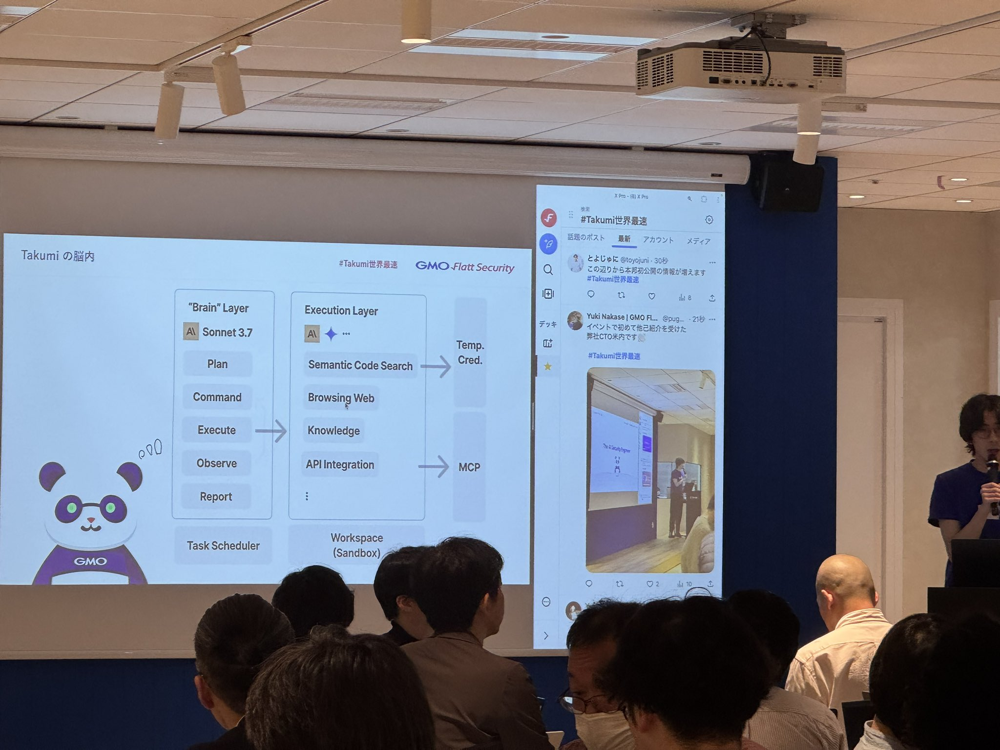

# 事業の観点での説明

* 事業部として今後の取り組みの方向性として以下のものを考えている。
    * お客さんにとって今あるデータから適切な数式を引き当ててくることが価値につながる
    * 既存のLLMを用いて、より高い価値を早く・安く提供することが重要

* 今の課題として
    * 適切なデータ軸を指定した際に適切な式を引き当ててくるところを純粋なLLMとの応答だけでやっている。それでよいかが不安。(技術的な独自性を出せるか？)

## 非同期島モデルの実装

現在各サイクルないでのみ並列化を行っているが、非同期島モデルでやればもっと効率よくなるし、そういうアルゴリズムの改良を加えれば差別化できるんでないか (既に完了しているならスルーで)

## オプティマイザの問題

いろんなオプティマイザを試したが、解が純粋なsinc^2の形をしている時、L-BFGS-B, BFGS, Newton-CG, ベイスンホッピング, adamなどを試したが目的関数を最小化する係数が同定できなかった、これはどう対処すればよいか

たまたま今回摂動を加えることで発見できたけど、これを理論的に研究したらなんかいい方法みつかったりしないか

bactgrowでも、trainに対して一番精度がいいのにoodとidで係数みつからないような状況が発生している

## 徐々にパラメータを追加していく取り組み (データ軸の指定がこれに対応してる？)

いきなり全部変数にして同定するのは難しい場合もありそう、その場合に動かす変数を減らして探索して得られた関数をコンテキストにして新たな関数を探索するなどの工夫は効果あるか

## ファインチューニング

一般的なLLMは関数同定に特化しておらず、指示を無視したり同じ関数を作ったりする場合があるし、コンテキストの設定ミスったら関係ない処理をする場合がある

関数同定に特化したモデルを作れば、プロンプトも簡素化できると思う

GMO Flatt Securityが提供するTakumiとか、slack連携できたり頼みやすかったりファインチューニングか独自のトレーニングが行われており、0-dayも多数発見されている

* ファインチューニング、研究者の手順をクローンしてるらしい、learn overtimeできるらしい、MCP
* 

## 事前にデータセットが作れない状況でのevaluate (データ軸の指定はないが)

指定区間内で変換できる波長変換ができるような、スペクトル分布が矩形になるドメイン幅の関数形の同定といった問題に対して、データセットを事前に用意することは現実的ではない、その場合でも、得られた関数を使ってその場で論理計算を行って誤差を評価できれば用途が広がる

てか本来のfunsearchはこっちをやってる

## 非同期島モデルの実装 (改) (没)

evaluateの中で論理計算も行う場合、evaluateとmutationも処理を切り離して、すべて効率よく並列化する意味はある？

### 並列化する意味がない理由
1. あるevaluateが終了した時、mutationが実行可能になる
2. あるmutationが終了した時、evaluateが実行可能になる
3. 任意のmutation終了時に、任意の計算リソースが空いていれば、即座にevaluateが実行可能である
4. 任意のevaluate終了時に、任意の計算リソースが空いていれば、即座にmutationが実行可能である

だからこれ以上並列化しても意味ないきがする

### 反論
3が間違い、mutationはAPI呼び出しであり、これの実行中CPUはアイドル状態であるが、mutationとevaluateを同じスレッドで行っている場合このリソースが使用できない可能性がある

### 結論
evaluateをGPUでやる場合は意味ない、cpuでやる場合ちょっと意味あるけど、いうてgemini flashとか使えば一瞬で答え帰ってくるからあんま意味ない

# いただいた点の方針について、どのように判断し何を選んだか

* 非同期島モデルの実装
* 既存のLLMを用いて速く提供することに直結する

# 今の課題に対して
純粋なLLMとの応答意外でなんか改良したいらしい

* 制約条件？
    * 既存のLLM (ファインチューニングは既存のLLM使ってるからいいかな)
    * データ軸は指定済、Agentみたいに動的に指定してくのも、Takumiっぽくていいと思うが
    
式をどうかえたらどう変化した、みたいな情報をもうちょいコンテキストに含めたい気がする evaluator があることなどを知ってもらってファインチューニングはめっちゃやってみたい、普通に関数同定してる最中にエラーはいた出力を片っ端から反面教師にしてファインチューニングすれば良いのでは？あとは成功例を片っ端から教師にしてファインチューニング。入出力と正誤わかってるから無限にファインチューニングできる気がする、ニッチな分野でLLMがしらない式とかを正解としてファインチューニングしたい気がする

gemini flashでも結構書き間違いが多かった、プロンプト改良するよりファインチューニングしたほうがよい

プロンプト改良と非同期島モデルぐらいしか思いつかん、あとはRAGとか、複数LLMのアンサンブル、探索仮定の詳細な報告で安心感(いらんかも)

マルチターン対話、惜しい式とかに対して改良をたのむなど人間が介入できると嬉しいかも？

長期的にみればメタラーニング

発見された公式に置けるparams(項ではなく係数)と、物理量の対応関係を特定する機能 (変換効率の場合だとp2が素子長だった)、これはチューニング試せば機械的に探せると思う

中間報告と軌道修正を挟めるようにしたくね？

探索の安定性の数値化 (客は興味ないかも)

いいのが複数見つかったら全部提案 (人が物理的な意味評価したいかも)

オプティマイザの問題どうにかしてほしい
