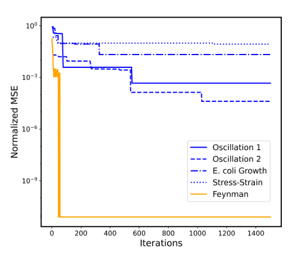

# bactgrow

qwen2.5-coder:14b で4224回目の探索で十分小さい誤差になった

## 発見された関数
```python
def found_equation(b: np.ndarray, s: np.ndarray, temp: np.ndarray, pH: np.ndarray, params: np.ndarray) -> np.ndarray:
    mu_max = params[0]
    Ks = params[1]
    b_sat = params[2]
    Q10 = params[3]
    T_ref = params[4]
    mu_ref = params[5]
    pH_effect = params[6]
    sigma_pH_base = params[7]
    alpha = params[8]
    beta = params[9]
    # Enhanced Monod model for substrate inhibition, including cooperative interactions and substrate saturation effects
    mu_substrate = (mu_max * s) / ((Ks + beta * np.power(s, 2))
                                   * (1 + alpha * b / b_sat))
    # Improved Hill function with logistic transformation for population density effect to better model competition dynamics at high densities
    mu_population = (np.log(1 + alpha * (b / b_sat))) / np.log(1 + alpha)
    # Temperature adaptation enhanced with Q10 factor and Gaussian term, more accurately accounting for thermal stress effects
    T_effect = Q10 ** ((temp - T_ref) / 10.0) * \
        np.exp(-0.05 * (np.power((temp - 37.0), 2)))
    mu_temp = mu_ref * T_effect
    # pH effect modeled as a Gaussian function with adaptive sigma_pH, including higher-order polynomial terms for precise non-linear effects at extreme pH values
    sigma_adaptive = sigma_pH_base + 0.04 * np.abs(pH - 7.0) + 0.025 * np.power(
        (pH - 7.0), 2) + 0.0017 * np.power((pH - 7.0), 3) + 0.0005 * np.power((pH - 7.0), 4)
    mu_pH = mu_temp * np.exp(-pH_effect * ((pH - 7.0) / sigma_adaptive) ** 2)
    # Combined growth rate factors with advanced stability mechanisms, ensuring substrate influence and effective clipping
    return np.clip(mu_substrate * mu_population * mu_pH, 1e-10, mu_max)
```

## 誤差表

### 今回
| データセット | 誤差 (loss)            |
|--------------|------------------------|
| train        | -0.00031873956322669983 |
| id           | -0.0007042033830657601  |
| ood          | -0.005407379940152168   |

### 先行研究
#### oodとid

#### train


## 考察
論文で発見されている関数より精度がたかい

発見した式が長すぎるとパラメータの振り方によって無理やり結果が合う可能性が高まるから過学習しがち
