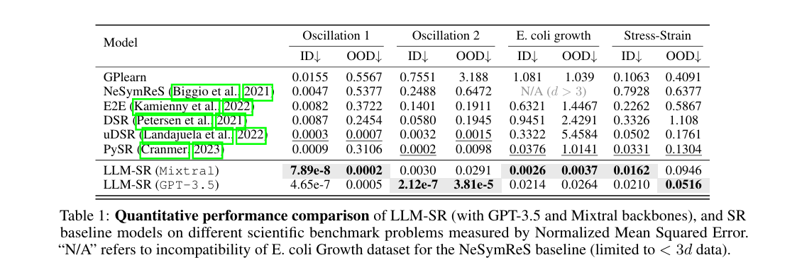
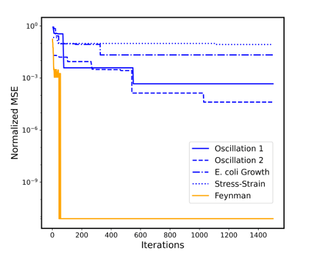

# oscillator1

gemini3:12b を使って236回目で十分誤差が小さくなる関数を発見した

## 発見された関数
```python
def found_equation(x: np.ndarray, v: np.ndarray, params: np.ndarray) -> np.ndarray:
    acceleration = params[0] + params[1] * v - params[2] * \
        x + params[3] * x * v - params[4] * x**2 * np.sin(x)
    return acceleration
```

## 誤差表

### 今回
| Dataset | Loss Value                |
|---------|---------------------------|
| train   | -2.2259064280660823e-06   |
| id      | -2.2255817384575494e-06   |
| ood     | -1.608407728781458e-05    |

### 先行研究
#### oodとid

#### train


## 考察
発見した式がシンプルでいい感じ
